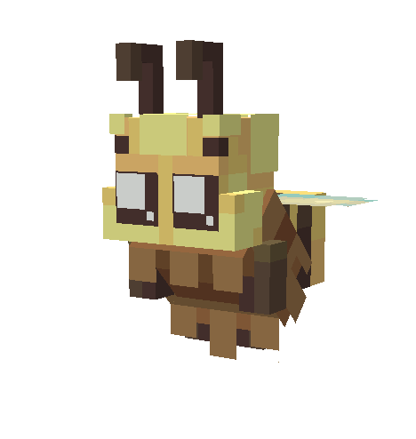

# 🐝 Abeilles

### Présentation

Le système Abeille est une fonctionnalité permettant d’introduire une nouvelle mécanique de progression basée sur la capture, l’exploitation et l’optimisation des abeilles.

Il repose sur plusieurs éléments autour de la production de ressources et de l’amélioration continue.

<figure><figcaption></figcaption></figure>

### Fonctionnement général

* Capture d’abeilles dans les differents warp du spawn à l’aide d’un filet
* Production de miel via les ruches royales
* Amélioration des ruches afin d’augmenter leur capacité et leur efficacité
* Utilisation de reines pour réduire les temps de cycle
* Combinaison d’abeilles pour obtenir des niveaux supérieurs
* Optimisation des gains via le familier Maya
* Progression via des succès liés aux abeilles

### **Succès**

De nouveaux succès liés au système Abeille seront ajoutés dans la catégorie **Agriculteur**.

### **Limite des ruches royales**

Le nombre de **ruches royales** pouvant être placées est limité et peut être augmenté via le système de <mark style="color:yellow;">**`/box upgrades`**</mark>.

Chaque amélioration augmente la capacité maximale en échange d’un coût en **argent** et en **ressources liées aux abeilles**.


• Cette limite est appliquée **par box**\
• Une ruche supplémentaire ne peut pas être placée si la limite est atteinte


### Nouveaux objets

🪤 Filet

Le filet permet de capturer les abeilles via un **clic gauche**.

Les abeilles ne peuvent pas être attaquées et doivent obligatoirement être capturées avec cet objet.

| Propriété  | Valeur                  |
| ---------- | ----------------------- |
| Rareté     | Commun                  |
| Durabilité | 64                      |
| Réparable  | Non                     |
| Obtention  | Fabrication à l’atelier |

🍯 Ruche royale

La **Ruche royale** est une structure permettant de produire du miel automatiquement à partir des abeilles placées à l’intérieur.

La ruche fonctionne par cycles de production :

* Les abeilles placées produisent du miel automatiquement
* Une reine peut être ajoutée pour réduire le temps de cycle
* La production dépend du nombre et de la rareté des abeilles
* La ruche doit être dans un **chunk chargé** pour fonctionner

Un hologramme est affiché au-dessus de chaque ruche afin de fournir des informations en temps réel.

Il permet de visualiser :

* Le niveau de la ruche
* Le nombre d’abeilles présentes
* Le temps restant avant le prochain cycle
* Le nombre de cycles actuels par rapport au maximum
* L’état de la ruche (en production ou pleine)


Une ruche cesse de produire lorsqu’elle atteint son nombre maximum de cycles sans récupération.


| Propriété    | Valeur                  |
| ------------ | ----------------------- |
| Rareté       | Épique                  |
| Obtention    | Fabrication à l’atelier |
| Déplaçable   | Oui                     |
| Propriétaire | Aucun                   |

🐝 Abeilles (1★ à 5★)

Une fois capturées, elles peuvent être placées dans une **ruche royale** afin de produire du miel automatiquement.

| Propriété   | Valeur                  |
| ----------- | ----------------------- |
| Type        | Ressource / Production  |
| Obtention   | Capture d’abeilles      |
| Utilisation | Production de miel      |
| Évolution   | Par combinaison         |
| Placement   | Ruche royale uniquement |

#### Niveaux d’abeilles

| Abeilles         | Rareté     | Réduction cycle |
| ---------------- | ---------- | --------------- |
| Reine abeille 1★ | Commun     | -5%             |
| Reine abeille 2★ | Rare       | -10%            |
| Reine abeille 3★ | Epique     | -15%            |
| Reine abeille 4★ | Légendaire | -20%            |
| Reine abeille 5★ | Mythique   | -25%            |

| Abeille    | Rareté     | Production      |
| ---------- | ---------- | --------------- |
| Abeille 1★ | Commun     | 1 miel / cycle  |
| Abeille 2★ | Rare       | 2 miels / cycle |
| Abeille 3★ | Épique     | 3 miels / cycle |
| Abeille 4★ | Légendaire | 4 miels / cycle |
| Abeille 5★ | Mythique   | 5 miels / cycle |

🧪 Combinaison 2000

💡 **Effet**

Lorsqu’elle est utilisée, la Combinaison 2000 permet de :\
→ Réussir la combinaison à **100%** 

🛠️ **Objet spécial**

| Propriété    | Valeur                           |
| ------------ | -------------------------------- |
| Nom          | Combinaison 2000                 |
| Effet        | Garantit une combinaison réussie |
| Consommation | Oui                              |

### 🐝Familier Maya

| Level     | Maya                                                | Shiny               |
| --------- | --------------------------------------------------- | ------------------- |
| Niveau 1  | ■ + 10000 $ par heure                               | ➨ + 15000$          |
| Niveau 5  | ■ Produit 4 miels par heure                         | ➨ 8                 |
| Niveau 10 | ■ +40 chance                                        | ➨ +60               |
| Niveau 15 | ■ Produit 1 miel royale par heure                   | ➨ 2 miel royale/h   |
| Niveau 20 | ■ x1,5 chance d’obtenir une abeille (non cumulable) | ➨x2 (non cumulable) |


Pas de fusion possible pour ce famillier


<figure><figcaption></figcaption></figure>

### 🧬 Combinaison des abeilles

La combinaison permet de fusionner deux abeilles identiques afin d’obtenir une abeille de niveau supérieur.

Pour effectuer une combinaison, les conditions suivantes doivent être respectées :

* Les deux abeilles doivent avoir le **même nombre d’étoiles**
* Les deux abeilles doivent être du **même type**
* Les abeilles normales et les reines ne peuvent pas être mélangées

| Abeilles utilisées | Résultat   |
| ------------------ | ---------- |
| 2  Abeille 1★      | Abeille 2★ |
| 2  Abeille 2★      | Abeille 3★ |
| 2  Abeille 3★      | Abeille 4★ |
| 2  Abeille 4★      | Abeille 5★ |
| 2  Reine 1★        | Reine 2★   |
| 2  Reine 2★        | Reine 3★   |
| 2  Reine 3★        | Reine 4★   |
| 2  Reine 4★        | Reine 5★   |

### 🔄 Déroulement

#### En cas de réussite

* Les deux abeilles sont consommées
* Une abeille de niveau supérieur est obtenue

#### En cas d’échec

* La première abeille est conservée
* La seconde abeille est perdue
* Aucun résultat n’est obtenu

### Crafts à l’atelier

Les nouveaux crafts <mark style="color:yellow;">**`/atelier`**</mark> seront ajoutés prochainement.

