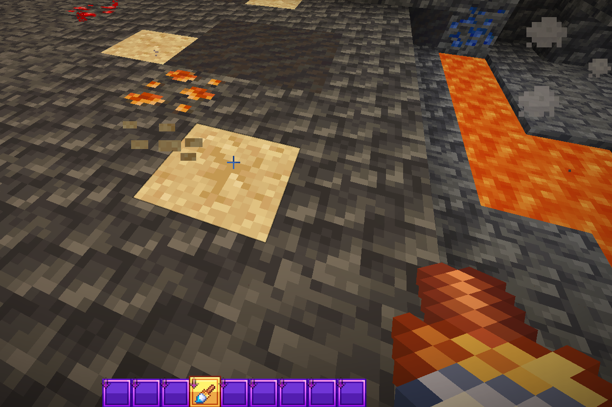
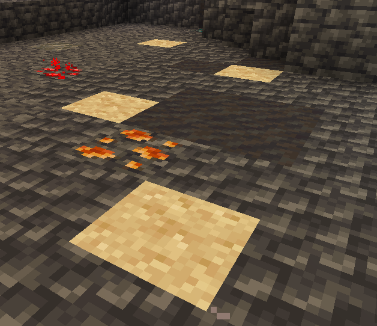
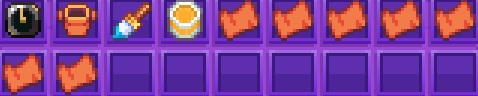

# 🏺 Archéologie

Le mode Archéologie permet de fouiller des sables suspects afin d’obtenir des ressources, objets rares et récompenses exclusives.

### 🧹 Fonctionnement

Des sables suspects sont présents dans différentes zones du serveur.\
Ils peuvent être fouillés à l’aide d’un pinceau afin de révéler leur contenu.

Chaque fouille permet d’obtenir différents types de récompenses aléatoires.

<figure><figcaption></figcaption></figure>

### 📍 Zones de fouille

Les sables suspects se trouvent à plusieurs endroits du spawn :

* Sur les plages
* Dans la mine, du niveau 1 au niveau 4

<figure><figcaption></figcaption></figure>

### 🎁 Récompenses

En fouillant les sables, il est possible d’obtenir :

* Des minerais
* Des coins
* Des gemmes
* Des morceaux de jarre antique
* Des revêtements antiques
* Des familiers exclusifs

### 🏺 Jarres antiques

Les morceaux de jarre antique sont numérotés de 1 à 7.\
Ils permettent de fabriquer des jarres via la commande **/atelier**.

Une fois fabriquées, les jarres peuvent être consommées.

* Maximum : 5 jarres actives en même temps
* Chaque jarre donne +10 de chance

<figure><figcaption></figcaption></figure>

### 🧭 Boussole antique

Les revêtements antiques permettent de fabriquer une boussole via la commande <mark style="color:yellow;">**`/atelier`**</mark>

* 8 revêtements antiques sont nécessaires

Une fois obtenue, la boussole :

* Donne +50 de chance
* Doit être tenue en main gauche pour activer son effet

### 🐾 Familiers

L’archéologie permet également d’obtenir de nouveaux familiers :

* Zephyr
* Zephyr Shiny

###

