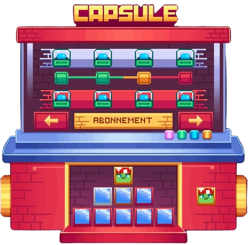
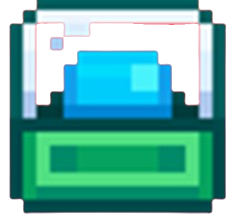
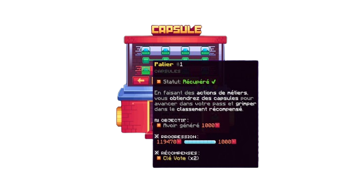

# 🎟️ Capsules

### Obtention

Les capsules sont une monnaie sur le serveur. Vous pouvez voir votre évolution dans le /classement.

Les **capsules** s’obtiennent en réalisant des actions liées aux métiers. Toutes les actions de métier ont un pourcentage de chance de donner une capsule. Lorsque vous obtenez une capsule, elle s'affiche juste au-dessus de votre barre d'inventaire.

### Pass Capsules

Ce pass est réinitialisé chaque semaine. Un total mensuel est conservé uniquement pour établir le **classement mensuel**.

Dans ce pass, vous allez avoir la possibilité d'avoir des récompenses. Le fonctionnement du pass n'est pas compliqué, il vous suffit de farmer les capsules pour débloquer les paliers et obtenir des récompenses (petit bonus si vous êtes premium, des récompenses supplémentaires vous attendent).

<figure><figcaption></figcaption></figure>

Au-dessus vous pouvez voir l'interface du pass de capsules. Vous avez remarqué 3 couleurs se distinguent facilement : le carré vert, le carré jaune et le carré rouge, chaque couleur définis un état d'avancement dans le pass, à savoir :

* Le carré vert pour les palier déjà débloqués
* Le carré jaune pour le palier en cours
* Le carré rouge pour les paliers non débloqués

Pour récupérer vos récompense il vous suffit de cliquer sur le petit icône  une petite description apparaît lors du survol de celui-ci, vous permettant de voir votre récompense, ainsi que de voir si vous l'avez déjà récupérée

<figure><figcaption></figcaption></figure>

### Classement & Récompenses

Le classement est en deux parties, une hebdomadaire et une mensuelle. Ces deux classements rapportent des récompenses en fin de semaine ou en fin de mois.

#### Voici les récompenses **:**

<table data-full-width="false"><thead><tr><th width="129.7999267578125">Classement</th><th width="269.800048828125">Récompense(s) hebdomadaire</th><th width="280.4500732421875">Récompense(s) mensuel</th></tr></thead><tbody><tr><td><strong>TOP 1</strong></td><td>
500 

Abonnement premium  3 jours
</td><td>
Icône capsule temporaire (1 mois)

2000 

Abonnement premium  7 jours
</td></tr><tr><td><strong>TOP 2</strong></td><td>
350 

Abonnement premium  1 jour
</td><td>
1000 

Abonnement premium  7 jours
</td></tr><tr><td><strong>TOP 3</strong></td><td>
250 

2.500.000 
</td><td>
500 

Abonnement premium  3 jours

7.500.000 
</td></tr><tr><td><strong>TOP 4</strong></td><td>
150 

2.000.000 
</td><td>
350 

Abonnement premium 1 jour

5.000.000 
</td></tr><tr><td><strong>TOP 5</strong></td><td>1.500.000 </td><td>
200 

3.500.000 
</td></tr><tr><td><strong>TOP 6</strong></td><td>1.250.000 </td><td>
100 

2.500.000 
</td></tr><tr><td><strong>TOP 7</strong></td><td>1.000.000 </td><td>
75 

2.000.000 
</td></tr><tr><td><strong>TOP 8</strong></td><td>750.000 </td><td>
50 

1.500.000 
</td></tr><tr><td><strong>TOP 9</strong></td><td>500.000 </td><td>
25 

1.000.000 
</td></tr></tbody></table>
