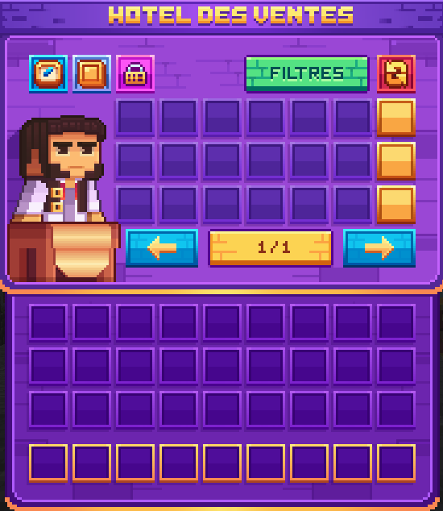

# 🏦 Hôtel des Ventes

### Introduction

L'hôtel des ventes, ou l'ah, est un magasin entre les joueurs. Chacun peut vendre ses items ou les acheter à d'autres joueurs.

L'échange entre joueurs est crucial pour développer ta progression sur Blocaria.

### Comment fonctionne l’hôtel des ventes ?

Cette interface est disponible avec la commande <mark style="color:yellow;">**`/ah`**</mark>, elle dispose de plusieurs onglets comme vos ventes, l'historique des ventes. Vous aurez aussi la possibilité d'appliquer un filtre afin d'y voir plus clair dans vos recherches d'achat.

Vous pourrez aussi connaître la valeur d'un item avec le <kbd><mark style="color:yellow;">/ah average<mark style="color:yellow;"></kbd> . Le montant affiché est une moyenne des ventes de cet item sur les 14 derniers jours.\
Si un <mark style="color:yellow;">?</mark> est affiché, c'est que votre item n'a pas eu de vente au ah dans les 14 derniers jours.

<figure><figcaption></figcaption></figure>

### Système de vente d'objets

* <mark style="color:yellow;">**Vente**</mark> : Pour vendre un item, tu dois faire la commande <mark style="color:yellow;">`/ah sell [montant]`</mark> avec l'item à vendre dans la main principale.
* Vous pourrez également mettre en avant vos items une fois mis en vente avec le shift clique dans l'onglet vos ventes, afin qu'il soient à la vue de tout le monde. Attention, soyez le plus réactif car il n'y a que 3 places disponibles.
* <mark style="color:yellow;">**Recherche**</mark> : Tu peux rechercher des objets dans le <mark style="color:yellow;">**`/ah`**</mark> via la commande <mark style="color:yellow;">**`/ah search <pseudo>`**</mark>.
* <mark style="color:yellow;">**Prix moyen**</mark>**&#x20;:** En passant le curseur sur un objet, tu peux voir le prix moyen auquel cet objet est vendu. Cela t'aide à évaluer le juste prix pour tes transactions.
* <mark style="color:yellow;">**Comparaison d'offres**</mark> : Dans le <mark style="color:yellow;">**`/ah`**</mark> de Blocaria, les catégories ont été retirées. En cliquant sur un objet spécifique, un menu s'ouvre et affiche les objets similaires disponibles à l'achat, te permettant ainsi de choisir la meilleure offre.
* <mark style="color:yellow;">Après les achats,</mark> assurez-vous de les récupérer en utilisant la commande <mark style="color:yellow;">**`/ah claim`**</mark>**.**


L’hôtel des ventes est conçu pour encourager le commerce. Profite de cette plateforme pour échanger, acheter et vendre des objets, tout en trouvant les meilleures offres disponibles !

