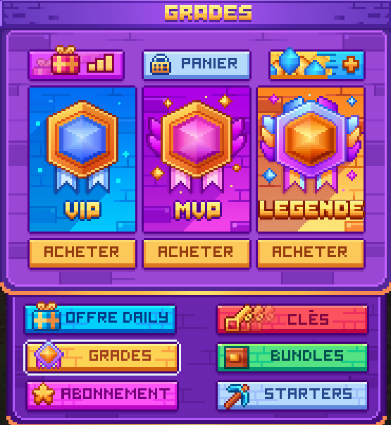
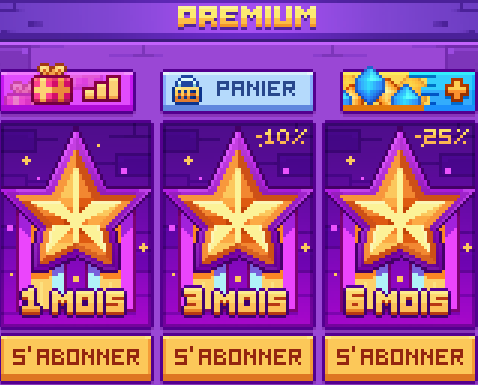
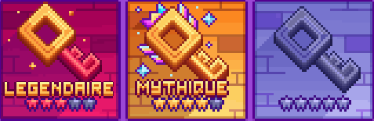
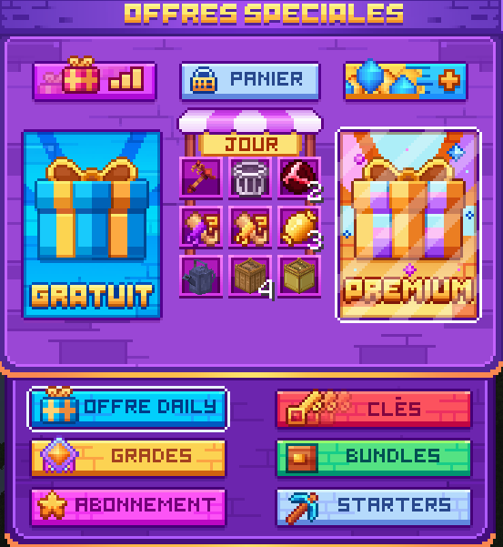
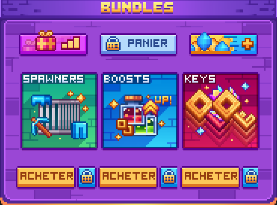

# 💎 La Boutique

### Introduction

La boutique du serveur vous propose en échange de gemmes :

* Les grades
* Les clés pour ouvrir les caisses
* Ainsi que beaucoup d'autres avantages.

Dans la boutique, vous aurez aussi la possibilité de prendre un abonnement premium qui vous donnera des avantages exclusifs !

Les gemmes sont obtenables via le site internet de blocaria : <mark style="color:red;">Lien du site</mark>

Pour récupérer vos gemmes en jeu, il vous suffit d'utiliser la commande <kbd><mark style="color:yellow;">/claim<mark style="color:yellow;"></kbd>. S'il ne se passe rien au bout de 5 minutes, merci d'ouvrir un ticket sur le [discord de Blocaria](https://discord.gg/37P6tDzm)

### Les Grades

Il existe 3 **grades différents**, achetable selon certaines conditions :

<mark style="color:yellow;">**VIP**</mark> : Achetable avec 1200 gemmes via la commande <kbd><mark style="color:yellow;">/boutique<mark style="color:yellow;"></kbd>

<mark style="color:yellow;">**MVP**</mark> : Achetable avec 2750 gemmes ainsi que le grade VIP via la commande <kbd><mark style="color:yellow;">/boutique<mark style="color:yellow;"></kbd>

<mark style="color:yellow;">**Légende**</mark> : Achetable avec 4000 gemmes ainsi que le grade MVP via la commande <kbd><mark style="color:yellow;">/boutique<mark style="color:yellow;"></kbd>

Voici à quoi ressemble l'interface des grades dans la boutique :

<figure><figcaption></figcaption></figure>

Il existe aussi 3 cosmétiques (Titre) exclusifs :

<mark style="color:yellow;">**Éternel**</mark> : attribué après **1000 € dépensés dans la boutique** _(grade purement cosmétique)_

<mark style="color:yellow;">**Éternel+**</mark> : attribué après **5000 € dépensés dans la boutique** _(grade purement cosmétique)_

<mark style="color:yellow;">**Iconique**</mark> : attribué à la personne ayant **dépensé le plus d’argent dans la boutique au cours du mois** _(grade purement cosmétique)_

### Abonnement

Le **Premium** correspond à un statut spécial vous accordant des **avantages exclusifs** et des **bonus supplémentaires** par rapport à l’expérience standard.

Il permet notamment de :

* Bénéficier de **récompenses supplémentaires**.
* Accéder à des **bonus actifs**.
* Profiter davantage **d’exclusivités** pouvant concerner votre progression, votre confort de jeu ou des éléments cosmétiques.

Voici à quoi ressemble l'interface de l'abonnement premium dans la boutique :

<figure><figcaption></figcaption></figure>

### Les clés

Différentes caisses sont disponibles au spawn, avec l'obtention d'items exclusifs et de boosts pour votre aventure. Vous trouverez plus d'informations sur la page [<mark style="color:yellow;">"Les caisses"</mark>](les-caisses.md)

Les clés sont disponibles à l’achat pour n'importe quelle rareté:

* **À l’unité**
* En **pack de 3**
* En **pack de 8 avec une clé offerte en plus**

Une **catégorie spéciale** vous est également proposée pour les **clés disponibles lors d’événements temporaires**.

<figure><figcaption></figcaption></figure>

### Starter pack

Trois packs vous sont proposés, achetables une seule fois par joueur pour lancer votre aventure :

⟶ Découverte (niveau 1)

⟶ Ascension (niveau 2)

⟶ Ultime (niveau 3)

<figure><figcaption></figcaption></figure>

### Offres journalières

Chaque jour, **9 objets** sont mis en avant avec une **réduction appliquée à leur prix de base**.\
Ces objets peuvent inclure, par exemple : des **clés**, divers **objets**, des **boosts**, des **spawners**, et bien d’autres éléments pour votre aventure.

Il est possible de récupérer **1 objet gratuit par jour**.

Cet objet est **attribué automatiquement** : il n’est donc pas possible de le choisir.

Un **abonnement actif** permet de bénéficier d’un **objet gratuit supplémentaire par jour**, soumis aux mêmes conditions.

<figure><figcaption></figcaption></figure>

### Bundles promotionnels

Les bundles correspondent à un **groupement de plusieurs offres à l’achat**, qui vous sont proposées avec une **réduction par rapport à la valeur cumulée des objets ou avantages pris séparément**.

#### **Disponibilité**

De manière **bimensuelle**, il est possible de choisir entre **3 bundles différents** (sur un total de **6 existants**).\
Chaque bundle est **achetable une seule fois**.

#### **Contenu possible**

Un bundle peut contenir :

* Du **temps d’abonnement**
* Des **clés**
* Des **Gemmes**
* Des **boosts**
* Des **icônes et éléments cosmétiques**

<figure><figcaption></figcaption></figure>
