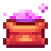
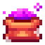

# ⚒️ La Forge

### La Forge

La Forge est une fonctionnalité permettant la réparation des objets via une interface dédiée.\
Elle est accessible à l’aide de la commande : <kbd><mark style="color:yellow;">/forgeron<mark style="color:yellow;"></kbd>.

L’interface comporte deux onglets distincts :

**Réparation des outils de rareté**

**Réparation des outils évolutifs**

### Obtention des poudres

Le concassage de géodes permet d'en obtenir, avec une probabilité variable :

**Poudre de perlimpinpin** 

**Poudre enchantée** 

### Système de réparation

#### Outils de rareté

La réparation des outils de rareté nécessite l’utilisation de **poudre corrompue**.\
Chaque utilisation restaure **25 %** de durabilité de l’objet.

#### Outils évolutifs

Les outils évolutifs peuvent être réparés à l’aide de :

**Poudre de perlimpinpin** : restaure **15 %** de durabilité.

**Poudre enchantée** : restaure **100 %** de durabilité (réparation complète).

<figure><figcaption></figcaption></figure> <figure><figcaption></figcaption></figure>

### Procédure

Pour effectuer une réparation :

Placer l’objet à réparer dans l’emplacement prévu à cet effet.

Ajouter la poudre compatible dans l’emplacement dédié.

Cliquer sur le bouton **Réparer** afin de valider l’action.

### Incompatibilité

Si une poudre incompatible est associée à un objet :

Un message d’erreur s’affiche.

Celui-ci précise que la poudre utilisée n’est pas adaptée à l’objet sélectionné.
