# 🏗️ La mine

### **Description générale**

La Mine est une zone d’exploration souterraine composée de **quatre étages**.\
Chaque étage nécessite un **niveau de maîtrise spécifique** afin d’y accéder.\
La vigilance est de mise : des **créatures hostiles** rôdent en permanence, rendant l’exploration dangereuse et nécessitant de savoir se défendre.

### **Accès et progression**

L’accès aux étages de la Mine est progressif et dépend de votre niveau de rangs.

#### **Premier étage**

* **Accès** : Disponible dès le début de l’aventure

<strong>Minerais disponibles</strong>

Charbon 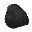

Fer 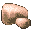

Argent 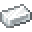

Or 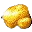

Créatures hostiles

<figure>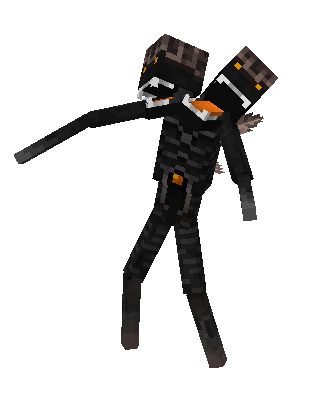<figcaption></figcaption></figure>

<strong>Slenderman</strong>

#### **Deuxième étage**

* **Accès** : Rang **Or I** requis

<strong>Minerais disponibles</strong>

Charbon 

Fer 

Or 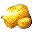

Cobalt 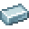

Créatures hostiles

<figure><figcaption></figcaption></figure> <figure><figcaption></figcaption></figure>

<strong>Slenderman / Sanspattes</strong>

#### **Troisième étage**

* **Accès** : Rang **Diamant I** requis

<strong>Minerais disponibles</strong>

Cuivre 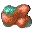

Or 

Rubis 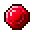

Créatures hostiles

<figure><figcaption></figcaption></figure> <figure><figcaption></figcaption></figure> <figure>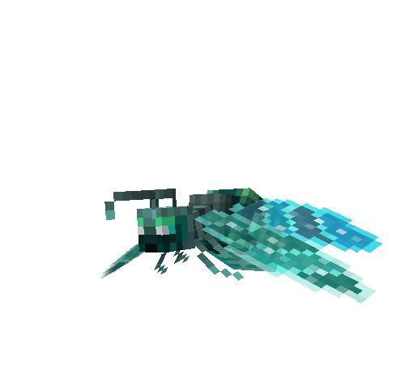<figcaption></figcaption></figure>

<strong>Fourmis géante jaune / Sanspattes / Luciole fluo</strong>

#### **Quatrième étage**

* **Accès** : Rang **Rubis I** requis

<strong>Minerais disponibles</strong>

Lapis 

Redstone 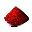

Diamant 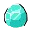

Topaze 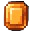

Opale 

Créatures hostiles

<figure><figcaption></figcaption></figure> <figure><figcaption></figcaption></figure>

 

<strong>Golem d'améthyste / Luciole fluo</strong>


La difficulté et la rareté des minerais augmentent à mesure que vous progressez dans les étages. Une préparation adéquate est fortement recommandée avant de s’aventurer dans les niveaux les plus profonds.

