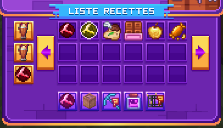

# 🛠️ L'atelier

#### Introduction

L’Atelier est une fonctionnalité accessible depuis le spawn via un villageois ou grâce à la commande <mark style="color:yellow;">**`/atelier`**</mark>.

L'atelier vous permet de produire des items rares du jeu. Les items auront un temps de craft différent. Vous pourrez avoir jusqu'à 6 tables d'atelier pour faire plusieurs crafts à la fois.

<figure><figcaption></figcaption></figure>

### Les différentes fonctionnalités

L'atelier est composé de plusieurs parties, les tables d'atelier, le craft et les recettes.

<figure><figcaption></figcaption></figure>

### 1. Les tables d'ateliers

Les tables d'ateliers sont des zones disponibles pour le craft. Vous aurez accès au fur et à mesure de l’évolution de votre rang à de plus en plus de tables.\
\
Le craft peut demander un temps plus ou moins long de craft, il est donc utile de posséder plusieurs tables pour crafter jusqu'à 6 objets en même temps.

Table d'a<strong>telier 1</strong>

Vous avez accès à cette table dès votre arriver sur le serveur.

<strong>Table d'atelier 2</strong>

Vous aurez accès à partir du rang Or I et y ajouter 1 000 000$

<strong>Table d'atelier 3</strong>

Vous aurez accès à partir du rang Émeraude I et y ajouter 2 500 000$

Table d'atelier 4

Vous aurez accès à partir du rang Saphir I et y ajouter 10 000 000$

Table d'atelier 5

Vous aurez accès à partir du rang Obsidienne I et y ajouter 25 000 000$

<mark style="color:red;">Table d'atelier 6</mark>

Vous aurez accès à partir du rang

### 2. Le craft

Une fois le craft lancé à l'aide des recettes vous pourrez grâce à l'espace de craft garder un oeil sur la progression du craft en cours et savoir le temps qu'il reste avant la fin du craft.

### 3. Les recettes

En cliquant sur le livre des recettes vous pourrez avoir accès à la liste des craft de l'atelier.

Pour lancer une recette il vous suffit de choisir l'item que vous souhaitez crafter et lancer la production avec le bouton fabriquer

#### Liste des différents crafts

La pierre d'évolution

La pierre d'évolution permet d'amélioré certains outils

Elle prendra 5 minutes à être fabriqué

<figure><figcaption></figcaption></figure>

x64 diamants\
x64 émeraudes\
x8 netherite\
x64 lingots d'argent\
x32 lingots de cobalt

La pierre d'évolution forgée

La pierre d'évolution forgée permet d'amélioré certains outils

Elle prendra 15 minutes à être fabriqué

<figure><figcaption></figcaption></figure>

x4 pierres d'évolutions\
x64 rubis\
x48 topazes\
x32 opales

La poudre organique

La poudre organique vous permet de redonner de la durabilité à vos générateurs

Elle prendra 5 minutes à être fabriqué

<figure><figcaption></figcaption></figure>

x1 poudre de perlimpinpin\
x1 âme\
x16 graines d'aubergines

La jardinière métallique, dorée, précieuse

Les jardinières permettent un temps de pousse

_**Jardinière métallique**_

<figure><figcaption></figcaption></figure>

x1 jardinière en bois\
x16 sacs de compose\
x16 graines customs\
x5 blocs de fer\
x16 lingots de cobalt\
x32 lingots d'argent

_**Jardinière dorée**_

<figure><figcaption></figcaption></figure>

x1 jardinière métallique\
x32 sacs de compose\
x16 graines customs\
x10 blocs d'or\
x16 diamants\
x1 lingot d'or

_**Jardinière précieuse**_

<figure><figcaption></figcaption></figure>

x1 jardinière dorée\
x64 sacs de compose\
x32 graines customs\
x10 blocs de diamant\
x32 topazes\
x16 opales

Arrosoir 

Arrosoir métallique

x256 lingots de fer

x1 seau d’eau

Arrosoir dorée

x128 blocs d’or

x128 lingots de cobalt

x128 lingots d’argent

x1 arrosoir métallique

Arrosoir précieux

x128 topazes

x128 opales

x256 rubis

x1 arrosoir dorée

Fabricateur

<figure><figcaption></figcaption></figure>

x64 blocs de redstone\
x64 topazes\
x64 blocs de fer\
x64 opales\
x1 pierre d'évolution forgée\
x64 lingots de cobalt\
x64 blocs de diamant\
x64 rubis\
x64 blocs d'or

Breuvage de chance

Ce breuvage augmente votre chance pendant 15 minutes

_**Commun**_

<figure><figcaption></figcaption></figure>

x64 verres de terre\
x64 escargots\
x64 pattes de lapin\
x64 lingots d'argent\
x1 fiole vide

_**Rare**_

<figure><figcaption></figcaption></figure>

x1 breuvage de chance commun\
x32 sardines (épique)\
x16 crabes (légendaire)\
x64 lingots de cobalt\
x64 rubis\
x1 fiole vide

_**Épique**_

<figure><figcaption></figcaption></figure>

x1 breuvage de chance rare\
x16 truites arc-en-ciel (mythique)\
x64 topazes\
x64 opales\
x1 fiole vide

Breuvage de force

Ce breuvage augmente votre force pendant 15 minutes

_**Commun**_

<figure><figcaption></figcaption></figure>

x64 chevaines (commun)\
x64 huîtres (rare)\
x64 bâtons de blaze\
x64 lingots d'argent\
x1 fiole vide

_**Rare**_

<figure><figcaption></figcaption></figure>

x1 breuvage de force commun\
x32 perches (épique)\
x16 crevettes (légendaire)\
x64 lingots de cobalt\
x64 rubis\
x1 fiole vide

_**Épique**_

<figure><figcaption></figcaption></figure>

x1 breuvage de force rare\
x16 homards (mythique)\
x64 topazes\
x64 opales\
x1 fiole vide

Breuvage de saturation

Ce breuvage augmente votre saturation pendant 15 minutes

_**Commun**_

<figure><figcaption></figcaption></figure>

x64 coques (commun)\
x64 brèmes (rare)\
x64 carrotes dorée\
x64 lingots d'argent\
x1 fiole vide

_**Rare**_

<figure><figcaption></figcaption></figure>

x1 breuvage de saturation commun\
x32 poissons-chat (épique)\
x16 carpes (légendaire)\
x64 lingots de cobalt\
x64 rubis\
x1 fiole vide

_**Épique**_

<figure><figcaption></figcaption></figure>

x1 breuvage de saturation rare\
x16 blob (mythique)\
x64 topazes\
x64 opales\
x1 fiole vide

Breuvage de vitesse

Ce breuvage augmente votre vitesse pendant 15 minutes

_**Commun**_

<figure><figcaption></figcaption></figure>

x64 poissons météo (commun)\
x64 fluke (rare)\
x64 sucres\
x64 lingots d'argent\
x1 fiole vide

_**Rare**_

<figure><figcaption></figcaption></figure>

x1 breuvage de vitesse commun\
x32 chirurgiens bleu (épique)\
x16 thons (légendaire)\
x64 lingots de cobalt\
x64 rubis\
x1 fiole vide

_**Épique**_

<figure><figcaption></figcaption></figure>

x1 breuvage de vitesse rare\
x16 écrevisses (mythique)\
x64 topazes\
x64 opales\
x1 fiole vide

Breuvage de résistance

Ce breuvage augmente votre résistance pendant 15 minutes

_**Commun**_

<figure><figcaption></figcaption></figure>

x64 Maquereaux (commun)\
x64 moule (rare)\
x64 écailles de tortue\
x64 lingots d'argent\
x1 fiole vide

_**Rare**_

<figure><figcaption></figcaption></figure>

x1 breuvage de résistance commun\
x32 tilapias (épique)\
x16 anguilles (légendaire)\
x64 lingots de cobalt\
x64 rubis\
x1 fiole vide

_**Épique**_

<figure><figcaption></figcaption></figure>

x1 breuvage de résistance rare\
x16 poulpes (mythique)\
x64 topazes\
x64 opales\
x1 fiole vide

Breuvage de fortune

Ce breuvage augmente votre fortune pendant 15 minutes

_**Commun**_

<figure><figcaption></figcaption></figure>

x64 anchois (commun)\
x64 brochets (rare)\
x64 pépites d'or\
x64 lingots d'argent\
x1 fiole vide

_**Rare**_

<figure><figcaption></figcaption></figure>

x1 breuvage de fortune commun\
x32 poissons soleil (épique)\
x16 vivaneaux (légendaire)\
x64 lingots de cobalt\
x64 rubis\
x1 fiole vide

_**Épique**_

x1 breuvage de fortune rare\
x16 poulpes (mythique)\
x64 topazes\
x64 opales\
x1 fiole vide

Breuvage de férocité

Ce breuvage augmente votre férocité pendant 15 minutes

_**Commun**_

<figure><figcaption></figcaption></figure>

x64 harengs (commun)\
x64 mulet (rare)\
x64 poudres de blaze\
x64 lingots d'argent\
x1 fiole vide

_**Rare**_

<figure><figcaption></figcaption></figure>

x1 breuvage de férocité commun\
x32 piranhas (épique)\
x16 poissons dorée (légendaire)\
x64 lingots de cobalt\
x64 rubis\
x1 fiole vide

_**Épique**_

<figure><figcaption></figcaption></figure>

x1 breuvage de férocité rare\
x16 hippocampe (mythique)\
x64 topazes\
x64 opales\
x1 fiole vide

Boussole Antique

Boussole Antique

x8 revêtements antique

x1 boussole

Ruche royale

Ruche royale

x256 miels

x32 gelées royale

x1 nid d’abeilles

8 Blocs de miel

8 Blocs de miel

x36 miels

Barre de chocolat

Barre de chocolat

x9 carrés de chocolat

Pomme dorée enchantée

Pomme dorée enchantée

x128 miels

x16 gelées royale

x1 pomme dorée

Bonbon au miel

Bonbon au miel

x32 miels

x1 gelée royale

Filet

Filet

x32 ficelles

x128 bâtons

Souffleur mielleux

Souffleur mielleux

x128 gelée royale

x1 corne de chèvre

Masse mielleuse

Masse mielleuse

x512 dards d’abeille

x1 épée mythique

Smoothie acidulé

Smoothie acidulé

x8 fraises

x8 bananes

x8 pêches

x1 fiole

Smoothie détoxifiant

Smoothie détoxifiant

x8 noix de coco

x8 figues

x8 abricots

x8 mangues

x1 smoothie acidulé

Jus de légume

Jus de légume

x32 salades

x32 tomates

x32 maïs

x32 aubergine

x1 fiole

Jarre antique

Jarre antique

x1 morceau de jarre 1

x1 morceau de jarre 2

x1 morceau de jarre 3

x1 morceau de jarre 4

x1 morceau de jarre 5

x1 morceau de jarre 6

x1 morceau de jarre 7

