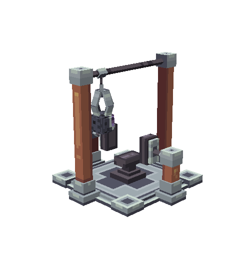
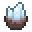
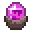
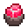
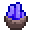
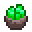
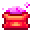

# 🛠️ Le Concasseur

### Introduction

Le concasseur est une machine pour ouvrir des géodes. En cliquant sur le concasseur une interface s'ouvre et vous permet d'y déposer vos géodes pour les concasser.\
Il s’agit d’un système **personnel**, chaque concasseur appartenant exclusivement à son propriétaire.

<figure><figcaption></figcaption></figure>

Chaque joueur peut posséder **jusqu’à 6 concasseurs**, ou **8 concasseurs** s’il dispose du statut _premium_. Disponible avec la commande <mark style="color:yellow;">**`/concasseur`**</mark>**&#x20;à partir du rang** Obsidienne II , sur votre box ou bien au spawn.

Les concasseurs peuvent être **améliorés individuellement** contre de la monnaie, à condition d’avoir concassé un certain nombre de géodes au préalable.

### Fonctionnement d’un concasseur

Le fonctionnement est simple et automatique :

* Vous placez une [**géode**](les-geodes.md) **fermée** dans un concasseur.
* Après **5 minutes**, la géode s’ouvre automatiquement.
* Vous obtenez **une géode concassé**, ainsi qu’éventuellement **une poudre**.


Chaque concassage est comptabilisé et contribue à débloquer les améliorations du concasseur concerné.



_**Il est possible que lors du concassage votre géode soit vide, alors vous n'obtiendrez rien.**_


#### _Géodes obtenues_

À chaque concassage, la géode obtenue est déterminée selon les probabilités suivantes :

* **Quartz** 
* **Améthyste** 
* **Jaspe** 
* **Azurite** 
* **Agathe** 

Certaines améliorations permettent d’augmenter les chances d’obtenir des géodes plus rares.

#### _Poudres obtenues_

En plus de la géode, vous pouvez obtenir une poudre :

* **Aucune poudre**
* **Poudre de perlimpinpin** 
* **Poudre enchantée** 

Les poudres sont indépendantes du type de géode obtenu.

## Améliorations des concasseurs

Chaque concasseur peut être amélioré séparément.\
Les améliorations nécessitent **de l’argent IG** et un **nombre minimum de géodes concassées** avec ce concasseur.

Il existe **quatre types d’améliorations**.

#### _Amélioration Doublée_

Cette amélioration augmente la probabilité de **doubler une poudre obtenue** lorsqu’une poudre apparaît.

* Niveau 1 : 18 % de chance de doubler la poudre
* Niveau 2 : 21 % de chance de doubler la poudre
* Niveau 3 : 24 % de chance de doubler la poudre
* Niveau 4 : 27 % de chance de doubler la poudre
* Niveau 5 : 30% de chance de doubler la poudre


⚠️ Le doublage ne s’applique **que si une poudre est déjà obtenue**.


#### _Amélioration Temps réduit_

Cette amélioration permet de **réduire le temps de concassage**, initialement fixé à 5 minutes.

* Niveau 1 : réduction de 16secondes
* Niveau 2 : réduction de 16secondes supplémentaire
* Niveau 3 : réduction de 16secondes supplémentaire
* Niveau 4 : réduction de 16secondes supplémentaire
* Niveau 5 : réduction de 16secondes supplémentaire

Les réductions sont cumulatives par niveau sur le temps de base.

#### _Amélioration Enchantée_

Cette amélioration augmente la probabilité d’obtenir une **poudre enchantée**.

* Niveau 1 : + 4% épique
* Niveau 2 : +2% légendaire
* Niveau 3 : +4% légendaire
* Niveau 4 : +2% mythique
* Niveau 5 : +4% mythique

Cette amélioration est essentielle pour les joueurs cherchant à produire des poudres rares.

#### _Amélioration Rareté augmentée_

Cette amélioration modifie la répartition des géodes obtenues afin d’augmenter les chances d’obtenir des **géodes rares**, tout en diminuant celles des géodes communes.

À chaque niveau, les chances de **Quartz et Améthyste diminuent**, tandis que celles de **l’Azurite et de l’Agathe augmentent**.

* Niveau 1 : 73% de reussite du concassage
* Niveau 2 : 76% de reussite du concassage
* Niveau 3 : 79% de reussite du concassage
* Niveau 4 : 82% de reussite du concassage
* Niveau 5 : 85% de reussite du concassage

Au niveau maximal, l’Agathe peut atteindre **10 %**, et l’Azurite **25 %**, rendant les concasseurs haut niveau extrêmement rentables.


Une bonne gestion de vos améliorations fera toute la différence sur la durée.

