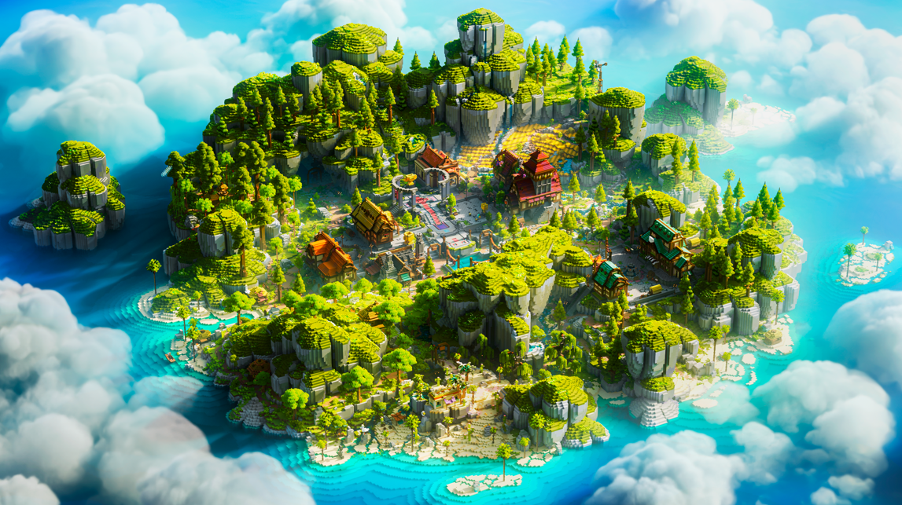
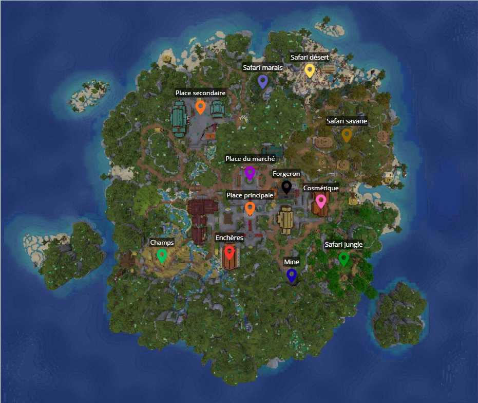

# 🌎 Le Spawn

Le spawn est un espace commun à tous les joueurs. Au centre de celui-ci, vous trouverez un portail de téléportation qui vous amènera vers votre box !

<figure><figcaption></figcaption></figure>

Au spawn, vous trouverez de nombreuses interfaces et commandes auprès des villageois, souvent postés près des bâtiments.

Vous pourrez facilement monter vos niveaux de métier : pêcheur, mineur, chasseur et fermier grâce à l'installation prévue au spawn.

#### Voici une carte des différents points au spawn :

<figure><figcaption></figcaption></figure>

Place principale et secondaire

Sur la place principale, on peut trouver l'arrivée du spawn et le portail de téléportation vers votre box. En avançant, vous trouverez la caisse de vote de couleur verte et les caisses accessibles par des récompenses ou avec la <mark style="color:yellow;">`/boutique`</mark>

Sur la place secondaire, vous retrouverez le barman

Place du marché

Sur la place du marché, vous trouverez 6 villageois qui ouvrent chacun une page du <mark style="color:yellow;">`/shop`</mark> et 1 qui propose les "offres spéciales".

Enchères

Le bâtiment des enchères est présent notamment pour l'événement en jeu (enchères) qui apparaît aléatoirement dans la journée. Un villageois vous y présente aussi l'hôtel des ventes, également accessible via le <mark style="color:yellow;">`/ah`</mark>

Zones safari (Marais, Désert, Savane, Jungle)

Dans chacune des zones Safari, vous pourrez trouver des spawners de mobs vanilla, mais aussi des apparitions aléatoires d’animaux customs. Vous pourrez facilement faire progresser votre métier de chasseur.

Forgeron

Dans la forge (<mark style="color:yellow;">`/warp forgeron`</mark>), vous trouverez le forgeron. Celui-ci vous présente l'interface pour la réparation des outils rares.

Devant le bâtiment, vous trouverez également un [concasseur](le-concasseur.md), utile pour ouvrir vos [géodes](les-geodes.md).

Champs

Dans cette zone du spawn, vous pourrez facilement pratiquer votre métier d'agriculteur grâce aux différentes cultures (blé, carotte, pomme de terre...).

Les cultures se replantent automatiquement, avec ou sans outil, et repoussent plus vite que les cultures vanilla (<mark style="color:yellow;">`/warp champs`</mark>)

Cosmétique

Dans ce bâtiment du spawn, vous aurez accès à votre inventaire de cosmétiques. Vous pourrez équiper vos différents cosmétiques et vous pavaner devant les autres joueurs avec les plus rares ! <mark style="color:yellow;">`/warp cosmetic`</mark>

Mine

La mine renferme bien des secrets et des trésors. Vous y trouverez facilement les minerais pour votre métier de mineur, mais faites attention : des monstres habitent ces cavernes et pourraient bien protéger leur butin. Pour votre vaillance, ces monstres vous feront monter votre métier de chasseur.

Beaucoup d'autres zones sont encore à découvrir au spawn ! N’hésitez pas à vous y balader tout en récupérant quelques pièces sur votre passage.

## Codex

Pour faciliter vos déplacements au spawn, nous avons créé le `/codex`. Cette interface propose différents points de téléportation vers les lieux clés. Cela vous permet de vous téléporter directement depuis votre île ou le spawn vers la zone de votre choix, rendant votre exploration plus fluide.

Vous pouvez aussi utiliser la commande <mark style="color:yellow;">`/warp [Nom]`</mark> pour vous y rendre encore plus rapidement !

<figure><figcaption></figcaption></figure>
