# 🐅 Les animaux

### Apparition 

Les animaux peuvent apparaître dans votre box en fonction du biome, ainsi qu’au spawn dans les différentes zones Safaris : [<mark style="color:yellow;">Voir plan dans la catégorie spawn</mark>](le-spawn.md)\
Certains sont exclusifs à la box ou au spawn et d’autres apparaissent sur les deux.

### Safari 

Les safaris sont des zones dédiées au spawn où les animaux, aussi bien vanilla que customs, apparaissent.\
\
Pour les mobs vanilla, des spawners sont placés au sol. Les animaux peuvent apparaître seulement autour de ceux-ci et sur un bloc d'herbe.\
\
Concernant les animaux customs, sachez qu'ils apparaissent naturellement dans des zones aléatoires.

### Liste des animaux 

Vous trouverez dans le tableau ci-dessous la liste des animaux présents sur le serveur, ainsi que leur rareté, leur biome d’apparition et leurs loots.

<mark style="color:green;">Animaux Commun</mark>

| Nom      | Biome  | Loots                     | Image                                                                   |
| -------- | ------ | ------------------------- | ----------------------------------------------------------------------- |
| Écureuil | Plaine | Glands / Familier         | 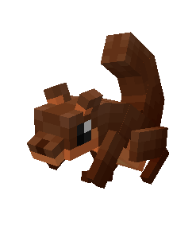 |
| Capybara | Plaine | Familier                  | 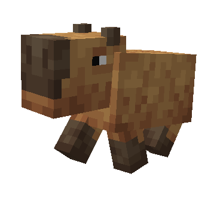 |
| Singe    | Jungle | Queue de singe / Familier | 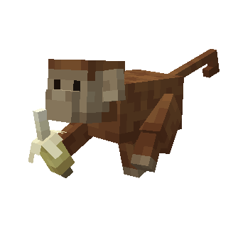    |

<mark style="color:blue;">Animaux Rare</mark>

| Nom       | Biome  | Loots               | Image                                                                    |
| --------- | ------ | ------------------- | ------------------------------------------------------------------------ |
| Bouquetin | Désert | Corne / Familier    | 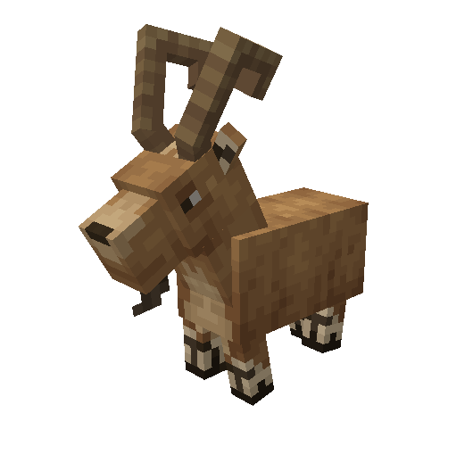 |
| Pingouin  | Neige  | Fourrure / Familier | 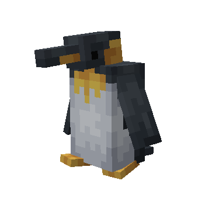  |
| Zèbre     | Savane | Peau / Familier     | 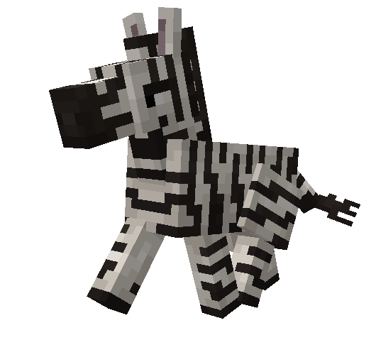     |

<mark style="color:purple;">Animaux</mark> <mark style="color:purple;">Épique</mark>

| Nom          | Biome  | Loots              |                                                                         |
| ------------ | ------ | ------------------ | ----------------------------------------------------------------------- |
| Serpent      | Désert | Écaille / Familier | 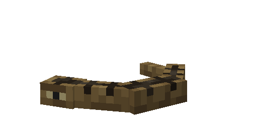 |
| Bison        | Neige  | Cuir / Familier    |     |
| Flamant rose | Marais | Plume / Familier   | 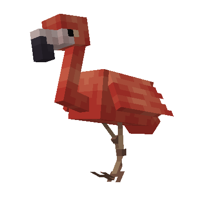 |

<mark style="color:orange;">Animaux Légendaire</mark>

| Nom       | Biome  | Loots               |                                                                          |
| --------- | ------ | ------------------- | ------------------------------------------------------------------------ |
| Lion      | Savane | Fourrure / Familier | 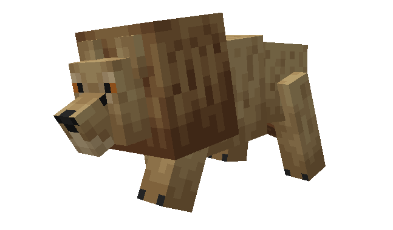      |
| Tigre     | Jungle | Dent / Familier     |      |
| Alligator | Marais | Dent / Familier     | 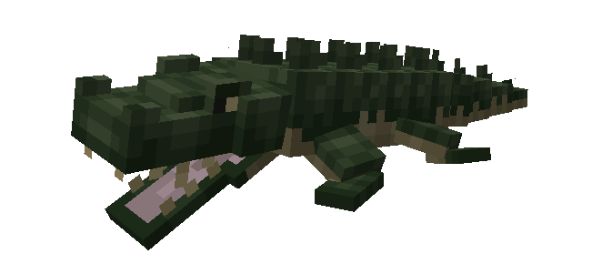 |

<mark style="color:red;">Animaux Mythique</mark>

| Nom        | Biome  | Loots                     |                                                                         |
| ---------- | ------ | ------------------------- | ----------------------------------------------------------------------- |
| Méduse     | Marais | Cœur de méduse / Familier | 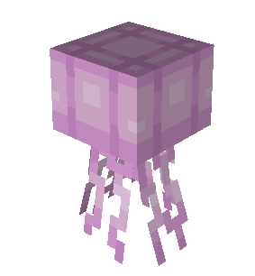 |
| Rhinocéros | Savane | Corne / Familier          |     |
| Éléphant   | Savane | Défense / Familier        |  |

Pour chaque animal, vous avez une chance de drop un œuf de familier. Vous pourrez tenter de faire éclore cet œuf afin d'obtenir le familier de l'animal en question (qu'il s'agisse d'un familier normal ou d'un shiny)

Pour mieux comprendre les familiers, vous pouvez trouver plus d'explications dans la catégorie [<mark style="color:yellow;">Les familiers</mark>](les-familiers.md)
