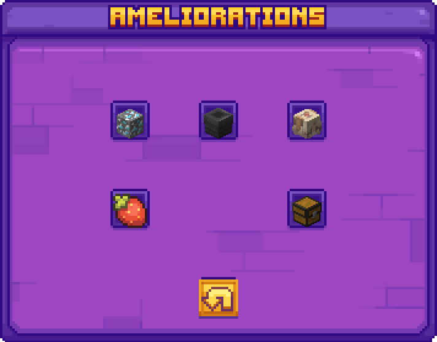

# 🔼 Liste des menus de Box

## <mark style="color:yellow;">/box upgrade</mark>

Tu peux améliorer divers aspects de ta box, indépendamment de sa taille, en payant avec des coin. Les améliorations peuvent être effectuées jusqu'à cinq fois pour atteindre la limite maximale.

Grâce à ces améliorations, tu pourras personnaliser et optimiser ta box pour mieux répondre à tes besoins et objectifs dans le jeu !

Voici les différentes améliorations possibles :

<figure><figcaption>
<strong>Aperçu du </strong><mark style="color:yellow;"><strong><code>/box upgrade</code></strong></mark>
</figcaption></figure>

### <mark style="color:yellow;">N</mark><mark style="color:yellow;">**ombre de membres sur ta box**</mark>

* <mark style="color:yellow;">**De base**</mark> : 4 membres
* <mark style="color:yellow;">**Amélioration**</mark> : Jusqu'à 10 membres

### <mark style="color:yellow;">C</mark><mark style="color:yellow;">**offre de ta box**</mark>

* <mark style="color:yellow;">**De base**</mark> : 1 ligne de stockage
* <mark style="color:yellow;">**Amélioration**</mark> : Jusqu'à 3 double coffres

### <mark style="color:yellow;">Gé</mark><mark style="color:yellow;">**nérateur de minerais**</mark>

* Permet d'augmenter la <mark style="color:yellow;">**production de minerais**</mark> dans ta box grâce au générateur à stone de Minecraft (lave + eau). La stone se transforme en minerai au moment de la génération suivant les pourcentages dans le /upgrade.

<figure><figcaption>
amélioration max du générateur
</figcaption></figure>

### <mark style="color:yellow;">L</mark><mark style="color:yellow;">**imite d’entonnoirs**</mark>

* <mark style="color:yellow;">**De base**</mark> : 16 entonnoirs
* <mark style="color:yellow;">**Amélioration**</mark> : Jusqu'à 256 entonnoirs


Il y a aussi une limite qui est dépendante du chunk et qui n'est pas améliorable /limite


### <mark style="color:yellow;">Accélération de la pousse</mark>

* <mark style="color:yellow;">**De base**</mark> : +0.10%
* <mark style="color:yellow;">**Amélioration**</mark> : Jusqu'à 50%

## <mark style="color:yellow;">/limite</mark>

<figure><figcaption></figcaption></figure>

Les limites sont pour un chunk si vous dépassez cette limite, vous ne pourrez plus poser l'objet en question.

| Objets        | Limites | Objets                | Limites |
| ------------- | ------- | --------------------- | ------- |
| Enclumes      | 10      | Pistons               | 80      |
| Stockages     | 512     | Redstones             | 700     |
| Entonnoirs    | 32      | Générateurs           | 12      |
| Porte armures | 10      | Table d'enchantements | 10      |
| Observateurs  | 15      | Cadres                | 100     |

### <mark style="color:yellow;">/box bank</mark>

<figure><figcaption></figcaption></figure>

La commande `/box bank` vous permet de gérer votre argent de manière simple et sécurisée. Vous pouvez y déposer ou retirer de l'argent en fonction de vos besoins.

**Utilisation :**

* **Pour déposer de l'argent :**
  * Tapez `/box deposit [montant]` dans le chat.
  * Exemple : `/box deposit 500` dépose 500 unités d'argent dans la box.
* **Pour retirer de l'argent :**
  * Tapez `/box withdraw [montant]` dans le chat.
  * Exemple : `/box withdraw 300` retire 300 unités d'argent de la box.

**Exemples de commandes :**

* Déposer 200 unités d'argent : `/box deposit 200`
* Retirer 150 unités d'argent : `/box withdraw 150`

**Remarques :**

* Assurez-vous d'avoir le montant disponible avant de retirer.
* Le montant doit être spécifié en unités entières.

Gérez vos finances en toute simplicité avec la commande `/box bank` !
