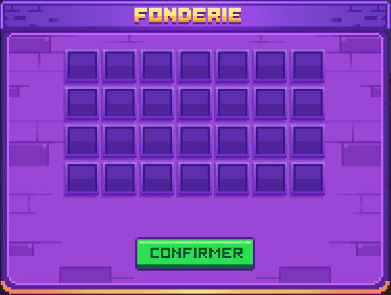

# 🔼 Amélioration de Box

Tu peux améliorer divers aspects de ta box, indépendamment de sa taille, en payant avec des yuzus. Les améliorations peuvent être effectuées jusqu'à cinq fois pour atteindre la limite maximale.&#x20;

Tu peux retrouver le prix de ces améliorations dans le <mark style="color:yellow;">**`/box upgrade`**</mark>.

Voici les différentes améliorations possibles :&#x20;

<figure><figcaption>
<strong>Aperçu du </strong><mark style="color:yellow;"><strong><code>/box upgrade</code></strong></mark>
</figcaption></figure>

### <mark style="color:yellow;">N</mark><mark style="color:yellow;">**ombre de membres sur ta box**</mark>

* <mark style="color:yellow;">**De base**</mark> : 4 membres
* <mark style="color:yellow;">**Amélioration**</mark> : Jusqu'à 8 membres
* <mark style="color:yellow;">**Bonus**</mark> : 10 membres pour 500 gemmes

### <mark style="color:yellow;">C</mark><mark style="color:yellow;">**offre de ta box**</mark>

* <mark style="color:yellow;">**De base**</mark> : 1 ligne de stockage
* <mark style="color:yellow;">**Amélioration**</mark> : Jusqu'à 3 double coffres

### <mark style="color:yellow;">Gé</mark><mark style="color:yellow;">**nérateur de minerais**</mark>

* Permet d'augmenter la <mark style="color:yellow;">**production de minerais**</mark> dans ta box.

<figure><figcaption>
<strong>Aperçu du </strong><mark style="color:yellow;"><strong><code>/gen</code></strong></mark>
</figcaption></figure>

### <mark style="color:yellow;">L</mark><mark style="color:yellow;">**imite d’entonnoirs**</mark>

* <mark style="color:yellow;">**De base**</mark> : 16 entonnoirs
* <mark style="color:yellow;">**Amélioration**</mark> : Jusqu'à 256 entonnoirs

### <mark style="color:yellow;">No</mark><mark style="color:yellow;">**mbre de villageois sur ta box**</mark>

* <mark style="color:yellow;">**De base**</mark> : 2 villageois
* <mark style="color:yellow;">**Amélioration**</mark> : Jusqu'à 16 villageois

### <mark style="color:yellow;">Ac</mark><mark style="color:yellow;">**cès au Nether**</mark>

* Déblocable en complétant des <mark style="color:yellow;">**quêtes**</mark> pour l’amélioration de la taille de ta box.


Grâce à ces améliorations, tu pourras personnaliser et optimiser ta box pour mieux répondre à tes besoins et objectifs dans le jeu !

