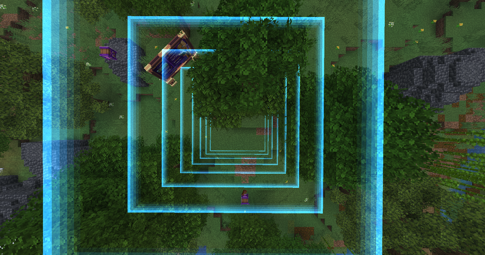
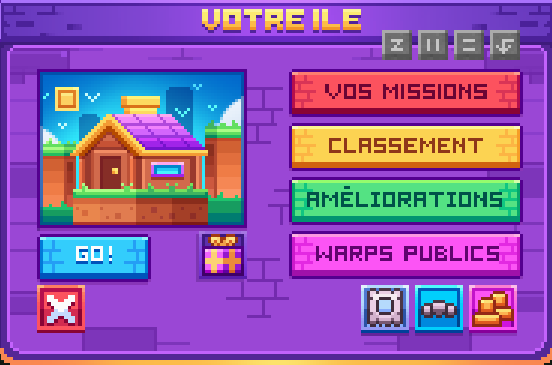

# 📦 Les Boxs

### I**ntroduction**

La box est l’un des éléments centraux de Blocaria. Elle constitue l’espace principal dédié à votre aventure. Votre box est votre espace pour créer et vous amuser, seul ou avec vos amis.

### Les boxs, c'est quoi?

* Le mode de jeu Boxed vous fait arriver sur votre île entourée d'une bordure. Pour agrandir celle-ci, il vous faudra réaliser les missions disponibles au <mark style="color:yellow;">`/mission`</mark>. Chaque mission validée augmentera votre box d'un bloc. Ces missions sont communes à tous les membres d'une même box
* La taille maximale de votre box est de 400x400 blocs
* Création de la box : Utilisez la commande <mark style="color:yellow;">`/box create <nom>`</mark> pour créer votre box.
* Une fois votre box créée, vous apparaîtrez dans une zone de 4x4 blocs.

<figure><figcaption></figcaption></figure>

Vous pouvez ouvrir le menu de votre box grâce à la commande <mark style="color:yellow;">`/box`</mark>. Dans ce menu, vous retrouverez toutes les informations importantes pour gérer votre box.

<figure><figcaption></figcaption></figure>

### Les missions

La box peut être améliorée au fil de votre progression, notamment par l’augmentation de sa taille via les missions de box, accessibles avec la commande <mark style="color:yellow;">`/mission`</mark>.

<table data-header-hidden data-full-width="false"><thead><tr><th width="137.566650390625">Catégorie</th><th width="586.9832763671875">Description</th></tr></thead><tbody><tr><td><mark style="color:$success;"><strong>Très Facile</strong></mark></td><td>Ces missions, basées sur les succès vanilla, vous introduisent aux mécaniques de base du serveur. Elles facilitent votre démarrage grâce à des récompenses utiles et une progression rapide</td></tr><tr><td><mark style="color:green;"><strong>Facile</strong></mark></td><td>Ces missions sont axées sur la découverte des métiers, des mécaniques et des shops. Elles vous accompagnent durant votre phase d’installation et marquent la fin de votre tutoriel</td></tr><tr><td><mark style="color:yellow;"><strong>Moyen</strong></mark></td><td>Dernière catégorie guidée, elle est centrée sur la mise en place de vos premières fermes, l’organisation de votre stockage et l’obtention d’un équipement adapté.</td></tr><tr><td><mark style="color:orange;"><strong>Difficile</strong></mark></td><td>Ces missions, plus ouvertes et variées, vous offrent davantage de liberté et contribuent principalement à votre progression globale.</td></tr><tr><td><mark style="color:$danger;"><strong>Très Difficile</strong></mark></td><td>Ces missions sont plus exigeantes en investissement. Elles sont orientées vers des objectifs secondaires et introduisent l’aspect compétitif du serveur.</td></tr><tr><td><mark style="color:purple;"><strong>Abominable</strong></mark></td><td>Ces missions de grande ampleur nécessitent une forte coopération au sein de votre box. Elles incluent des objectifs intensifs et atypiques qui mettront votre esprit d'équipe à l'épreuve.</td></tr></tbody></table>

<figure><figcaption></figcaption></figure>

### Missions : Catégorie Ultime

Les missions de catégorie ultime deviennent disponibles une fois la catégorie Abominable du <mark style="color:yellow;">`/mission`</mark> complétée.\
Elles vous permettent de gagner des points de box et se renouvellent chaque semaine.

Chaque semaine, une même box peut accomplir jusqu’à six missions, chacune appartenant à une catégorie différente, sur le même principe que les missions journalières.

### Missions de box journalières

Les **missions de box journalières** se renouvellent chaque jour et peuvent être complétées **jusqu’à 6 fois par jour**.\
Les objectifs sont **communs à tous les joueurs d’une même box** et progressent grâce aux actions de l’ensemble de ses membres.

Trois emplacements de missions sont disponibles simultanément. Chaque mission complétée **révèle une nouvelle mission**.\
Il est possible de **renouveler une mission** : la première fois est gratuite, vous aurez la possibilité de les passer avec des gemmes.

<figure><figcaption></figcaption></figure>

Les missions journalières sont **réinitialisées lors d’un changement de catégorie de difficulté**.

### Inviter un ami sur ma box

À la création de votre box, vous aurez la possibilité d'inviter deux amis à vous rejoindre. Vous pourrez facilement augmenter cette limite via le menu <mark style="color:yellow;">`/box upgrade`</mark> .

Pour l'inviter, il vous suffira d'utiliser la commande <mark style="color:yellow;">`/box invite [pseudo]`</mark>.

### Pack de textures

Le serveur fonctionne avec un pack de textures, il est obligatoire pour pouvoir jouer convenablement. Il se télécharge automatiquement à votre arrivée sur le serveur. Si ce n'est pas le cas, merci de suivre l'ordre ci-dessous.

* Sélectionnez le serveur : Dans votre liste de serveurs Minecraft, cliquez une fois sur Blocaria.
* Paramètres de connexion : Cliquez sur le bouton **Modifier** en bas de votre écran.
* Activation du Pack : Repérez l'option **packs de ressources**.
* Validation : Cliquez sur le bouton jusqu'à obtenir l'état **Activé**.
* Finalisation : Cliquez sur Terminé, puis **reconnectez-vous** au serveur.

### **Biomes customisés**

* Le système de biomes customisés vous permettra de récupérer de nouvelles ressources, essentielles à votre progression sur le serveur. La box que vous avez créée se situe au centre de la carte ci-dessous.
* Plus vous accomplissez de missions coopératives (/missions), plus la taille de votre box s'étend, vous permettant ainsi d'accéder aux différents biomes disponibles.
* Lors de la création de votre box, vous apparaîtrez dans un biome ressemblant à une plaine, mais enrichi en arbres, avec de nouveaux mobs disponibles. Ces nouveaux mobs dépendent du biome de spawn, comme par exemple :
  * Le tigre dans la savane
  * Le crocodile dans le marais 
* Grâce à ces drops personnalisés, vous découvrirez dès le début que le serveur offre de nouveaux objets vendables au <kbd><mark style="color:yellow;">/shop<mark style="color:yellow;"></kbd>.
* Allez découvrir les différents animaux et objets que vous pouvez obtenir dans la sous-catégorie "[Les animaux](les-animaux.md)".

### Amélioration de box

* Les améliorations de la box permettent d’augmenter certaines limites de votre box. Vous pourrez y accéder avec le <kbd><mark style="color:yellow;">/box upgrade<mark style="color:yellow;"></kbd>
* Toutes les améliorations de votre box sont financées par la monnaie principale du mode de jeu et tous les membres de votre équipe peuvent accéder à l'amélioration de leur box.

<figure><figcaption></figcaption></figure>
