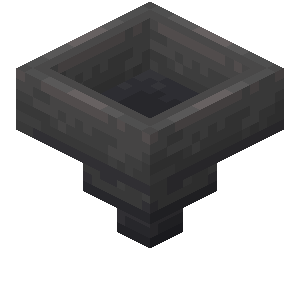
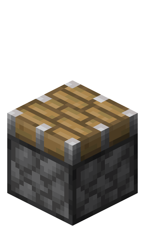
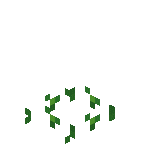
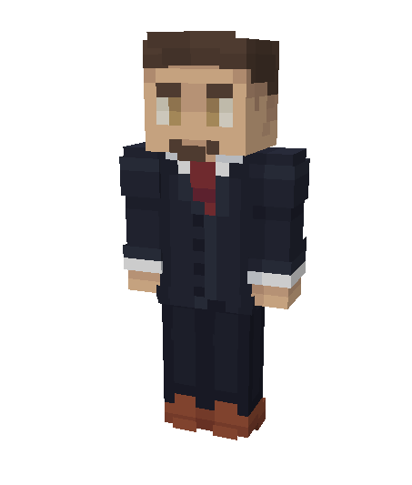
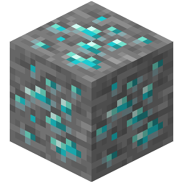
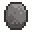
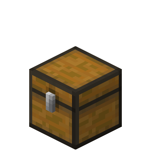
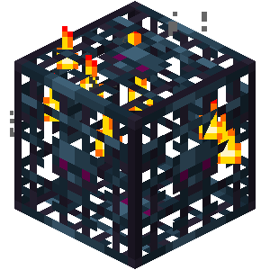

# 📦 Les Boxs

### I**ntroduction**

La box est l’un des éléments centraux de Blocaria. Elle constitue l’espace principal dédié à votre aventure. Votre box est votre espace pour créer et vous amuser, seul ou avec vos amis.

### Les boxs, c'est quoi?

* Le mode de jeu Boxed vous fait arriver sur votre île entourée d'une bordure. Pour agrandir celle-ci, il vous faudra réaliser les missions disponibles au <mark style="color:yellow;">`/mission`</mark>. Chaque mission validée augmentera votre box d'un bloc. Ces missions sont communes à tous les membres d'une même box
* La taille maximale de votre box est de 400x400 blocs
* Création de la box : Utilisez la commande <mark style="color:yellow;">`/box create <nom>`</mark> pour créer votre box.
* Une fois votre box créée, vous apparaîtrez dans une zone de 4x4 blocs.

<figure><figcaption></figcaption></figure>

Vous pouvez ouvrir le menu de votre box grâce à la commande <mark style="color:yellow;">`/box`</mark>. Dans ce menu, vous retrouverez toutes les informations importantes pour gérer votre box.

<figure><figcaption></figcaption></figure>

### Les missions

La box peut être améliorée au fil de votre progression, notamment par l’augmentation de sa taille via les missions de box, accessibles avec la commande <mark style="color:yellow;">`/mission`</mark>.

<table data-header-hidden data-full-width="false"><thead><tr><th width="137.566650390625">Catégorie</th><th width="586.9832763671875">Description</th></tr></thead><tbody><tr><td><mark style="color:$success;"><strong>Très Facile</strong></mark></td><td>Ces missions, basées sur les succès vanilla, vous introduisent aux mécaniques de base du serveur. Elles facilitent votre démarrage grâce à des récompenses utiles et une progression rapide</td></tr><tr><td><mark style="color:green;"><strong>Facile</strong></mark></td><td>Ces missions sont axées sur la découverte des métiers, des mécaniques et des shops. Elles vous accompagnent durant votre phase d’installation et marquent la fin de votre tutoriel</td></tr><tr><td><mark style="color:yellow;"><strong>Moyen</strong></mark></td><td>Dernière catégorie guidée, elle est centrée sur la mise en place de vos premières fermes, l’organisation de votre stockage et l’obtention d’un équipement adapté.</td></tr><tr><td><mark style="color:orange;"><strong>Difficile</strong></mark></td><td>Ces missions, plus ouvertes et variées, vous offrent davantage de liberté et contribuent principalement à votre progression globale.</td></tr><tr><td><mark style="color:$danger;"><strong>Très Difficile</strong></mark></td><td>Ces missions sont plus exigeantes en investissement. Elles sont orientées vers des objectifs secondaires et introduisent l’aspect compétitif du serveur.</td></tr><tr><td><mark style="color:purple;"><strong>Abominable</strong></mark></td><td>Ces missions de grande ampleur nécessitent une forte coopération au sein de votre box. Elles incluent des objectifs intensifs et atypiques qui mettront votre esprit d'équipe à l'épreuve.</td></tr></tbody></table>

<figure><figcaption></figcaption></figure>

### Missions : Catégorie Ultime

Les missions de catégorie ultime deviennent disponibles une fois la catégorie Abominable du <mark style="color:yellow;">`/mission`</mark> complétée.\
Elles vous permettent de gagner des points de box et se renouvellent chaque semaine.

Chaque semaine, une même box peut accomplir jusqu’à six missions, chacune appartenant à une catégorie différente, sur le même principe que les missions journalières.

### Missions de box journalières

Les **missions de box journalières** se renouvellent chaque jour et peuvent être complétées **jusqu’à 6 fois par jour**.\
Les objectifs sont **communs à tous les joueurs d’une même box** et progressent grâce aux actions de l’ensemble de ses membres.

Trois emplacements de missions sont disponibles simultanément. Chaque mission complétée **révèle une nouvelle mission**.\
Il est possible de **renouveler une mission** : la première fois est gratuite, vous aurez la possibilité de les passer avec des gemmes.

<figure><figcaption></figcaption></figure>

Les missions journalières sont **réinitialisées lors d’un changement de catégorie de difficulté**.

### Inviter un ami sur ma box

À la création de votre box, vous aurez la possibilité d'inviter deux amis à vous rejoindre. Vous pourrez facilement augmenter cette limite via le menu <mark style="color:yellow;">`/box upgrade`</mark> .

Pour l'inviter, il vous suffira d'utiliser la commande <mark style="color:yellow;">`/box invite [pseudo]`</mark>.

### Pack de textures

Le serveur fonctionne avec un pack de textures, il est obligatoire pour pouvoir jouer convenablement. Il se télécharge automatiquement à votre arrivée sur le serveur. Si ce n'est pas le cas, merci de suivre l'ordre ci-dessous.

* Sélectionnez le serveur : Dans votre liste de serveurs Minecraft, cliquez une fois sur Blocaria.
* Paramètres de connexion : Cliquez sur le bouton **Modifier** en bas de votre écran.
* Activation du Pack : Repérez l'option **packs de ressources**.
* Validation : Cliquez sur le bouton jusqu'à obtenir l'état **Activé**.
* Finalisation : Cliquez sur Terminé, puis **reconnectez-vous** au serveur.

### **Biomes customisés**

* Le système de biomes customisés vous permettra de récupérer de nouvelles ressources, essentielles à votre progression sur le serveur. La box que vous avez créée se situe au centre de la carte ci-dessous.
* Plus vous accomplissez de missions coopératives (/missions), plus la taille de votre box s'étend, vous permettant ainsi d'accéder aux différents biomes disponibles.
* Lors de la création de votre box, vous apparaîtrez dans un biome ressemblant à une plaine, mais enrichi en arbres, avec de nouveaux mobs disponibles. Ces nouveaux mobs dépendent du biome de spawn, comme par exemple :
  * Le tigre dans la savane
  * Le crocodile dans le marais 
* Grâce à ces drops personnalisés, vous découvrirez dès le début que le serveur offre de nouveaux objets vendables au <kbd><mark style="color:yellow;">/shop<mark style="color:yellow;"></kbd>.
* Allez découvrir les différents animaux et objets que vous pouvez obtenir dans la sous-catégorie "[Les animaux](les-animaux.md)".

### Amélioration de box

* Les améliorations de la box permettent d’augmenter certaines limites de votre box. Vous pourrez y accéder avec le <kbd><mark style="color:yellow;">/box upgrade<mark style="color:yellow;"></kbd>
* Toutes les améliorations de votre box sont financées par la monnaie principale du mode de jeu et tous les membres de votre équipe peuvent accéder à l'amélioration de leur box.

<figure><figcaption></figcaption></figure>

Limite d’entonnoirs

La limite à la création de votre box est de 64 et pourra atteindre un maximum de 512.

Chaque amélioration vous coûtera de l'argent ainsi que des ressources, voici un tableau détaillé des améliorations possibles et du coût :

<figure><figcaption></figcaption></figure>

<table><thead><tr><th width="190">Limite</th><th width="240">Prix</th><th width="240">Ressources</th></tr></thead><tbody><tr><td>64 Entonnoirs</td><td>N/A</td><td>N/A</td></tr><tr><td>96 Entonnoirs</td><td>250.000 </td><td>64 lingots de fer </td></tr><tr><td>128 Entonnoirs</td><td>1.000.000 </td><td>16 Blocs de fer </td></tr><tr><td>196 Entonnoirs</td><td>2.500.000 </td><td>64 Blocs de fer </td></tr><tr><td>256 Entonnoirs</td><td>5.000.000 </td><td>128 Blocs de fer </td></tr><tr><td>320 Entonnoirs</td><td>10.000.000 </td><td>256 Blocs de fer </td></tr><tr><td>384 Entonnoirs</td><td>25.000.000 </td><td>512 Blocs de fer </td></tr><tr><td>512 Entonnoirs</td><td>50.000.000 </td><td>1.024 Blocs de fer </td></tr></tbody></table>

Limite Pistons

La limite à la création de votre box est de 64 et pourra atteindre un maximum de 512.

Chaque amélioration vous coûtera de l'argent ainsi que des ressources, voici un tableau détaillé des améliorations possibles et du coût :

<figure><figcaption></figcaption></figure>

<table><thead><tr><th width="190">Limite</th><th width="221.25">Prix</th><th width="262.5">Ressources</th></tr></thead><tbody><tr><td>64 Pistons</td><td>N/A</td><td>N/A</td></tr><tr><td>96 Pistons</td><td>250.000 </td><td>128 poudres de redstone </td></tr><tr><td>128 Pistons</td><td>1.000.000 </td><td>32 Blocs de redstone </td></tr><tr><td>196 Pistons</td><td>2.500.000 </td><td>128 Blocs de redstone </td></tr><tr><td>256 Pistons</td><td>5.000.000 </td><td>256 Blocs de redstone </td></tr><tr><td>320 Pistons</td><td>10.000.000 </td><td>512 Blocs de redstone </td></tr><tr><td>384 Pistons</td><td>25.000.000 </td><td>1.024 Blocs de redstone </td></tr><tr><td>512 Pistons</td><td>50.000.000 </td><td>2.048 Blocs de redstone </td></tr></tbody></table>

Vitesse de pousse des cultures

La limite de vitesse de pousse à la création de votre box est de +0 % (vitesse vanilla) et pourra atteindre un maximum de +15 %.\
Cette amélioration concerne seulement les cultures vanilla.

Chaque amélioration vous coûtera de l'argent ainsi que des ressources, voici un tableau détaillé des améliorations possibles et du coût :

<figure><figcaption></figcaption></figure>

<table><thead><tr><th width="190">Vitesse</th><th width="221.25">Prix</th><th width="262.5">Ressources</th></tr></thead><tbody><tr><td>+ 0 % de vitesse</td><td>N/A</td><td>N/A</td></tr><tr><td>+ 2,5 % de vitesse</td><td>1.000.000 </td><td>16 Sacs de compost </td></tr><tr><td>+ 5 % de vitesse</td><td>2.500.000 </td><td>64 Sacs de compost </td></tr><tr><td>+ 7,5 % de vitesse</td><td>2.500.000 </td><td>128 Sacs de compost </td></tr><tr><td>+ 10 % de vitesse</td><td>10.000.000 </td><td>256 Sacs de compost </td></tr><tr><td>+ 15 % de vitesse</td><td>25.000.000 </td><td>512 Sacs de compost </td></tr></tbody></table>

Limite de membres

La limite de membres à la création de votre box est de 3 et pourra atteindre un maximum de 10.

Chaque amélioration vous coûtera de l'argent, voici un tableau détaillé des améliorations possibles et du coût :

<figure><figcaption></figcaption></figure>

<table><thead><tr><th width="340">Limite</th><th width="340.25">Prix</th></tr></thead><tbody><tr><td>3 Membres</td><td>N/A</td></tr><tr><td>4 Membres</td><td>0 </td></tr><tr><td>5 Membres</td><td>250.000 </td></tr><tr><td>6 Membres</td><td>1.000.000 </td></tr><tr><td>7 Membres</td><td>2.500.000 </td></tr><tr><td>8 Membres</td><td>5.000.000 </td></tr><tr><td>10 Membres</td><td>10.000.000 </td></tr></tbody></table>

Nombre de coffre de box

La limite de pages de coffre à la création de votre box est de 1 et pourra atteindre un maximum de 9.

Chaque amélioration vous coûtera de l'argent ainsi que des niveaux de box, voici un tableau détaillé des améliorations possibles et du coût :

<figure><figcaption></figcaption></figure>

<table><thead><tr><th width="190">Limite</th><th width="221.25">Prix</th><th width="262.5">Prérequis</th></tr></thead><tbody><tr><td>1 Coffre</td><td>N/A</td><td>N/A</td></tr><tr><td>2 Coffres</td><td>250.000 </td><td>N/A</td></tr><tr><td>3 Coffres</td><td>500.000 </td><td>5.000 Niveaux de box 🏆</td></tr><tr><td>4 Coffres</td><td>1.250.000 </td><td>10.000 Niveaux de box 🏆</td></tr><tr><td>5 Coffres</td><td>2.500.000 </td><td>25.000 Niveaux de box 🏆</td></tr><tr><td>6 Coffres</td><td>5.000.000 </td><td>50.000 Niveaux de box 🏆</td></tr><tr><td>7 Coffres</td><td>12.500.000 </td><td>75.000 Niveaux de box 🏆</td></tr><tr><td>9 Coffres</td><td>25.000.000 </td><td>100.000 Niveaux de box 🏆</td></tr></tbody></table>

Amélioration générateur de minerais

Augmente la fréquence d'apparition des minéraux dans votre générateur. Il permet aussi de générer de nouveaux minéraux à chaque amélioration

Chaque amélioration vous coûtera de l'argent ainsi que des resssource, voici un tableau détaillé des améliorations possibles et du coût :

<figure><figcaption></figcaption></figure>

<table><thead><tr><th width="95">Niveau</th><th width="308.25">Ressources présentes</th><th width="133.25">Prix</th><th width="147.5">Ressources</th></tr></thead><tbody><tr><td>1</td><td><ul><li>Roche (90%)</li><li>Minerais de charbon (5%)</li><li>Minerais de cuivre (3%)</li><li>Minerais de fer (2%)</li></ul></td><td>N/A</td><td>N/A</td></tr><tr><td>2</td><td><ul><li>Roche (85%)</li><li>Minerais de charbon (6%)</li><li>Minerais de cuivre (4%)</li><li>Minerais de fer (3%)</li><li>Minerais d'or (2%)</li></ul></td><td>500.000 </td><td>2 Géodes </td></tr><tr><td>3</td><td><ul><li>Roche (80%)</li><li>Minerais de charbon (7%)</li><li>Minerais de cuivre (5%)</li><li>Minerais de fer (4%)</li><li>Minerais d'or (3%)</li><li>Minerais de lapis (1%)</li></ul></td><td>1.000.000 </td><td>8 Géodes </td></tr><tr><td>4</td><td><ul><li>Roche (75%)</li><li>Minerais de charbon (8%)</li><li>Minerais de cuivre (5.5%)</li><li>Minerais de fer (4.5%)</li><li>Minerais d'or (3.5%)</li><li>Minerais de lapis (2%)</li><li>Minerais de redstone (1,5%)</li></ul></td><td>2.500.000 </td><td>32 Géodes </td></tr><tr><td>5</td><td><ul><li>Roche (70%)</li><li>Minerais de charbon (9%)</li><li>Minerais de cuivre (6%)</li><li>Minerais de fer (5%)</li><li>Minerais d'or (4%)</li><li>Minerais de lapis (2.5%)</li><li>Minerais de redstone (2%)</li><li>Minerais de diamant (1.5%)</li></ul></td><td>5.000.000 </td><td>64 Géodes </td></tr><tr><td>6</td><td><ul><li>Roche (65%)</li><li>Minerais de charbon (9.5%)</li><li>Minerais de cuivre (6.5%)</li><li>Minerais de fer (5.5%)</li><li>Minerais d'or (4.5%)</li><li>Minerais de lapis (3%)</li><li>Minerais de redstone (2.5%)</li><li>Minerais de diamant (2%)</li><li>Minerais d'émeraude (1.5%)</li></ul></td><td>10.000.000 </td><td>128 Géodes </td></tr><tr><td>7</td><td><ul><li>Roche (60%)</li><li>Minerais de charbon (9.5%)</li><li>Minerais de cuivre (7.5%)</li><li>Minerais de fer (6.25%)</li><li>Minerais d'or (5.25%)</li><li>Minerais de lapis (3.5%)</li><li>Minerais de redstone (3%)</li><li>Minerais de diamant (2.5%)</li><li>Minerais d'émeraude (2%)</li><li>Minerais de quartz (0.25%)</li></ul></td><td>25.000.000 </td><td>256 Géodes </td></tr><tr><td>8</td><td><ul><li>Roche (55%)</li><li>Minerais de charbon (10%)</li><li>Minerais de cuivre (7.75%)</li><li>Minerais de fer (7%)</li><li>Minerais d'or (6%)</li><li>Minerais de lapis (4.5%)</li><li>Minerais de redstone (3.5%)</li><li>Minerais de diamant (3%)</li><li>Minerais d'émeraude (2.5%)</li><li>Minerais de quartz (1%)</li><li>Débris antiques (0.25%)</li></ul></td><td>50.000.000 </td><td>512 Géodes </td></tr></tbody></table>

Limite de coffres

La limite est de 75 coffres à la création de votre box et peut atteindre un maximum de 1 000.\
\
À noter que les doubles coffres comptent pour 2 coffres dans cette limite.

Chaque amélioration vous coûtera de l'argent ainsi que des prérequis, voici un tableau détaillé des améliorations possibles et du coût :

<figure><figcaption></figcaption></figure>

<table><thead><tr><th width="190">Limite</th><th width="221.25">Prix</th><th width="262.5">Prérequis</th></tr></thead><tbody><tr><td>75 Coffres</td><td>N/A</td><td>N/A</td></tr><tr><td>125 Coffres</td><td>250.000 </td><td>N/A</td></tr><tr><td>175 Coffres</td><td>1.000.000 </td><td>Terminer les missions très facile 🎯</td></tr><tr><td>250 Coffres</td><td>2.500.000 </td><td>Terminer les missions facile 🎯</td></tr><tr><td>350 Coffres</td><td>5.000.000 </td><td>Terminer les missions moyennes 🎯</td></tr><tr><td>500 Coffres</td><td>10.000.000 </td><td>Terminer les missions difficiles 🎯</td></tr><tr><td>750 Coffres</td><td>25.500.000 </td><td>Terminer les missions très difficiles 🎯</td></tr><tr><td>1000 Coffres</td><td>50.000.000 </td><td>Terminer les missions abominables 🎯</td></tr></tbody></table>

Limite de spawners

La limite de spawners est de 5 à la création de votre box et peut atteindre un maximum de 15.

Chaque amélioration vous coûtera de l'argent ainsi que des prérequis, voici un tableau détaillé des améliorations possibles et du coût :

<figure><figcaption></figcaption></figure>

<table><thead><tr><th width="190">Limite</th><th width="221.25">Prix</th><th width="262.5">Ressources</th></tr></thead><tbody><tr><td>5 spawners</td><td>N/A</td><td>N/A</td></tr><tr><td>7 spawners</td><td>1.000.000 </td><td>1 âme </td></tr><tr><td>9 spawners</td><td>2.500.000 </td><td>3 âmes </td></tr><tr><td>11 spawners</td><td>5.000.000 </td><td>5 âmes </td></tr><tr><td>13 spawners</td><td>10.000.000 </td><td>10 âmes</td></tr><tr><td>15 spawners</td><td>25.000.000 </td><td>25 âmes </td></tr></tbody></table>

