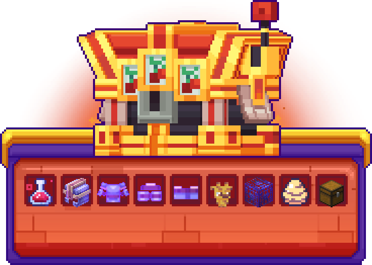

# 🎁 Les Caisses

Pour ajouter un aspect aléatoire à votre aventure, des caisses sont disponibles sur Blocaria. Certaines sont disponibles de manière permanente tandis que d'autres ne sont qu'éphémères.

Pour ouvrir ces caisses, vous devrez vous rendre, muni d'une clé, au <mark style="color:yellow;">**`/spawn`**</mark>. Les caisses se trouveront alors en face de vous.

Il existe différents moyens d'obtenir des clés : en les achetant dans la boutique avec des Gemmes, en votant pour le serveur, ou encore en les gagnant dans les events.

## <mark style="color:green;">Caisse Vote</mark>

La clé de la Caisse Vote s'obtient en votant pour le serveur avec la commande <mark style="color:green;">**`/vote`**</mark>.

<figure><figcaption>
<strong>Aperçu de la Caisse Vote</strong>
</figcaption></figure>

<table>
    <thead>
        <tr>
            <th width="437">Récompense</th>
            <th>Chance</th>
        </tr>
    </thead>
    <tbody>
        <tr>
            <td><mark style="color:green;"><strong>Bloc de terre</strong></mark> (x32)</td>
            <td><mark style="color:green;"><strong>15%</strong></mark></td>
        </tr>
        <tr>
            <td><mark style="color:yellow;"><strong>25.000</strong></mark>💰</td>
            <td><mark style="color:yellow;"><strong>15%</strong></mark></td>
        </tr>
        <tr>
            <td><mark style="color:green;"><strong>Shulker verte</strong></mark> (x1)</td>
            <td><mark style="color:green;"><strong>7%</strong></mark></td>
        </tr>
        <tr>
            <td><mark style="color:green;"><strong>Diamant</strong></mark> (x12)</td>
            <td><mark style="color:green;"><strong>6%</strong></mark></td>
        </tr>
        <tr>
            <td><mark style="color:green;"><strong>Fragment de netherite</strong></mark> (x2)</td>
            <td><mark style="color:green;"><strong>6%</strong></mark></td>
        </tr>
        <tr>
            <td><mark style="color:green;"><strong>2500 XP</strong></mark></td>
            <td><mark style="color:green;"><strong>6%</strong></mark></td>
        </tr>
        <tr>
            <td><mark style="color:blue;"><strong>Boost Métier</strong></mark> (x1)</td>
            <td><mark style="color:blue;"><strong>5%</strong></mark></td>
        </tr>
        <tr>
            <td><mark style="color:yellow;"><strong>50.000</strong></mark>💰</td>
            <td><mark style="color:yellow;"><strong>5%</strong></mark></td>
        </tr>
        <tr>
            <td><mark style="color:green;"><strong>Spawner à cochon</strong></mark> (x1)</td>
            <td><mark style="color:green;"><strong>4%</strong></mark></td>
        </tr>
        <tr>
            <td><mark style="color:green;"><strong>Éponge</strong></mark> (x1)</td>
            <td><mark style="color:green;"><strong>4%</strong></mark></td>
        </tr>
        <tr>
            <td><mark style="color:yellow;"><strong>75.000</strong></mark>💰</td>
            <td><mark style="color:yellow;"><strong>4%</strong></mark></td>
        </tr>
        <tr>
            <td><mark style="color:green;"><strong>Spawner à vache</strong></mark> (x1)</td>
            <td><mark style="color:green;"><strong>4%</strong></mark></td>
        </tr>
        <tr>
            <td><mark style="color:green;"><strong>Livre enchanté</strong></mark> (Mending)</td>
            <td><mark style="color:green;"><strong>3%</strong></mark></td>
        </tr>
        <tr>
            <td><mark style="color:green;"><strong>Druse d'Améthyste</strong></mark> (x1)</td>
            <td><mark style="color:green;"><strong>3%</strong></mark></td>
        </tr>
        <tr>
            <td><mark style="color:green;"><strong>Tête de Wither</strong></mark> (x1)</td>
            <td><mark style="color:green;"><strong>3%</strong></mark></td>
        </tr>
        <tr>
            <td><mark style="color:green;"><strong>Votre tête</strong></mark> (x1)</td>
            <td><mark style="color:green;"><strong>3%</strong></mark></td>
        </tr>
        <tr>
            <td><mark style="color:blue;"><strong>Rituel Rare</strong></mark></td>
            <td><mark style="color:blue;"><strong>3%</strong></mark></td>
        </tr>
        <tr>
            <td><mark style="color:blue;"><strong>Fourche Rare</strong></mark></td>
            <td><mark style="color:blue;"><strong>3%</strong></mark></td>
        </tr>
        <tr>
            <td><mark style="color:blue;"><strong>Objet Mystère</strong></mark> (x1)</td>
            <td><mark style="color:blue;"><strong>3%</strong></mark></td>
        </tr>
        <tr>
            <td><mark style="color:green;"><strong>Coquille de shulker</strong></mark> (x1)</td>
            <td><mark style="color:green;"><strong>2%</strong></mark></td>
        </tr>
        <tr>
            <td><mark style="color:green;"><strong>Oeuf de dragon</strong></mark> (x1)</td>
            <td><mark style="color:green;"><strong>2%</strong></mark></td>
        </tr>
        <tr>
            <td><mark style="color:green;"><strong>Icône Bonbon</strong></mark></td>
            <td><mark style="color:green;"><strong>2%</strong></mark></td>
        </tr>
        <tr>
            <td><mark style="color:blue;"><strong>Clé Cosmétique</strong></mark> (x1)</td>
            <td><mark style="color:blue;"><strong>2%</strong></mark></td>
        </tr>
        <tr>
            <td><mark style="color:green;"><strong>5 Gemmes</strong></mark></td>
            <td><mark style="color:green;"><strong>1%</strong></mark></td>
        </tr>
        <tr>
            <td><mark style="color:blue;"><strong>Cristal Rare</strong></mark></td>
            <td><mark style="color:blue;"><strong>1%</strong></mark></td>
        </tr>
        <tr>
            <td><mark style="color:purple;"><strong>Générateur Mystère</strong></mark> (x1)</td>
            <td><mark style="color:purple;"><strong>1%</strong></mark></td>
        </tr>
        <tr>
            <td><mark style="color:purple;"><strong>Clé Épique</strong></mark> (x1)</td>
            <td><mark style="color:purple;"><strong>1%</strong></mark></td>
        </tr>
    </tbody>
</table>

## <mark style="color:blue;">Caisse Cosmétique</mark>

La clé de la Caisse Cosmétique s'obtient en l'achetant dans le <mark style="color:blue;">**`/vip`**</mark> au prix de 300 Gemmes, en participant à des events, ou en augmentant vos niveaux de métier.

<figure><figcaption>
<strong>Aperçu de la Caisse Cosmétique</strong>
</figcaption></figure>

<table>
    <thead>
        <tr>
            <th width="437">Récompense</th>
            <th>Chance</th>
        </tr>
    </thead>
    <tbody>
        <tr>
            <td><mark style="color:blue;"><strong>Soda américain</strong></mark></td>
            <td><mark style="color:blue;"><strong>6%</strong></mark></td>
        </tr>
        <tr>
            <td><mark style="color:blue;"><strong>Mozza Stick's</strong></mark></td>
            <td><mark style="color:blue;"><strong>6%</strong></mark></td>
        </tr>
        <tr>
            <td><mark style="color:blue;"><strong>Casque audio</strong></mark></td>
            <td><mark style="color:blue;"><strong>6%</strong></mark></td>
        </tr>
        <tr>
            <td><mark style="color:blue;"><strong>Donut au chocolat</strong></mark></td>
            <td><mark style="color:blue;"><strong>6%</strong></mark></td>
        </tr>
        <tr>
            <td><mark style="color:blue;"><strong>Chapeau de frite</strong></mark></td>
            <td><mark style="color:blue;"><strong>6%</strong></mark></td>
        </tr>
        <tr>
            <td><mark style="color:blue;"><strong>Chapeau de glace</strong></mark></td>
            <td><mark style="color:blue;"><strong>6%</strong></mark></td>
        </tr>
        <tr>
            <td><mark style="color:purple;"><strong>Enjoy' Stick</strong></mark></td>
            <td><mark style="color:purple;"><strong>6%</strong></mark></td>
        </tr>
        <tr>
            <td><mark style="color:purple;"><strong>Manetto's Geek</strong></mark></td>
            <td><mark style="color:purple;"><strong>6%</strong></mark></td>
        </tr>
        <tr>
            <td><mark style="color:yellow;"><strong>Machine d'arcade</strong></mark></td>
            <td><mark style="color:yellow;"><strong>6%</strong></mark></td>
        </tr>
        <tr>
            <td><mark style="color:yellow;"><strong>Pizz'hat hut</strong></mark></td>
            <td><mark style="color:yellow;"><strong>6%</strong></mark></td>
        </tr>
        <tr>
            <td><mark style="color:yellow;"><strong>Pacm'hat</strong></mark></td>
            <td><mark style="color:yellow;"><strong>5%</strong></mark></td>
        </tr>
        <tr>
            <td><mark style="color:yellow;"><strong>Pièce endiablée</strong></mark></td>
            <td><mark style="color:yellow;"><strong>5%</strong></mark></td>
        </tr>
        <tr>
            <td><mark style="color:yellow;"><strong>Sac à pièce</strong></mark></td>
            <td><mark style="color:yellow;"><strong>5%</strong></mark></td>
        </tr>
        <tr>
            <td><mark style="color:red;"><strong>Pac'bags</strong></mark></td>
            <td><mark style="color:red;"><strong>5%</strong></mark></td>
        </tr>
        <tr>
            <td><mark style="color:red;"><strong>Pince à Champi'</strong></mark></td>
            <td><mark style="color:red;"><strong>5%</strong></mark></td>
        </tr>
        <tr>
            <td><mark style="color:red;"><strong>Cha' popcorn</strong></mark></td>
            <td><mark style="color:red;"><strong>5%</strong></mark></td>
        </tr>
        <tr>
            <td><mark style="color:red;"><strong>Sac'otdog</strong></mark></td>
            <td><mark style="color:red;"><strong>5%</strong></mark></td>
        </tr>
        <tr>
            <td><mark style="color:red;"><strong>Chapeau Burger</strong></mark></td>
            <td><mark style="color:red;"><strong>5%</strong></mark></td>
        </tr>
    </tbody>
</table>

## <mark style="color:purple;">Caisse Épique</mark>

La clé de la Caisse Émeraude s'obtient en l'achetant dans le <mark style="color:purple;">**`/vip`**</mark> au prix de 450 Gemmes, en participant à des events ou dans les clés mystères.

<figure><figcaption>
<strong>Aperçu de la Caisse É</strong>
</figcaption></figure>

<table>
    <thead>
        <tr>
            <th width="437">Récompense</th>
            <th>Chance</th>
        </tr>
    </thead>
    <tbody>
        <tr>
            <td><mark style="color:red;"><strong>Clé Divine</strong></mark></td>
            <td><mark style="color:red;"><strong>5,65%</strong></mark></td>
        </tr>
        <tr>
            <td><mark style="color:red;"><strong>Boost Métier</strong></mark></td>
            <td><mark style="color:red;"><strong>5,64%</strong></mark></td>
        </tr>
        <tr>
            <td><mark style="color:yellow;"><strong>200.000</strong></mark>💰</td>
            <td><mark style="color:yellow;"><strong>5,64%</strong></mark></td>
        </tr>
        <tr>
            <td><mark style="color:purple;"><strong>Rituel Épique</strong></mark> (x2)</td>
            <td><mark style="color:purple;"><strong>6,64%</strong></mark></td>
        </tr>
        <tr>
            <td><mark style="color:purple;"><strong>Bonbon</strong></mark> (x3)</td>
            <td><mark style="color:purple;"><strong>5,64%</strong></mark></td>
        </tr>
        <tr>
            <td><mark style="color:purple;"><strong>Générateur Mystère</strong></mark> (x2)</td>
            <td><mark style="color:purple;"><strong>5,64%</strong></mark></td>
        </tr>
        <tr>
            <td><mark style="color:purple;"><strong>Œuf Épique</strong></mark></td>
            <td><mark style="color:purple;"><strong>5,64%</strong></mark></td>
        </tr>
        <tr>
            <td><mark style="color:purple;"><strong>Canne Épique</strong></mark></td>
            <td><mark style="color:purple;"><strong>5,64%</strong></mark></td>
        </tr>
        <tr>
            <td><mark style="color:purple;"><strong>Bâton Épique</strong></mark></td>
            <td><mark style="color:purple;"><strong>5,64%</strong></mark></td>
        </tr>
        <tr>
            <td><mark style="color:purple;"><strong>Fourche Épique</strong></mark></td>
            <td><mark style="color:purple;"><strong>5,64%</strong></mark></td>
        </tr>
        <tr>
            <td><mark style="color:purple;"><strong>Foreuse Épique</strong></mark></td>
            <td><mark style="color:purple;"><strong>5,64%</strong></mark></td>
        </tr>
        <tr>
            <td><mark style="color:purple;"><strong>Couperet Épique</strong></mark></td>
            <td><mark style="color:purple;"><strong>5,64%</strong></mark></td>
        </tr>
        <tr>
            <td><mark style="color:purple;"><strong>Lame Épique</strong></mark></td>
            <td><mark style="color:purple;"><strong>5,65%</strong></mark></td>
        </tr>
        <tr>
            <td><mark style="color:purple;"><strong>Amulette Épique</strong></mark></td>
            <td><mark style="color:purple;"><strong>4,06%</strong></mark></td>
        </tr>
        <tr>
            <td><mark style="color:purple;"><strong>Icône de Météorite</strong></mark></td>
            <td><mark style="color:purple;"><strong>4%</strong></mark></td>
        </tr>
        <tr>
            <td><mark style="color:purple;"><strong>Oeuf de dragon</strong></mark> (x2)</td>
            <td><mark style="color:purple;"><strong>3%</strong></mark></td>
        </tr>
        <tr>
            <td><mark style="color:purple;"><strong>Générateur Hoglin</strong></mark> (x1)</td>
            <td><mark style="color:purple;"><strong>2,5%</strong></mark></td>
        </tr>
        <tr>
            <td><mark style="color:purple;"><strong>Clé Épique</strong></mark> (x2)</td>
            <td><mark style="color:purple;"><strong>2%</strong></mark></td>
        </tr>
    </tbody>
</table>

## <mark style="color:red;">Caisse Divine</mark>

La clé de la Caisse Divine s'obtient en l'achetant dans le <mark style="color:red;">**`/vip`**</mark> au prix de 750 Gemmes ou dans les clés mystères.

<figure><figcaption>
<strong>Aperçu de la Caisse Divine</strong>
</figcaption></figure>

<table>
    <thead>
        <tr>
            <th width="437">Récompense</th>
            <th>Chance</th>
        </tr>
    </thead>
    <tbody>
        <tr>
            <td><mark style="color:yellow;"><strong>2.000.000</strong></mark>💰</td>
            <td><mark style="color:yellow;"><strong>10%</strong></mark></td>
        </tr>
        <tr>
            <td><mark style="color:red;"><strong>Bonbon</strong></mark> (x4)</td>
            <td><mark style="color:red;"><strong>8%</strong></mark></td>
        </tr>
        <tr>
            <td><mark style="color:red;"><strong>Icône de TNT</strong></mark></td>
            <td><mark style="color:red;"><strong>8%</strong></mark></td>
        </tr>
        <tr>
            <td><mark style="color:red;"><strong>Bâton Divin</strong></mark> (améliorée)</td>
            <td><mark style="color:red;"><strong>7%</strong></mark></td>
        </tr>
        <tr>
            <td><mark style="color:red;"><strong>Couperet Divin</strong></mark> (améliorée)</td>
            <td><mark style="color:red;"><strong>7%</strong></mark></td>
        </tr>
        <tr>
            <td><mark style="color:red;"><strong>Bottes Divine</strong></mark> (améliorée)</td>
            <td><mark style="color:red;"><strong>6,70%</strong></mark></td>
        </tr>
        <tr>
            <td><mark style="color:red;"><strong>Casque Divin</strong></mark> (améliorée)</td>
            <td><mark style="color:red;"><strong>6,70%</strong></mark></td>
        </tr>
        <tr>
            <td><mark style="color:red;"><strong>Œuf Divin</strong></mark></td>
            <td><mark style="color:red;"><strong>6%</strong></mark></td>
        </tr>
        <tr>
            <td><mark style="color:red;"><strong>Canne Éloquente</strong></mark> (améliorée)</td>
            <td><mark style="color:red;"><strong>6%</strong></mark></td>
        </tr>
        <tr>
            <td><mark style="color:red;"><strong>Pantalon Divin</strong></mark> (améliorée)</td>
            <td><mark style="color:red;"><strong>5,90%</strong></mark></td>
        </tr>
        <tr>
            <td><mark style="color:red;"><strong>Plastron Divin</strong></mark> (améliorée)</td>
            <td><mark style="color:red;"><strong>5,70%</strong></mark></td>
        </tr>
        <tr>
            <td><mark style="color:red;"><strong>Lame Céleste</strong></mark> (améliorée)</td>
            <td><mark style="color:red;"><strong>5%</strong></mark></td>
        </tr>
        <tr>
            <td><mark style="color:red;"><strong>Arc de la divinité</strong></mark> (améliorée)</td>
            <td><mark style="color:red;"><strong>4%</strong></mark></td>
        </tr>
        <tr>
            <td><mark style="color:red;"><strong>Fourche Divine</strong></mark> (améliorée)</td>
            <td><mark style="color:red;"><strong>4%</strong></mark></td>
        </tr>
        <tr>
            <td><mark style="color:red;"><strong>Marteau danté</strong></mark> (améliorée)</td>
            <td><mark style="color:red;"><strong>3%</strong></mark></td>
        </tr>
        <tr>
            <td><mark style="color:red;"><strong>Clé Divine</strong></mark> (x2)</td>
            <td><mark style="color:red;"><strong>3%</strong></mark></td>
        </tr>
        <tr>
            <td><mark style="color:red;"><strong>Amulette Divine</strong></mark></td>
            <td><mark style="color:red;"><strong>2,5%</strong></mark></td>
        </tr>
        <tr>
            <td><mark style="color:red;"><strong>Coffre de vente</strong></mark></td>
            <td><mark style="color:red;"><strong>1,50%</strong></mark></td>
        </tr>
    </tbody>
</table>

## <mark style="color:yellow;">Caisse Jackpot</mark>

La clé de la Caisse Jackpot s'obtient en accumulant 12 fragments de clé, 1 fragment est obtenu en achetant diverses clés au <mark style="color:yellow;">**`/boutique`**</mark>

<figure><figcaption>
<strong>Aperçu de la Caisse Jackpot</strong>
</figcaption></figure>

<table>
    <thead>
        <tr>
            <th width="437">Récompense</th>
            <th>Chance</th>
        </tr>
    </thead>
    <tbody>
        <tr>
            <td><mark style="color:yellow;"><strong>Coffre Jackpot</strong></mark></td>
            <td><mark style="color:yellow;"><strong>18%</strong></mark></td>
        </tr>
        <tr>
            <td><mark style="color:yellow;"><strong>Boost Métier</strong></mark> <strong>(global)</strong></td>
            <td><mark style="color:yellow;"><strong>17%</strong></mark></td>
        </tr>
        <tr>
            <td><mark style="color:yellow;"><strong>Bottes du Guerrier</strong></mark></td>
            <td><mark style="color:yellow;"><strong>12%</strong></mark></td>
        </tr>
        <tr>
            <td><mark style="color:yellow;"><strong>Pantalon du Guerrier</strong></mark></td>
            <td><mark style="color:yellow;"><strong>10%</strong></mark></td>
        </tr>
        <tr>
            <td><mark style="color:yellow;"><strong>Œuf Albinos Aléatoire</strong></mark></td>
            <td><mark style="color:yellow;"><strong>10%</strong></mark></td>
        </tr>
        <tr>
            <td><mark style="color:yellow;"><strong>Casque du Guerrier</strong></mark></td>
            <td><mark style="color:yellow;"><strong>9%</strong></mark></td>
        </tr>
        <tr>
            <td><mark style="color:yellow;"><strong>Générateur Gardien</strong></mark> <strong>(x1)</strong></td>
            <td><mark style="color:yellow;"><strong>6%</strong></mark></td>
        </tr>
        <tr>
            <td><mark style="color:yellow;"><strong>Girafe</strong></mark></td>
            <td><mark style="color:yellow;"><strong>6%</strong></mark></td>
        </tr>
    </tbody>
</table>


Tentez votre chance et ouvrez des caisses sur Blocaria !

