# 🎁 Les Caisses

### Introduction

Afin d’ajouter une dimension aléatoire à l’aventure, plusieurs c**aisses** sont disponibles sur Blocaria.\
Certaines sont permanentes, tandis que d’autres sont disponibles pour une durée limitée.

Certains items sont disponibles seulement dans ces caisses comme les cosmétiques et plusieurs tags.

### Fonctionnement

Les Caisses sont accessibles au <kbd><mark style="color:yellow;">/spawn<mark style="color:yellow;"></kbd>.\
Pour les ouvrir, il vous suffira de cliquer sur la caisse avec la clé. Cela lance l'animation et vous donne la récompense.

### Obtention des clés

Les clés peuvent être obtenues de différentes manières :

* Achat dans la [boutique ](la-boutique.md)avec des **Gemmes** <mark style="color:yellow;">**`/`**</mark><mark style="color:yellow;">`boutique`</mark>
* [Vote](../bienvenue-sur-blocaria/comment-voter-pour-blocaria.md) pour le serveur via la commande <mark style="color:yellow;">**`/vote`**</mark>
* Récompenses d’évènements
* Progression dans certains métiers

### Caisse Vote

Caisse Vote

La **clé de Caisse Vote** s’obtient en [votant pour le serveur](../bienvenue-sur-blocaria/comment-voter-pour-blocaria.md) avec la commande <mark style="color:yellow;">**`/vote`**</mark>.

<figure>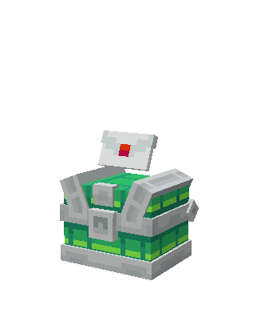<figcaption></figcaption></figure>


{% column width="50%" %}

Clé cosmétic

<figure><figcaption></figcaption></figure>

Clés Légendaires

<figure><figcaption></figcaption></figure>

Grouminou (Pet)

<figure>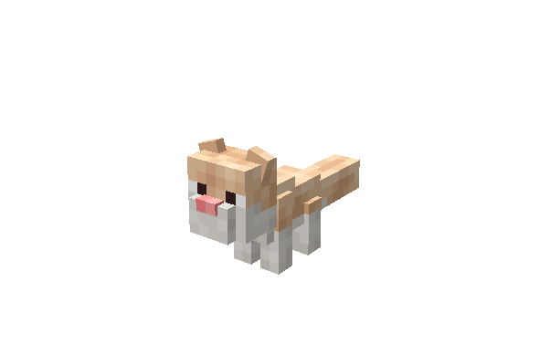<figcaption></figcaption></figure>

Premium 12H

<figure><figcaption></figcaption></figure>

Pioche Commune

<figure>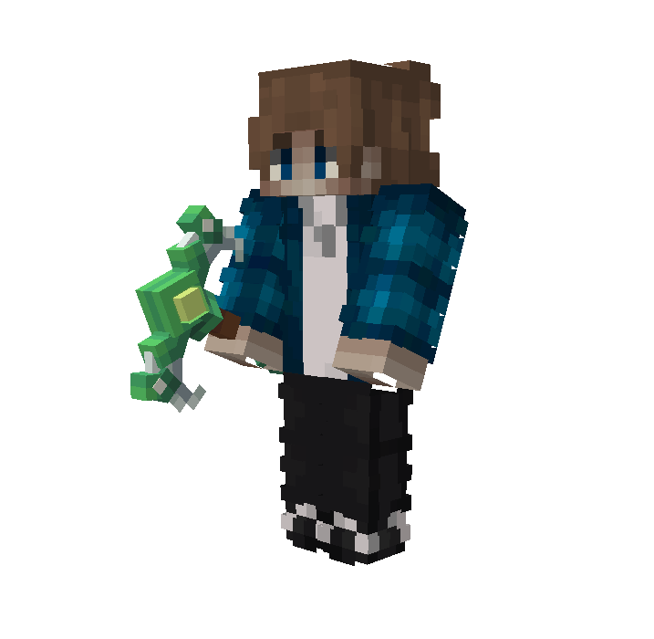<figcaption></figcaption></figure>

Canne Commune

<figure>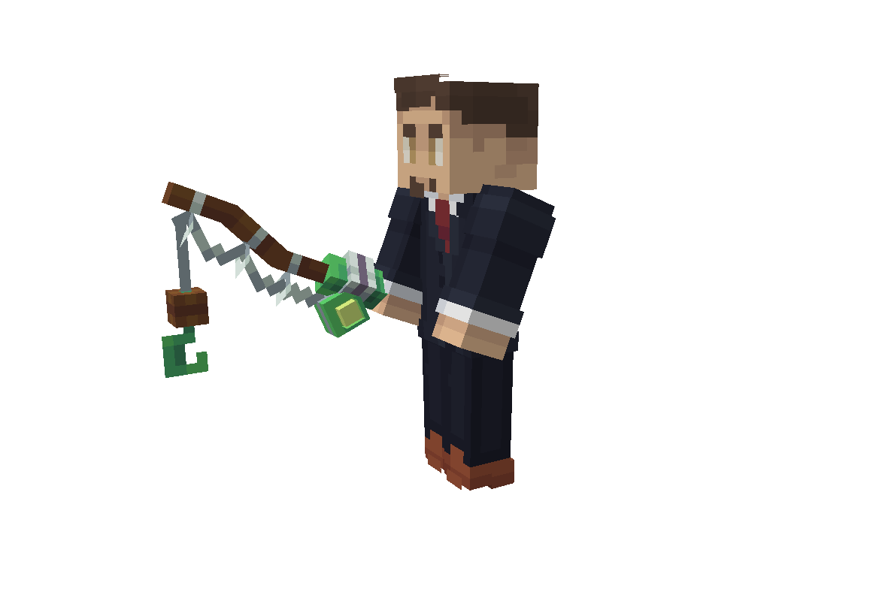<figcaption></figcaption></figure>

épée commune

<figure>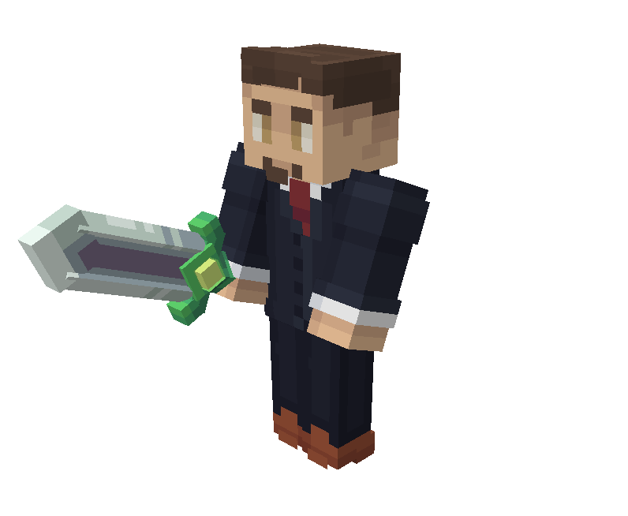<figcaption></figcaption></figure>

Breuvage XP Métier (épique)

Bouteille d'XP

<figure><figcaption></figcaption></figure>

Jardinière en Bois X2

<figure>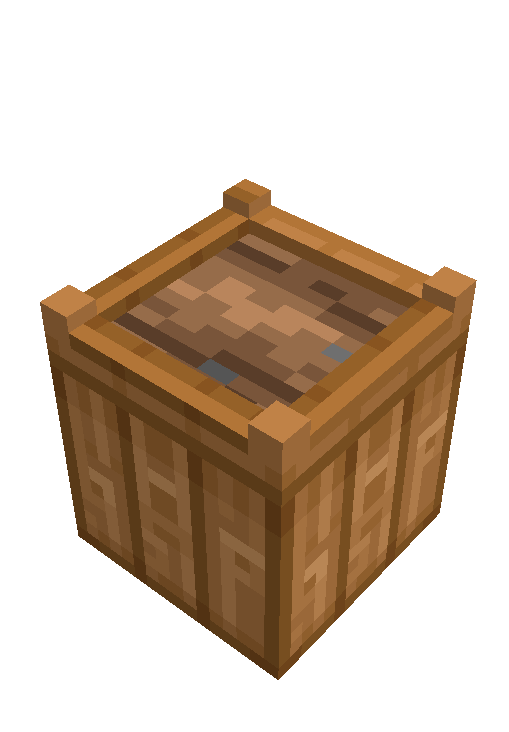<figcaption></figcaption></figure>

Plume de Fly

<figure>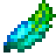<figcaption></figcaption></figure>

Pourdre Organique X4

<figure><figcaption></figcaption></figure>

Poudre de Perlimpinpin (épique) X3

<figure><figcaption></figcaption></figure>



{% column width="50%" %}

10 Gemmes

<figure><figcaption></figcaption></figure>

Lots de Rituels Commun X3

<figure>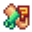<figcaption></figcaption></figure>

50 000 

<figure><figcaption></figcaption></figure>

10 000 

<figure><figcaption></figcaption></figure>

Pioche a Spawner

<figure>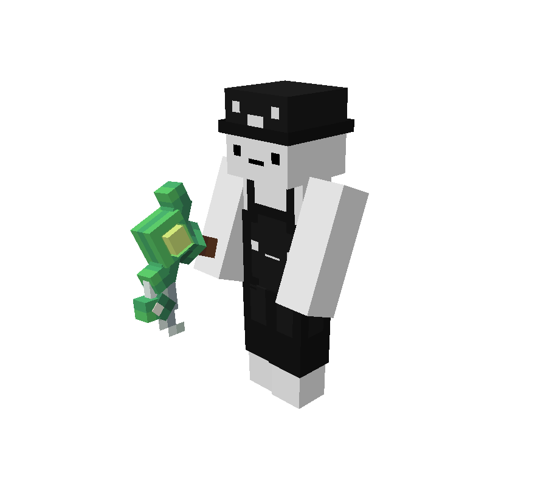<figcaption></figcaption></figure>

Votre tête

<figure><figcaption></figcaption></figure>

Bâton Commun

<figure>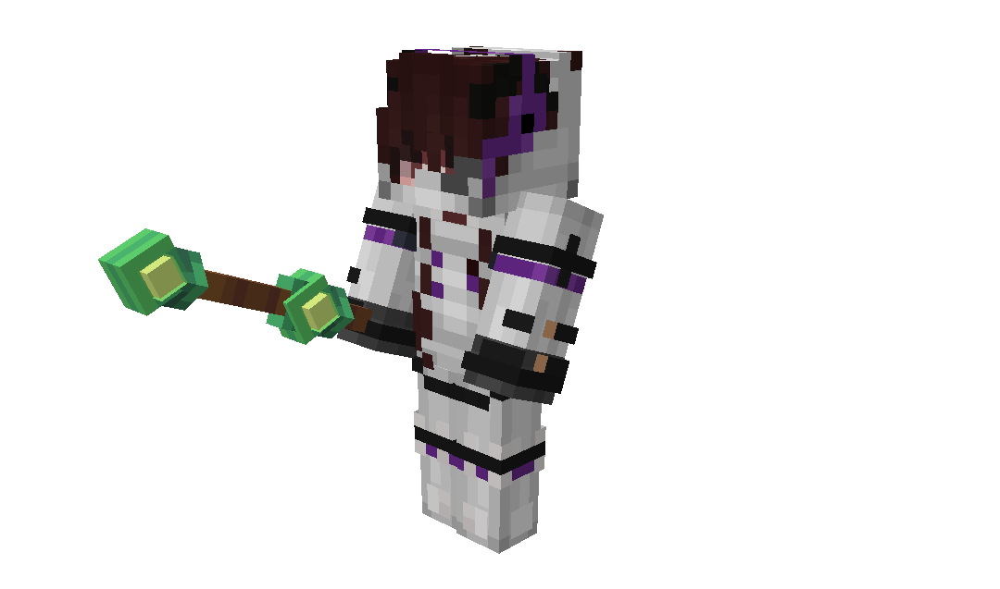<figcaption></figcaption></figure>

Fourche Commune

<figure>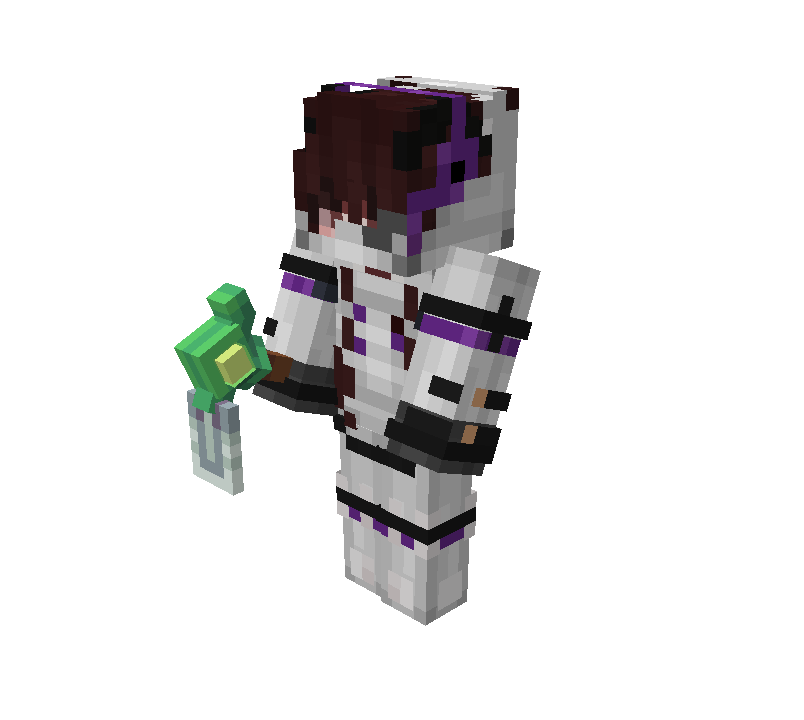<figcaption></figcaption></figure>

Terre X32

<figure><figcaption></figcaption></figure>

Spawner Rare (Aléatoire)

<figure><figcaption></figcaption></figure>

Spawner Commun (Aléatoire)

<figure><figcaption></figcaption></figure>

Sac de Graines X3

<figure><figcaption></figcaption></figure>





Le vote permet ainsi d’obtenir régulièrement des récompenses gratuites.


### Caisse Cosmétique

La clé de la Caisse Cosmétique s'obtient en l'achetant dans le <mark style="color:yellow;">**`/vip`**</mark> au prix de 300 Gemmes, en participant à des évents, ou en augmentant vos niveaux de métier.

<figure>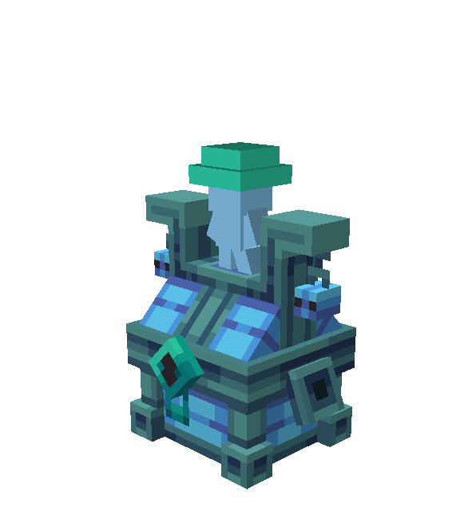<figcaption></figcaption></figure>


{% column width="50%" %}

Titre Personnalisé

<figure><figcaption></figcaption></figure>

Bâton de Soleil

<figure>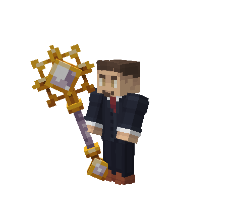<figcaption></figcaption></figure>

Casque d'Améthyste

<figure>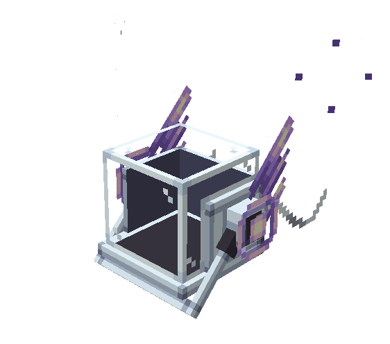<figcaption></figcaption></figure>

Aile d'Améthyste

<figure>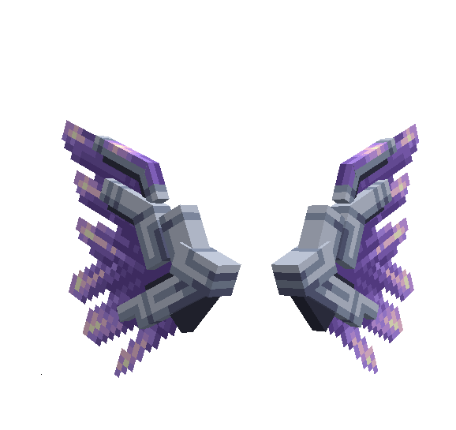<figcaption></figcaption></figure>

Balais de Sorcière

<figure>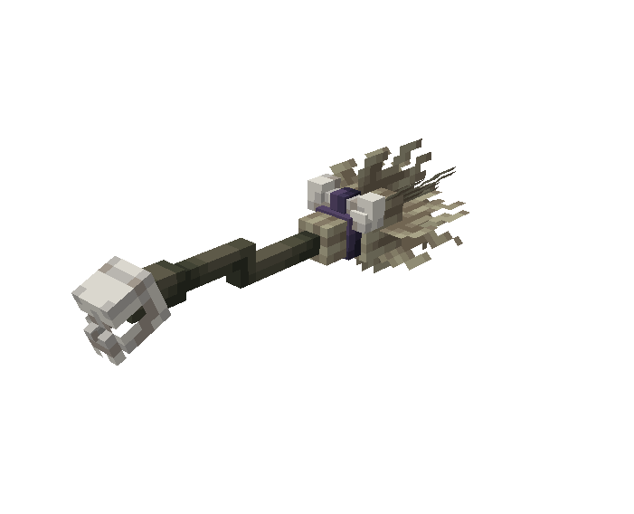<figcaption></figcaption></figure>

Chapeau de Sorcière

<figure>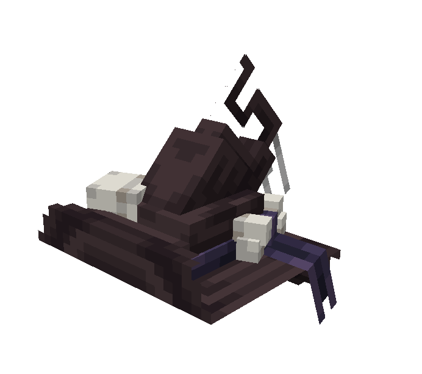<figcaption></figcaption></figure>

Monstruosité Enchaînée

<figure>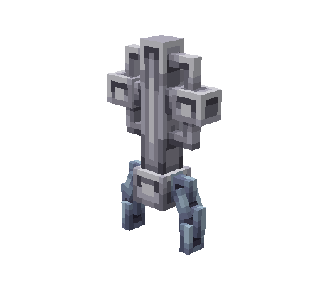<figcaption></figcaption></figure>

Epée Enchaînée

<figure><figcaption></figcaption></figure>

Lanterne de Lotus

<figure>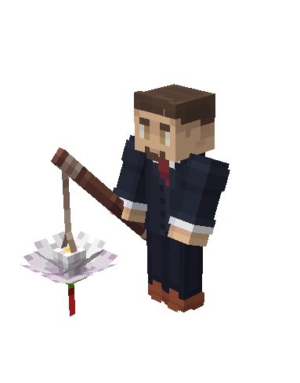<figcaption></figcaption></figure>

Collier de Chaîne

<figure>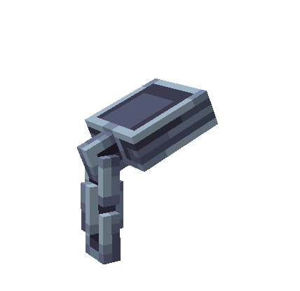<figcaption></figcaption></figure>

Epaulette Elégante

<figure>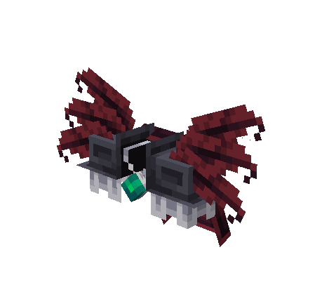<figcaption></figcaption></figure>

Bouteille de Plongée

<figure>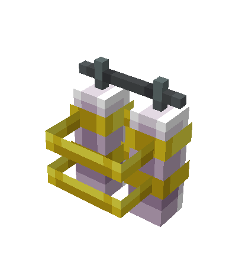<figcaption></figcaption></figure>

Chapeau de Requin

<figure>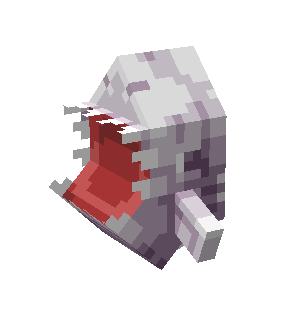<figcaption></figcaption></figure>



{% column width="50%" %}

Chapeau de Corbeau

<figure><figcaption></figcaption></figure>

Aile de Corbeau

<figure>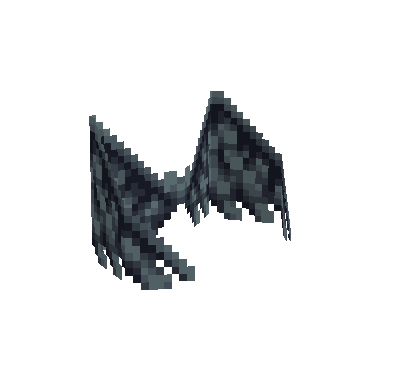<figcaption></figcaption></figure>

Propulseur Cyberspace

<figure>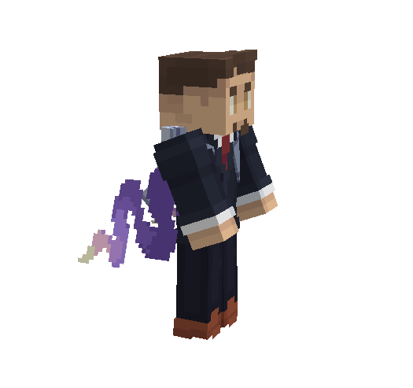<figcaption></figcaption></figure>

Chapeau Elégant

<figure>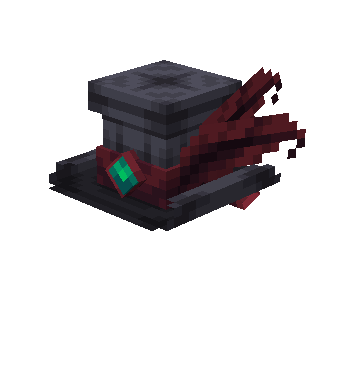<figcaption></figcaption></figure>

Harpon à Poisson

<figure>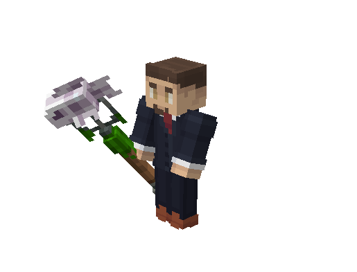<figcaption></figcaption></figure>

Sac du Pêcheur

<figure>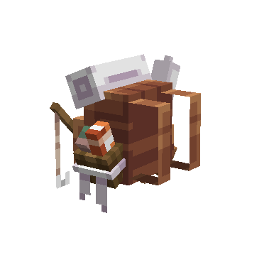<figcaption></figcaption></figure>

Chapeau de Grenouille

<figure>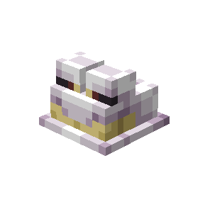<figcaption></figcaption></figure>

Sac de Lotus

<figure>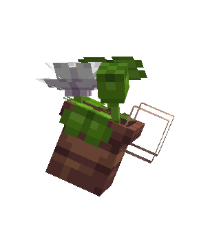<figcaption></figcaption></figure>

Aileron de Requin

<figure>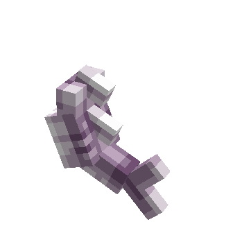<figcaption></figcaption></figure>

Cape du Soleil

<figure>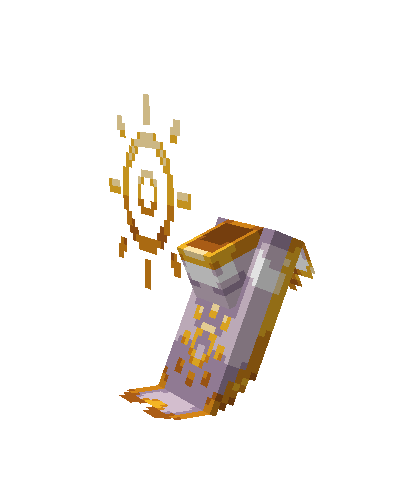<figcaption></figcaption></figure>

Chapeau du Soleil

<figure>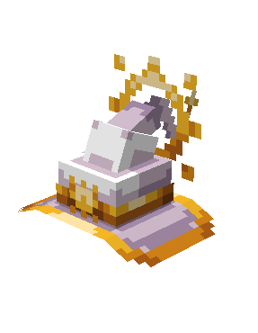<figcaption></figcaption></figure>

Pistolet à Bulle

<figure>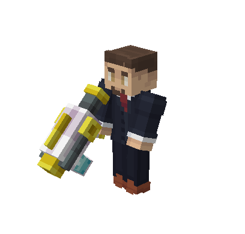<figcaption></figcaption></figure>




### Caisse Légendaire

<figure>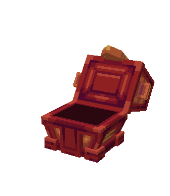<figcaption></figcaption></figure>

La **Caisse Légendaire** propose des récompenses de grande valeur, notamment :




Grade MVP

<figure>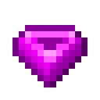<figcaption></figcaption></figure>

Clé Légendaire X2

<figure><figcaption></figcaption></figure>

Clé Cosmétique

<figure><figcaption></figcaption></figure>

Spawner Légendaire

<figure>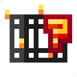<figcaption></figcaption></figure>

Poubelle Portative

<figure>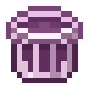<figcaption></figcaption></figure>

Eponge Légendaire

<figure>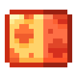<figcaption></figcaption></figure>

Epée Légendaire

<figure>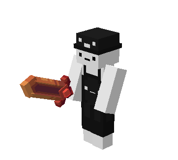<figcaption></figcaption></figure>

Marteau Légendaire

<figure><figcaption></figcaption></figure>

Magnus (Pet)

<figure><figcaption></figcaption></figure>

350 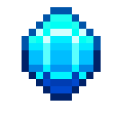

<figure><figcaption></figcaption></figure>

Poudre Corrompue X16

<figure>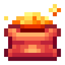<figcaption></figcaption></figure>

Boost XP (Métier)

<figure>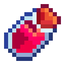<figcaption></figcaption></figure>

Boost de Capsules (Métiers)

<figure>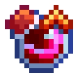<figcaption></figcaption></figure>

XP Bottle

<figure><figcaption></figcaption></figure>





Hache Légendaire

<figure>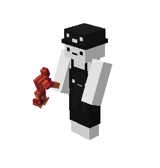<figcaption></figcaption></figure>

Pioche Spawner Légendaire

<figure>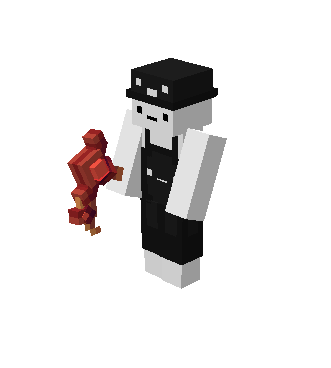<figcaption></figcaption></figure>

Pierre d'Evolution

<figure>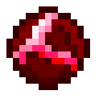<figcaption></figcaption></figure>

Fourche Légendaire

<figure>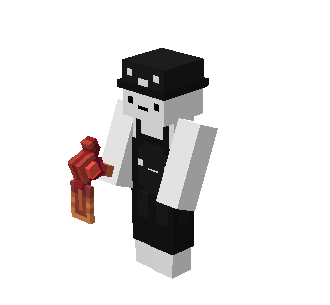<figcaption></figcaption></figure>

Canne Légendaire

<figure>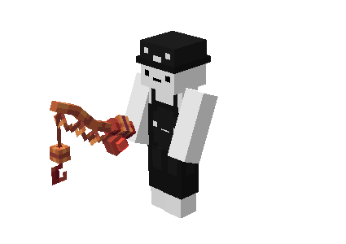<figcaption></figcaption></figure>

Laboureuse Légendaire

<figure><figcaption></figcaption></figure>

Lot de Rituels X4

<figure>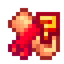<figcaption></figcaption></figure>

Premium (5 jours)

<figure>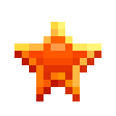<figcaption></figcaption></figure>

350 000 

<figure><figcaption></figcaption></figure>

Breuvage (Aléatoire)

<figure>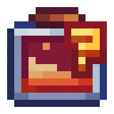<figcaption></figcaption></figure>

Plume de Fly X5

<figure><figcaption></figcaption></figure>

Délice

<figure>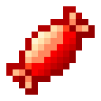<figcaption></figcaption></figure>

250 000 

<figure><figcaption></figcaption></figure>




### Caisse Mythique

<figure>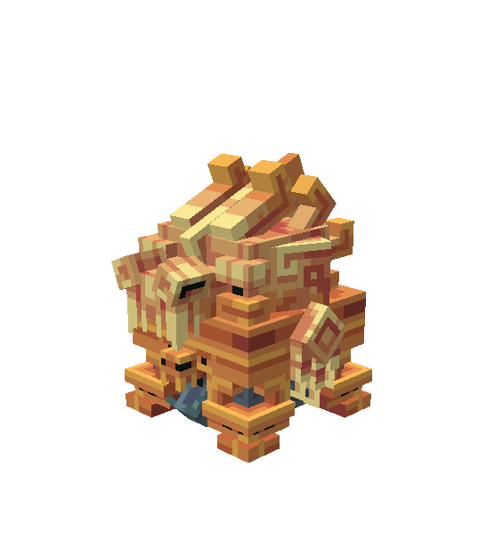<figcaption></figcaption></figure>

La **Caisse Mythique** propose des récompenses d'une grande valeur, notamment :


{% column width="50%" %}

Grade Légende

<figure><figcaption></figcaption></figure>

Clé Cosmétique

<figure><figcaption></figcaption></figure>

Générateur Mythique

<figure><figcaption></figcaption></figure>

Plastron Mythique

<figure>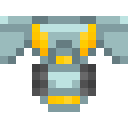<figcaption></figcaption></figure>

Pantalon Mythique

<figure>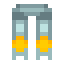<figcaption></figcaption></figure>

Pioche a Spawner

<figure>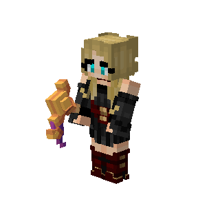<figcaption></figcaption></figure>

Imperieus (pet)

<figure><figcaption></figcaption></figure>

Marteau Mythique

<figure>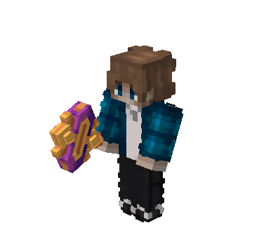<figcaption></figcaption></figure>

Souffleur Mythique

<figure><figcaption></figcaption></figure>

Sceau d'Eau Infini

<figure><figcaption></figcaption></figure>

Epée Mythique

<figure>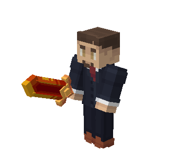<figcaption></figcaption></figure>

Casque Mythique

<figure>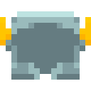<figcaption></figcaption></figure>

Pierre d'Evolution Forgée

<figure><figcaption></figcaption></figure>

Premium

<figure><figcaption></figcaption></figure>



{% column width="50%" %}

Bottes Mythique

<figure>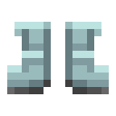<figcaption></figcaption></figure>

Hache Mythique

<figure>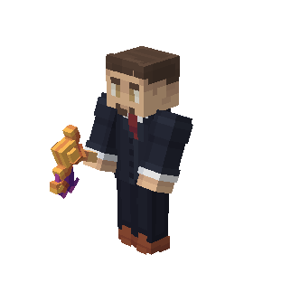<figcaption></figcaption></figure>

Fourche Mythique

<figure>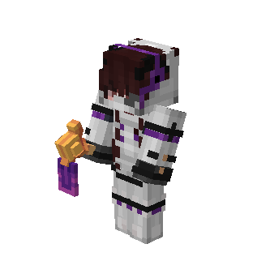<figcaption></figcaption></figure>

Canne Mythique

<figure>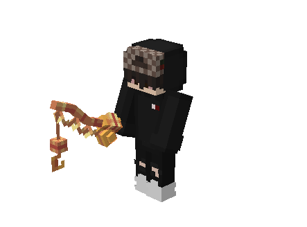<figcaption></figcaption></figure>

Bâton Mythique

<figure>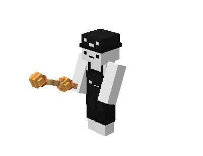<figcaption></figcaption></figure>

1000 

<figure><figcaption></figcaption></figure>

Lot de Rituels X3

<figure><figcaption></figcaption></figure>

Boost d'XP (Métier)

<figure><figcaption></figcaption></figure>

Poudre corrompue

<figure><figcaption></figcaption></figure>

Breuvage Mythique

<figure>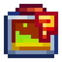<figcaption></figcaption></figure>

Ambroisie

500 000

<figure><figcaption></figcaption></figure>

Clé Mythique X2

<figure>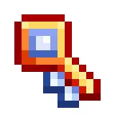<figcaption></figcaption></figure>





Tentez votre chance et ouvrez des caisses sur Blocaria !

