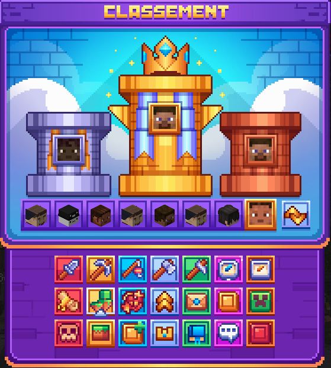

# 🥇 Les Classements

### Introduction

Le classement est un espace de compétition sur le serveur. Il permet aux joueurs de se challenger, avec les 21 catégories de classement proposées.

Le classement s'actualise environ toutes les 5 minutes.

Chaque classement montre le top 3 des meilleurs joueurs dans la catégorie sélectionnée. En dessous vous trouvez le top 4 à 10 et à droite votre propre classement.

Les deux flèches vous permettent de choisir la période sur laquelle vous souhaitez voir le classement.

* <mark style="color:yellow;">**Aujourd'hui**</mark> : Réinitialisation du classement chaque jour à 00h00.
* <mark style="color:yellow;">**Cette semaine**</mark> : Réinitialisation du classement chaque semaine.
* <mark style="color:yellow;">**Ce mois-ci**</mark> : Réinitialisation du classement à la fin de chaque mois.
* <mark style="color:yellow;">**Depuis toujours**</mark> : Classement actif depuis le début du serveur.

<figure><figcaption></figcaption></figure>

### Les différents classement

Métier chasseur

Le métier chasseur classe les joueurs les plus haut en niveau de métier.\
Pour augmenter votre niveau de jobs chasseur regarder les conditions dans le <kbd><mark style="color:yellow;">/jobs<mark style="color:yellow;"></kbd>

Métier mineur

Le métier mineur classe les joueurs les plus haut en niveau de métier.\
Pour augmenter votre niveau de jobs mineur regarder les conditions dans le <kbd><mark style="color:yellow;">/jobs<mark style="color:yellow;"></kbd>

Métier pêcheur

Le métier pêcheur classe les joueurs les plus haut en niveau de métier.\
Pour augmenter votre niveau de jobs pêcheur regarder les conditions dans le <kbd><mark style="color:yellow;">/jobs<mark style="color:yellow;"></kbd>

Métier bûcheron

Le métier bûcheron classe les joueurs les plus haut en niveau de métier.\
Pour augmenter votre niveau de jobs bûcheron regarder les conditions dans le <kbd><mark style="color:yellow;">/jobs<mark style="color:yellow;"></kbd>

Métier agriculteur

Le métier agriculteur classe les joueurs les plus haut en niveau de métier.\
Pour augmenter votre niveau de jobs agriculteur regarder les conditions dans le <kbd><mark style="color:yellow;">/jobs<mark style="color:yellow;"></kbd>

Médailles

Le classement des médailles classe les meilleurs joueurs pour les évènements. Les évènement peuvent être récompensé pas des médailles. Les joueurs ayant remporter le plus de évènement apparaitront en haut de ce classement.

Ce classement sera récompensé en fin de mois

Temps de jeu

Le classement de temps de jeu classe les joueurs les plus présent sur le serveur le temps passé sur celui-ci.

Rituels

Le classement des rituels classe les joueurs qui on réalisé le plus de rituel. Pour entrer dans ce classement il faut compléter entièrement un rituel.\
Pour connaître ce qu'est un rituel et comment les obtenir: [Les rituels](les-rituels.md)

Niveaux d'iles

Le classement des niveaux d'ile classe les iles ayant le plus de points d'iles. Pour obtenir des points d'iles il vous faut compléter les quêtes du <kbd><mark style="color:yellow;">/journal<mark style="color:yellow;"></kbd>.

Ce classement est fait par ile et non par joueur.\
\
Le Tags **Champion** est attribué à la boxe ayant atteint le **Top 1 du classement du niveau d'ile du mois précédent**

Poissons pêchés

Ce classement permet de connaitre le nombre de poisson pêché par chaque joueur. Le classement compte les poissons communs et customs.

Niveau de personnage

Le classement des niveaux de personnage montre les joueurs ayant le plus de niveau de personnage. Pour monter ton niveau de personnage suivre les indications dans le <kbd><mark style="color:yellow;">/personnage<mark style="color:yellow;"></kbd>

Votes

Le classement des votes montre les joueurs qui on le plus voté pour le serveur. Pour voter pour le serveur et récupérer les récompenses faite <kbd><mark style="color:yellow;">/vote<mark style="color:yellow;"></kbd> en jeu. chaque vote compte un point dans le classement.

Ce classement sera récompensé en fin de mois

Monnaie

Le classement pour le monnaie classe les joueurs les plus riches du serveur. A toi de trouver le meilleur moyen de te faire de l'argent rapidement pour monter dans ce top.

Mobs tués

Le classement des mobs tués classe les joueurs ayant le plus tué de mobs. Ce classement compte les monstres et les animaux, vanilla et custom, tués.

Donjons

Les donjons arrive bientôt sur le serveur !

Blocs cassés

Le classement des blocs cassés classe les joueurs ayant cassés le plus de blocs sur le boxe. Chaque bloc cassé vous rapportera un point, peut importe le bloc.

Pièces au spawn

Le classement des pièces au spawn classe les joueurs ayant récupéré le plus de pièce au spawn.

Succès

Le classement de succès classe les joueurs ayant fini le plus de palier de succès. Pour monter dans ce classement vous trouverez les information dans le <kbd><mark style="color:yellow;">/succès<mark style="color:yellow;"></kbd>

Collections

Le classement des collections classe les joueurs ayant le plus de collection terminé dans le <kbd><mark style="color:yellow;">/collection<mark style="color:yellow;"></kbd>.

Capsule

Les classement des capsules recense les joueurs ayant le plus de capsule. Chaque action dans un métier rapporte des capsules. Pour en savoir plus sur comment obtenir les capsules : [Les capsules](capsules.md)

Ce classement sera récompensé en fin de mois


N'attends plus pour tenter de défier les autres et obtenir des récompenses ! 😄

