# 🍌 Les cultures custom

## Système de Cultures Customisées

Le métier d'agriculteur s'enrichit de cultures exclusives. Ces plantations permettent la fabrication d'objets à l'atelier, l'accumulation de points de box et la progression dans vos rangs.

### Mécanique de Croissance

Pour assurer le développement de vos cultures, vous devez impérativement réunir ces deux conditions :

1. Être plantées dans une jardinière.
2. Être maintenues dans un état d'hydratation constant via l'utilisation d'un arrosoir.

Les cultures peuvent atteindre différents stades maximaux de croissance :

* La tomate et la salade ont 5 stades de pousse
* Le maïs et les aubergines ont 4 stades de pousse

Voici à quoi ressemble chaque culture étape par étape :

La tomate

<table><thead><tr><th width="340">Étape</th><th>Image</th></tr></thead><tbody><tr><td>Étape 1</td><td></td></tr><tr><td>Étape 2</td><td></td></tr><tr><td>Étape 3</td><td>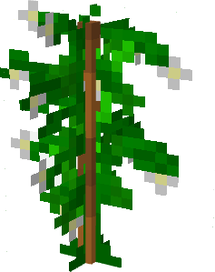</td></tr><tr><td>Étape 4</td><td></td></tr><tr><td>Étape 5</td><td>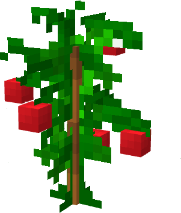</td></tr></tbody></table>

Le maïs

| Étape   | Image                                                                                    |
| ------- | ---------------------------------------------------------------------------------------- |
| Étape 1 |            |
| Étape 2 | 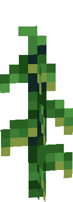 |
| Étape 3 | 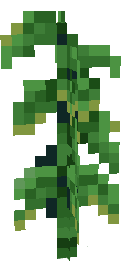 |
| Étape 4 | 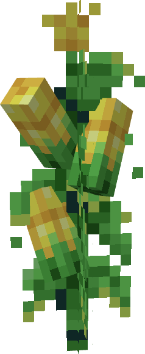          |

L’aubergine

<table><thead><tr><th width="340"></th><th></th></tr></thead><tbody><tr><td>Étape 1</td><td>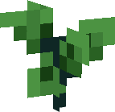</td></tr><tr><td>Étape 2</td><td></td></tr><tr><td>Étape 3</td><td></td></tr><tr><td>Étape 4</td><td>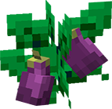</td></tr></tbody></table>

La salades

<table><thead><tr><th width="340">Étape</th><th>Image</th></tr></thead><tbody><tr><td>Étape 1</td><td>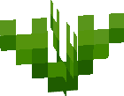</td></tr><tr><td>Étape 2</td><td>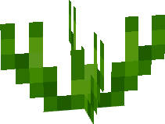</td></tr><tr><td>Étape 3</td><td>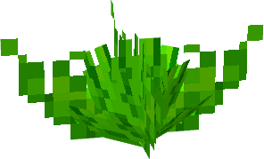</td></tr><tr><td>Étape 4</td><td>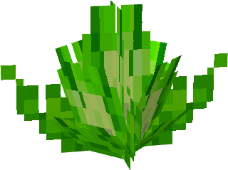</td></tr><tr><td>Étape 5</td><td>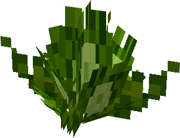</td></tr></tbody></table>


_Vous pouvez accélérer le processus en appliquant du compost (clic droit) sur une plante pour la faire passer instantanément au stade de croissance suivant. La récolte s'effectue également par un simple clic droit une fois la plante à maturité._


### Les Jardinières

Le choix de votre jardinière est déterminant pour votre rendement. Plus la rareté est élevée, plus le bonus de vitesse de pousse est important.\
Il existe 4 types de jardinière, et sur c'est quatre jardinière 3 sont craftable à [l'atelier](latelier.md#la-jardiniere-metallique-doree-precieuse) voici l'enssemble des jardinière :

La jardinière en bois

C'est la jardinière de base. Elle est obtenable seulement dans le caisse de vote et en récompense (Jobs, personnage, sur votre boxe...)

La jardinière métallique

Elle octroi un boost de 10% sur la vitesse de pousse.\
Elle sont fabriqués à l'atelier avec c'est ingrédients:

* Jardinière en bois
* 16 composts
* 16 graines customs
* 5 blocs de fer
* 32 minerais d'argent
* 16 minerais de cobalt

La jardinière dorée

Elle octroi un boost de 25% sur la vitesse de pousse.\
Elle sont fabriqués à l'atelier avec c'est ingrédients:

* Jardinière métallique
* 32 composts
* 32 graines customs
* 10 blocs d'or
* 32 minerais de cobalt
* 16 minerais de rubis

La jardinière précieuse

Elle octroi un boost de 50% sur la vitesse de pousse.\
Elle sont fabriqués à l'atelier avec c'est ingrédients:

* Jardinière dorée
* 64 composts
* 64 graines customs
* 10 blocs de diamants
* 32 minerais de topaze
* 16 minerais d'opales

<figure><figcaption></figcaption></figure>

### Maintenance et Hydratation

L'arrosoir est votre outil indispensable. Pour arroser une zone, maintenez le clic droit enfoncé pendant l'animation d'arrosage.

Il existe 3 arrosoirs différents obtenable pour le premier lors du tuto et les deux autres dans les caisses au spawn.

Différents arrosoirs

<table data-full-width="false"><thead><tr><th width="174.183349609375">Noms arrosoirs</th><th width="189.9666748046875">Rayon d'action</th><th width="185.083251953125">Temps d'hydratation</th><th>Visuel</th></tr></thead><tbody><tr><td>Arrosoir métallique</td><td>3x3 blocs</td><td>1 heure</td><td>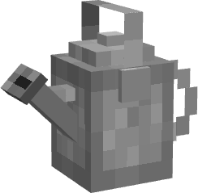</td></tr><tr><td>Arrosoir dorée</td><td>3x3 blocs</td><td>2 heures</td><td>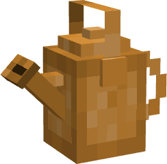</td></tr><tr><td>Arrosoir précieux</td><td>5X5 blocs</td><td>3 heures</td><td>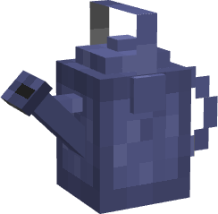</td></tr></tbody></table>

#### Caractéristiques des arrosoirs

Durabilité : 100 utilisations.

Recharge : S'effectue auprès d'une source d'eau (recharge de 10 unités par clic).

Cumul : Attention, le temps d'arrosage ne se cumule pas entre plusieurs passages.

<figure>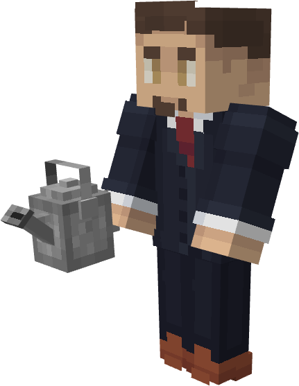<figcaption></figcaption></figure>

### Modes d'Obtention

Pour débuter votre exploitation ou améliorer votre matériel, vous disposez de plusieurs sources :

Jardinières : Disponibles initialement dans votre box, via les caisses de récompenses ou en tant que bonus de métier.

Arrosoirs : S'obtiennent via les caisses ou les récompenses de métier.

Graines : Présentes dans votre box au départ ou achetables au Marché Noir.
