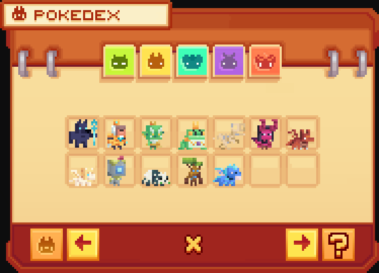

# 🎪 Les Événements

Les événements proposés ici seront uniquement des événements récurrents automatiquement lancés. 

Voici les différents types d’événements que tu pourras expérimenter sur le serveur, pour retrouver ces événements et les récompenses correspondantes, il suffit d'utiliser la commande <mark style="color:yellow;">**`/events`**</mark> :&#x20;

<figure><figcaption>
<strong>Aperçu du </strong><mark style="color:yellow;"><strong><code>/events</code></strong></mark>
</figcaption></figure>

## <mark style="color:yellow;">**Quels sont les différents événements ?**</mark>

### <mark style="color:yellow;">Chat Réaction</mark>

Une question, un calcul ou une complétion est envoyé dans le canal et tu dois répondre rapidement. &#x20;

<mark style="color:yellow;">**Récompenses et Fréquence**</mark>

* 25,000 💰&#x20;
* Lancement toutes les 6 minutes.

### <mark style="color:yellow;">Tournoi de Farm (Solo)</mark>

Une culture, une créature ou un bloc est choisi, et tu as 30 minutes pour en récolter.

<mark style="color:yellow;">**Récompenses et Fréquence**</mark>

* 🥇 500,000 💰 + 50 Gemmes
* 🥈 250,000 💰 + 25 Gemmes
* 🥉 100,000 💰 + 5 Gemmes
* Lancement chaque lundi, mardi, vendredi et samedi à 21h00.

### <mark style="color:yellow;">Tournoi de Farm (Coopératif)</mark>

Une culture, une créature ou un bloc est choisi, et tu as 30 minutes pour en récolter.

<mark style="color:yellow;">**Récompenses et Fréquence**</mark>

* 🥇 1,000,000 💰 + 100 Gemmes
* 🥈 500,000 💰 + 50 Gemmes
* 🥉 200,000 💰 + 10 Gemmes
* Lancement chaque mercredi et dimanche à 20h00.

### <mark style="color:yellow;">**Mascotte folle**</mark>

Une mascotte apparaît sur la place centrale. En la tapant, tu obtiendras des récompenses.

Un classement des 5 joueurs ayant tapé le plus de fois cette mascotte sera établi, et ces joueurs recevront des récompenses.

<mark style="color:yellow;">**Récompenses et Fréquence**</mark>

* 2,500 💰
* 🐄 Spawner à vache (x1)
* 🔑 Clé Épique (x1)
* 📿 Rituel Rare (x1)
* Et bien plus...
* Lancement chaque samedi à 17h00.

### <mark style="color:yellow;">**Pêche folle**</mark>

Durant 15 minutes, tu pourras pêcher sur la plage présent au spawn des objets spéciaux. Tu trouveras des loots classiques, mais aussi des spawners, des clés, et bien plus encore !

<mark style="color:yellow;">**Récompenses et Fréquence**</mark>

* 🐄 Spawner à vache (x1)
* 🔑 Clé Épique (x1)
* 📿 Rituel Épique (x1)
* 50,000 💰
* Et 49 autres...
* Lancement chaque mardi à 19h30 et dimanche à 16h30.

### <mark style="color:yellow;">Largage</mark>

Un total de 25 largages tombent dans le spawn et tu dois être le premier à les récupérer !

<mark style="color:yellow;">**Récompenses et Fréquence**</mark>

* 📿 Rituel Épique (x1)
* 🔑 Clé Épique (x1)
* 5 Gemmes
* Et 21 autres...
* Lancement toute la semaine à 18h30, et samedi et dimanche à 15h00.

### <mark style="color:yellow;">Événement Communautaire</mark>

Une culture, une créature ou un bloc est choisi ainsi qu'un montant de récolte. Tu dois le compléter dans le temps imparti.

<mark style="color:yellow;">**Récompenses et Fréquence**</mark>

* 250,000 💰 + 75 Gemmes
* Lancement chaque jeudi et dimanche à 21h00.

### <mark style="color:yellow;">Enchères</mark>

Des objets sont proposés et tu peux enchérir dessus. La meilleure offre repartira avec.

<mark style="color:yellow;">**Récompenses et Fréquence**</mark>

* 🐄 Spawner à vache (x1)
* 🔑 Clé Épique (x1)
* 📿 Rituel Épique (x1)
* 50,000 💰
* Et 49 autres...
* Lancement chaque jeudi et samedi à 19h00.

### <mark style="color:yellow;">Pi</mark><mark style="color:yellow;">**ñata**</mark>

Lorsque le nombre de votes requis est atteint, une Piñata apparaît au spawn. Tu dois la taper pour obtenir des récompenses, de l’argent, et une chance de gagner des clés de vote.


N'attends plus pour tenter de défier les autres et obtenir des récompenses !

