# 🐕 Les Familiers

### Introduction

Le serveur Blocaria propose des familiers pour vous accompagner lors de votre aventure. Vos familiers vous permettront de recevoir des avantages sur votre gameplay, avec des boosts d'argent, de métiers, de potions...

Vous pouvez cumuler jusqu'à 5 familiers actifs en même temps. Ils seront rangés dans l'interface du <mark style="color:yellow;">`/pets`</mark>. Dans votre inventaire de familiers, vous ne pouvez pas stocker plus de 5 fois le même familier (Un familier classique et shiny ne sont pas comptés comme le même familier)

### Comment avoir un familier

Les animaux customs, au spawn ou sur votre box, ont une probabilité de **laisser tomber un œuf à leur mort**. L'œuf obtenu dépend de l'animal tué. Posez-le sur votre boxe et attendez qu'il éclose. Vous avez deux possibilités à l’éclosion :

* <mark style="color:yellow;">**Œuf Vide**</mark> : Après son éclosion, l'œuf ne donne rien.
* <mark style="color:yellow;">**Œuf \[Animal]**</mark> : Lorsqu'il éclot, il vous donne un familier du même type que l'animal tué (en version classique ou shiny).

Le temps d’éclosion est différent en fonction de la rareté

<table data-header-hidden><thead><tr><th width="102.316650390625"></th><th width="95.61669921875"></th><th width="97.8499755859375"></th><th width="85.566650390625"></th><th width="114.5999755859375"></th><th width="96.7332763671875"></th><th width="81.61669921875"></th></tr></thead><tbody><tr><td>Rareté</td><td><mark style="color:green;">Commun</mark></td><td><mark style="color:blue;">Rare</mark></td><td><mark style="color:purple;">Épique</mark></td><td><mark style="color:red;">Légendaire</mark></td><td><mark style="color:yellow;">Mythique</mark></td><td>Spécial</td></tr><tr><td>Temps d’éclosion</td><td>5m-15m</td><td>15m-30m</td><td>30m-1h</td><td>1h-2h</td><td>2h-3h</td><td>3h-5h</td></tr></tbody></table>

### Utilisation

Une fois votre familier obtenu, vous pouvez le prendre dans votre main et faire un clic droit pour l'envoyer directement dans votre inventaire de familiers <mark style="color:yellow;">`/pets`</mark>

À gauche de l'interface, vous pourrez placer les familiers actifs, tandis que la section "Familiers possédés" regroupe les familiers obtenus mais non actifs.

Grâce aux petits écrous situés entre les flèches, vous pourrez sauvegarder des decks de familiers actifs. Nous vous conseillons d'en créer un par métier afin d'optimiser votre progression.

Vous pouvez équiper **5 familiers en même temps**, ce qui vous permet de combiner les avantages de ces derniers.

→ Gratuit : 2 emplacements

→ Grade VIP  : +1 emplacement

→ Grade MVP : +1 emplacement\
\
→ Grade Légende : +1 emplacement

Une fois votre familier sorti, en faisant <mark style="color:yellow;">`shift + clic droit`</mark> sur votre familier un menu s'ouvre ! Dans celui-ci vous avez plusieurs possibilités qui s'offrent à vous :&#x20;

* Vous pouvez voir les statistiques de votre familier
* Vous pouvez renommer votre familier (_uniquement disponible avec l'abonnement premium_)
* Vous pouvez accéder au menu de [fusion](les-familiers.md#niveau-de-familiers-et-rarete)

<figure><figcaption></figcaption></figure>

#### Les fruits et les bonbons

Les familiers se nourrissent de fruits et de bonbons pour gagner de l'expérience (XP) et monter en niveau.

Étapes pour nourrir votre familier :

* Ouvrez l'interface avec la commande <kbd><mark style="color:yellow;">/pets<mark style="color:yellow;"></kbd>.
* Placez le familier que vous souhaitez nourrir parmi vos familiers actifs.
* Faites un clic droit sur lui pour qu'il soit invoqué.
* Quittez l'interface : votre familier doit maintenant apparaître à vos côtés.
* Vous pouvez alors le nourrir en faisant un clic droit sur lui avec vos fruits ou bonbons en main.


À noter que vous pouvez lui donner stack par stack en faisant Shift + clic sur votre familier avec les fruits ou les bonbons en main


<table data-full-width="false"><thead><tr><th width="179.816650390625">Nom des fruits</th><th width="99.949951171875">XP</th><th width="443.2501220703125">Comment les obtenir ?</th></tr></thead><tbody><tr><td>Banane</td><td>1 XP</td><td>S'obtient en cassant des feuilles des arbres suivants : Sapin, Acajou, Chêne noir et Chêne pâle.</td></tr><tr><td>Pêche</td><td>2 XP</td><td>S'obtient en cassant des feuilles d'Acacia et de Cerisier.</td></tr><tr><td>Fraise</td><td>3 XP</td><td>S'obtient en cassant des feuilles de Chêne, de Bouleau et de Palétuvier.</td></tr><tr><td>Figuier de Barbarie</td><td>1 XP</td><td>S'obtient en cassant des cactus.</td></tr><tr><td>Gland</td><td>1 XP</td><td>S'obtient en tuant des écureuils.</td></tr></tbody></table>

<table data-full-width="false"><thead><tr><th width="180.2332763671875">Nom des bonbons</th><th width="100.0499267578125">XP</th><th width="443.7335205078125">Comment les obtenir ?</th></tr></thead><tbody><tr><td>Petit bonbon</td><td>200 XP</td><td>Caisses et récompenses autres</td></tr><tr><td>Bonbon</td><td>500 XP</td><td>Caisses et récompenses autres</td></tr><tr><td>Gros bonbon</td><td>1000 XP</td><td>Caisses et récompenses autres</td></tr><tr><td>Immense bonbon</td><td>1500 XP</td><td>Caisses et récompenses autres</td></tr></tbody></table>

### Niveau de familiers et rareté

Les familiers peuvent atteindre le niveau 20 en version classique ou shiny, mais grâce à la fusion, vous pouvez les faire monter jusqu'au niveau 25.

Pour procéder à une fusion, il vous suffit de réunir 3 familiers identiques de niveau 20. Une fois la fusion effectuée, le familier débloqué pourra atteindre le niveau 25 et obtenir sa dernière amélioration.

Si un familier shiny est inclus dans la fusion, le familier obtenu bénéficiera d'une probabilité accrue de devenir shiny.

* <mark style="color:yellow;">1 familier shiny</mark> - 50% de chance
* <mark style="color:yellow;">2 - 3 familiers shiny</mark> - 100% de chance

Étape pour fusionner:

* Assurez-vous de posséder 4 familiers du **même animal**, tous les quatre au **niveau 20**.
* Ouvrez l'interface avec la commande <kbd><mark style="color:yellow;">/pets<mark style="color:yellow;"></kbd>
* Passez votre souris sur le familier que vous souhaitez fusionner, puis faites <mark style="color:yellow;">`Shift + clic gauche`</mark> sur celui-ci pour ouvrir l'interface de fusion.
* Déposez vos **3 familiers** dans les emplacements prévus et validez la fusion.
* Vous obtenez alors un familier amélioré que vous pouvez désormais faire monter jusqu'au niveau 25.

<figure><figcaption></figcaption></figure>

Il existe différents niveaux de rareté pour les familiers :

➠ <mark style="color:green;">Commun</mark> ➠ <mark style="color:blue;">Rare</mark> ➠ <mark style="color:purple;">Épique</mark> ➠ <mark style="color:red;">Légendaire</mark> ➠ <mark style="color:yellow;">Mythique</mark>

Pets animaux:

<mark style="color:green;">Scrat / Écureuil</mark>

<table data-full-width="false"><thead><tr><th width="129.7332763671875" align="center">Niveau</th><th width="269.7332763671875" align="center">Classique</th><th width="270.28350830078125" align="center">Shiny</th></tr></thead><tbody><tr><td align="center">Niveau 1</td><td align="center">1 000 $/h</td><td align="center">1 500 $/h</td></tr><tr><td align="center">Niveau 5</td><td align="center">Effet vitesse II</td><td align="center">Effet vitesse III</td></tr><tr><td align="center">Niveau 10</td><td align="center">5% de chance d’avoir une bûche supplémentaire</td><td align="center">7,5% de chance d’avoir une bûche supplémentaire</td></tr><tr><td align="center">Niveau 15</td><td align="center">15% d'argent supplémentaire sur la vente de bûches de chêne</td><td align="center">22,5% d'argent supplémentaire sur la vente de bûches de chêne</td></tr><tr><td align="center">Niveau 20</td><td align="center">2,5% d'argent supplémentaire sur le métier Bûcheron</td><td align="center">3,5% d'argent supplémentaire sur le métier Bûcheron</td></tr></tbody></table>

<figure><figcaption></figcaption></figure> <figure>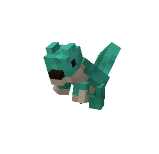<figcaption></figcaption></figure>

<mark style="color:green;">Capybou / Capybara</mark>

<table><thead><tr><th width="129.7332763671875">Niveau</th><th width="270.183349609375">Classique</th><th width="270.16668701171875">Shiny</th></tr></thead><tbody><tr><td>Niveau 1</td><td>1 250 $/h</td><td>1 750 $/h</td></tr><tr><td>Niveau 5</td><td>Effet chance I</td><td>Effet chance II</td></tr><tr><td>Niveau 10</td><td>+ 20 de chance</td><td>+ 30 de chance</td></tr><tr><td>Niveau 15</td><td>20% supplémentaire sur la vente de poissons communs</td><td>30% supplémentaire sur la vente de poissons communs</td></tr><tr><td>Niveau 20</td><td>2,5% supplémentaire sur l'xp du métier pêcheur</td><td>3,5% supplémentaire sur l'xp du métier pêcheur</td></tr></tbody></table>

<figure>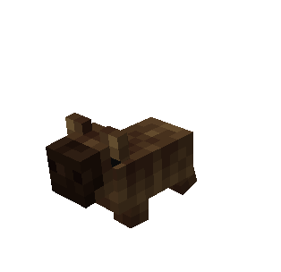<figcaption></figcaption></figure> <figure>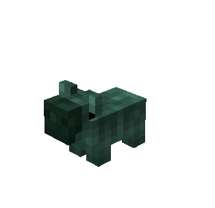<figcaption></figcaption></figure>

<mark style="color:green;">Babouche / Singe</mark>

<table data-full-width="true"><thead><tr><th width="129.7333984375">Niveau</th><th width="270.183349609375">Classique</th><th width="270.16668701171875">Shiny</th></tr></thead><tbody><tr><td>Niveau 1</td><td>1 500 $/h</td><td>2000 $/h</td></tr><tr><td>Niveau 5</td><td>Effet jump boost I</td><td>Effet jump boost II</td></tr><tr><td>Niveau 10</td><td>+ 20 de chance</td><td>+ 30 de chance</td></tr><tr><td>Niveau 15</td><td>Aucun dégâts de chute</td><td>Aucun dégâts de chute</td></tr><tr><td>Niveau 20</td><td>2,5% supplémentaire sur l'xp du métier bûcheron</td><td>3,5% supplémentaire sur l'xp du métier bûcheron</td></tr></tbody></table>

<figure>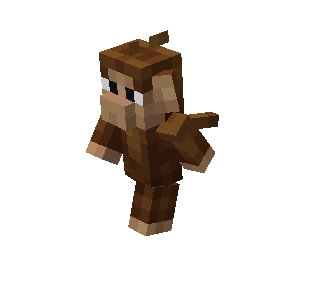<figcaption></figcaption></figure> <figure>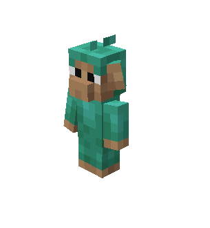<figcaption></figcaption></figure>

<mark style="color:blue;">Boutchou / Bouquetin</mark>

<table><thead><tr><th width="129.7332763671875">Niveau</th><th width="270.183349609375">Classique</th><th width="270.16668701171875">Shiny</th></tr></thead><tbody><tr><td>Niveau 1</td><td>3 000 $ /h</td><td>4 500 $ /h</td></tr><tr><td>Niveau 5</td><td>+ 25 de chance</td><td>+ 40 de chance</td></tr><tr><td>Niveau 10</td><td>Inflige Faiblesse I aux ennemis</td><td>Inflige Faiblesse II aux ennemis</td></tr><tr><td>Niveau 15</td><td>10% supplémentaire sur la vente de charbon</td><td>15% supplémentaire sur la vente de charbon</td></tr><tr><td>Niveau 20</td><td>3% supplémentaire sur l'argent du métier mineur</td><td>4,5% supplémentaire sur l'argent du métier mineur</td></tr></tbody></table>

<figure>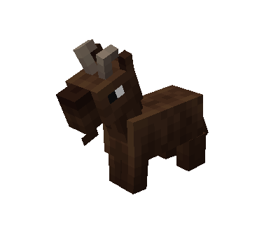<figcaption></figcaption></figure> <figure>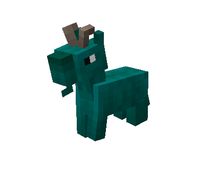<figcaption></figcaption></figure>

<mark style="color:blue;">Pingou / Pingouin</mark>

<table><thead><tr><th width="129.7332763671875">Niveau</th><th width="270.183349609375">Classique</th><th width="270.16656494140625">Shiny</th></tr></thead><tbody><tr><td>Niveau 1</td><td>3 500 $ /h</td><td>5 250 $ /h</td></tr><tr><td>Niveau 5</td><td>+25 de chance</td><td>+40 de chance</td></tr><tr><td>Niveau 10</td><td>Effet force du conduit I</td><td>effet Force du conduit II</td></tr><tr><td>Niveau 15</td><td>10% supplémentaire sur les capsules dans le métier pêcheur</td><td>15% supplémentaire sur les capsules dans le métier pêcheur</td></tr><tr><td>Niveau 20</td><td>Permet de pêcher Jack’pote (0,1% de chance)</td><td>Permet de pêcher Jack’pote (0,2% de chance)</td></tr></tbody></table>

<figure>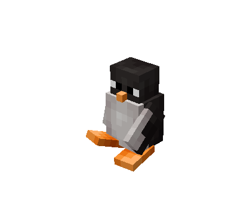<figcaption></figcaption></figure> <figure>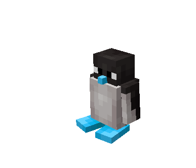<figcaption></figcaption></figure>

<mark style="color:purple;">Python / Serpent</mark>

<table><thead><tr><th width="129.7332763671875">Niveau</th><th width="270.183349609375">Classique</th><th width="270.16668701171875">Shiny</th></tr></thead><tbody><tr><td>Niveau 1</td><td>5000 $ /h</td><td>7500 $ /h</td></tr><tr><td>Niveau 5</td><td>+30 de chance</td><td>+45 de chance</td></tr><tr><td>Niveau 10</td><td>10% supplémentaire sur le drop des diamants</td><td>15% supplémentaire sur le drop des diamants</td></tr><tr><td>Niveau 15</td><td>10% supplémentaire sur la vente de lingots de fer</td><td>15% supplémentaire sur la vente de lingots de fer</td></tr><tr><td>Niveau 20</td><td>5% supplémentaire sur l'argent du métier mineur</td><td>7,5% supplémentaire sur l'argent du métier mineur</td></tr></tbody></table>

<figure>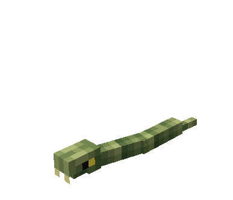<figcaption></figcaption></figure> <figure>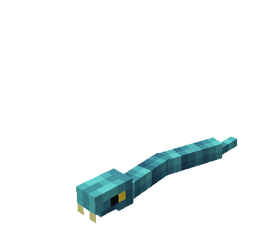<figcaption></figcaption></figure>

<mark style="color:purple;">Bisonours / Bison</mark>

<table><thead><tr><th width="129.7332763671875">Niveau</th><th width="270.183349609375">Classique</th><th width="270.16668701171875">Shiny</th></tr></thead><tbody><tr><td>Niveau 1</td><td>4 500 $ /h</td><td>6 750 $ /h</td></tr><tr><td>Niveau 5</td><td>4 cœurs supplémentaires (non cumulable)</td><td>6 cœurs supplémentaires (non cumulable)</td></tr><tr><td>Niveau 10</td><td>+30 de chance</td><td>+45 de chance</td></tr><tr><td>Niveau 15</td><td>5% supplémentaire sur la vente de la catégorie cultures</td><td>7,5% supplémentaire sur la vente de la catégorie cultures</td></tr><tr><td>Niveau 20</td><td>3% supplémentaire sur l'argent du métier agriculteur</td><td>4,5% supplémentaire sur l'argent du métier agriculteur</td></tr></tbody></table>

<figure>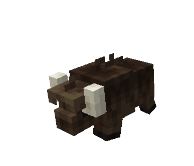<figcaption></figcaption></figure> <figure>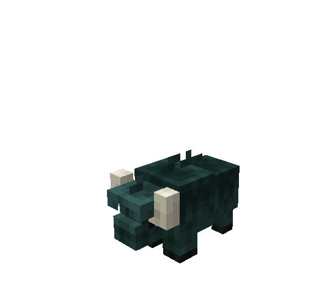<figcaption></figcaption></figure>

<mark style="color:purple;">Ziano / Zèbre</mark>

<table><thead><tr><th width="129.7332763671875">Niveau</th><th width="270.183349609375">Classique</th><th width="270.16668701171875">Shiny</th></tr></thead><tbody><tr><td>Niveau 1</td><td>5 500 $ /h</td><td>8 000 $ /h</td></tr><tr><td>Niveau 5</td><td>+30 de chance</td><td>+45 de chance</td></tr><tr><td>Niveau 10</td><td>10% de chance que la fourche ne perde pas de durabilité</td><td>15% de chance que la fourche ne perde pas de durabilité</td></tr><tr><td>Niveau 15</td><td>5% de réduction sur l'achat dans la catégorie agriculture</td><td>7,5% de réduction sur l'achat dans la catégorie agriculture</td></tr><tr><td>Niveau 20</td><td>3% supplémentaire sur l'xp du métier agriculteur</td><td>4,5% supplémentaire sur l'xp du métier agriculteur</td></tr></tbody></table>

<figure>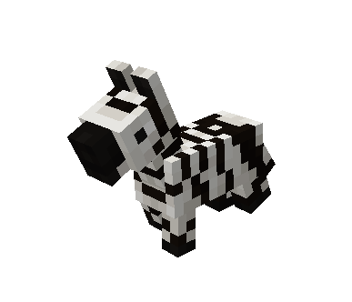<figcaption></figcaption></figure> <figure>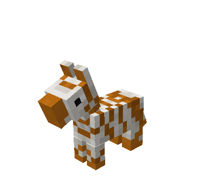<figcaption></figcaption></figure>

<mark style="color:red;">Simba / Lion</mark>

<table data-full-width="true"><thead><tr><th width="129.7333984375">Niveau</th><th width="270.183349609375">Classique</th><th width="270.16656494140625">Shiny</th></tr></thead><tbody><tr><td>Niveau 1</td><td>+40 de chance</td><td>+60 de chance</td></tr><tr><td>Niveau 5</td><td>Effet résistance au feu I</td><td>Effet résistance au feu I</td></tr><tr><td>Niveau 10</td><td>10 000 $ /h</td><td>15 000 $ /h</td></tr><tr><td>Niveau 15</td><td>Inflige wither I pendant 5 secondes</td><td>Inflige wither II pendant 5 secondes</td></tr><tr><td>Niveau 20</td><td>+5% capsules chasseur</td><td>7,5% capsules chasseur</td></tr></tbody></table>

<figure><figcaption></figcaption></figure> <figure>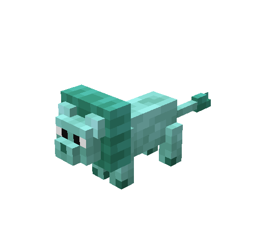<figcaption></figcaption></figure>

<mark style="color:red;">Tigrou / Tigre</mark>

<table><thead><tr><th width="129.7332763671875">Niveau</th><th width="270.183349609375">Classique</th><th width="270.16668701171875">Shiny</th></tr></thead><tbody><tr><td>Niveau 1</td><td>8 500 $ /h</td><td>12 500$ /h</td></tr><tr><td>Niveau 5</td><td>+ 50 chance</td><td>+ 75 chance</td></tr><tr><td>Niveau 10</td><td>5000$ /h</td><td>7 500 $ /h</td></tr><tr><td>Niveau 15</td><td>1 bûche supplémentaire</td><td></td></tr><tr><td>Niveau 20</td><td>5% supplémentaire sur l'argent du métier bûcheron</td><td>7,5% supplémentaire sur l'argent du métier bûcheron</td></tr></tbody></table>

<figure>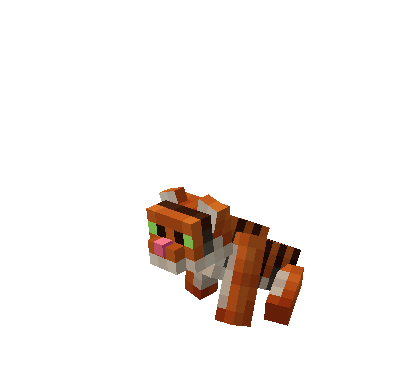<figcaption></figcaption></figure> <figure>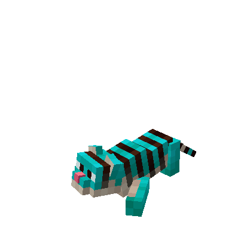<figcaption></figcaption></figure>

<mark style="color:red;">Crocroc / Alligator</mark>

<table><thead><tr><th width="129.7333984375">Niveau</th><th width="270.183349609375">Classique</th><th width="270.16656494140625">Shiny</th></tr></thead><tbody><tr><td>Niveau 1</td><td>7 500 $ /h</td><td>11 000 $ /h</td></tr><tr><td>Niveau 5</td><td>+40 de chance</td><td>+60 de chance</td></tr><tr><td>Niveau 10</td><td>Effet résistance I</td><td>effet résistance II</td></tr><tr><td>Niveau 15</td><td>10% supplémentaire sur la vente des loots customs</td><td>15% supplémentaire sur la vente des loots customs</td></tr><tr><td>Niveau 20</td><td>5% supplémentaire sur l'xp du métier éclaireur</td><td>7,5% supplémentaire sur l'xp du métier éclaireur</td></tr></tbody></table>

<figure>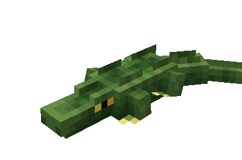<figcaption></figcaption></figure> <figure>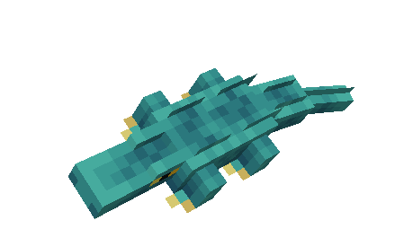<figcaption></figcaption></figure>

<mark style="color:red;">Pinky /</mark> <mark style="color:red;">Flamant</mark>

<table><thead><tr><th width="129.7332763671875">Niveau</th><th width="270.183349609375">Classique</th><th width="270.16668701171875">Shiny</th></tr></thead><tbody><tr><td>Niveau 1</td><td>8 000 $ /h</td><td>12 000 $ /h</td></tr><tr><td>Niveau 5</td><td>Effet grace du dophin I</td><td>Effet grace du dauphin II</td></tr><tr><td>Niveau 10</td><td>+40 de chance</td><td>+60 de chance</td></tr><tr><td>Niveau 15</td><td>10% de capsule supplémentaire sur le métier pêcheur</td><td>12,5% de capsule supplémentaire sur le métier pêcheur</td></tr><tr><td>Niveau 20</td><td>7,5% supplémentaire sur l'argent du métier pêcheur</td><td>10% supplémentaire sur l'argent du métier pêcheur</td></tr></tbody></table>

<figure>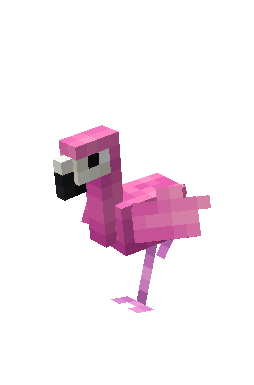<figcaption></figcaption></figure> <figure>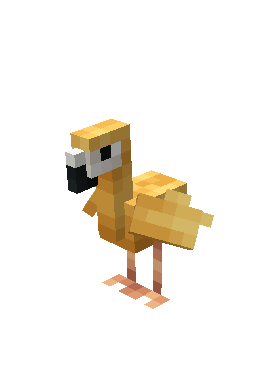<figcaption></figcaption></figure>

<mark style="color:yellow;">Médusa / Méduse</mark>

<table><thead><tr><th width="129.7332763671875">Niveau</th><th width="270.183349609375">Classique</th><th width="270.16668701171875">Shiny</th></tr></thead><tbody><tr><td>Niveau 1</td><td>+50 de chance</td><td>+75 de chance</td></tr><tr><td>Niveau 5</td><td>Effet respiration aquatique</td><td>Effet respiration aquatique</td></tr><tr><td>Niveau 10</td><td>5% supplémentaire sur la vente dans la catégorie poissons</td><td>7,5% supplémentaire sur la vente dans la catégorie poissons</td></tr><tr><td>Niveau 15</td><td>5% de doubler le loot à la pêche</td><td>7,5% de doubler le loot à la pêche</td></tr><tr><td>Niveau 20</td><td>7.5 % D'xp supplémentaire sur le métier pêcheur</td><td>10 % D'xp supplémentaire sur le métier pêcheur</td></tr></tbody></table>

<figure>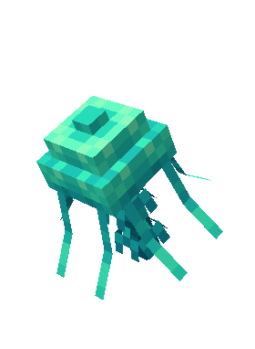<figcaption></figcaption></figure> <figure>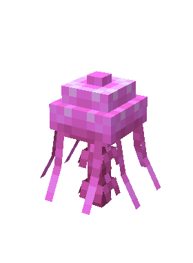<figcaption></figcaption></figure>

<mark style="color:yellow;">Rhinopharin / Rhinocéros</mark>

<table><thead><tr><th width="129.7332763671875">Niveau</th><th width="270.183349609375">Classique</th><th width="270.16668701171875">Shiny</th></tr></thead><tbody><tr><td>Niveau 1</td><td>+50 de chance</td><td>+75 de chance</td></tr><tr><td>Niveau 5</td><td>Effet Haste II</td><td>Effet Haste III</td></tr><tr><td>Niveau 10</td><td>12 000 $ /h</td><td>16 000 $ /h</td></tr><tr><td>Niveau 15</td><td>8 cœurs supplémentaire (non cumulable)</td><td>12 cœurs supplémentaire (non cumulable)</td></tr><tr><td>Niveau 20</td><td>5 % D'xp supplémentaire sur le métier mineur</td><td>7,5 % D'xp supplémentaire sur le métier mineur</td></tr></tbody></table>

<figure><figcaption></figcaption></figure> <figure>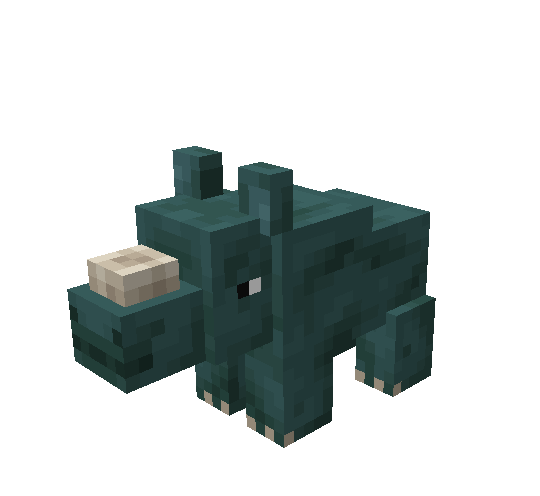<figcaption></figcaption></figure>

<mark style="color:yellow;">Dumbo / Eléphant</mark>

<table><thead><tr><th width="129.7333984375">Niveau</th><th width="270.1832275390625">Classique</th><th width="270.16668701171875">Shiny</th></tr></thead><tbody><tr><td>Niveau 1</td><td>10 000 $ /h</td><td>15 000 $ /h</td></tr><tr><td>Niveau 5</td><td>Effet force II</td><td>Effet force III</td></tr><tr><td>Niveau 10</td><td>+50 de chance</td><td>+75 de chance</td></tr><tr><td>Niveau 15</td><td>6 cœurs supplémentaire (non cumulable)</td><td>9 cœurs supplémentaire (non cumulable)</td></tr><tr><td>Niveau 20</td><td>5 % D'xp supplémentaire sur le métier chasseur</td><td>7,5 % D'xp supplémentaire sur le métier chasseur</td></tr></tbody></table>

<figure>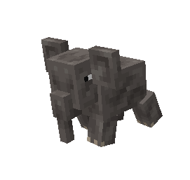<figcaption></figcaption></figure> <figure>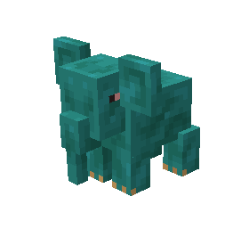<figcaption></figcaption></figure>

Pets événements et autres

<mark style="color:green;">Grominou</mark>

<table><thead><tr><th width="129.7333984375">Niveau</th><th width="270.183349609375">Classique</th><th width="270.16668701171875">Shiny</th></tr></thead><tbody><tr><td>Niveau 1</td><td>+20 de chance</td><td>+30 de chance</td></tr><tr><td>Niveau 5</td><td>2000 $ /h</td><td>3000 $ /h</td></tr><tr><td>Niveau 10</td><td>+500 $ par pièce ramassée</td><td>Effet vision nocturne</td></tr><tr><td>Niveau 15</td><td>+25 de chance</td><td>+35 de chance</td></tr><tr><td>Niveau 20</td><td>3,5% supplémentaire sur l'argent du métier chasseur</td><td>5% supplémentaire sur l'argent du métier chasseur</td></tr></tbody></table>

<figure>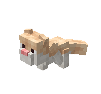<figcaption></figcaption></figure> <figure>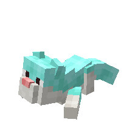<figcaption></figcaption></figure>

<mark style="color:red;">Magnus</mark>

<table><thead><tr><th width="129.7332763671875">Niveau</th><th width="270.183349609375">Classique</th><th width="270.16668701171875">Shiny</th></tr></thead><tbody><tr><td>Niveau 1</td><td>10 000 $ /h</td><td>15 000 $ /h</td></tr><tr><td>Niveau 5</td><td>+45 de chance</td><td>+65 de chance</td></tr><tr><td>Niveau 10</td><td>3% supplémentaire sur la vente dans la catégorie minerais</td><td>5% supplémentaire sur la vente dans la catégorie minerais</td></tr><tr><td>Niveau 15</td><td>4% supplémentaire sur l'argent du métier mineur</td><td>6% supplémentaire sur l'argent du métier mineur</td></tr><tr><td>Niveau 20</td><td>20% de réduction du temps de fabrication dans l’atelier</td><td>30% de réduction du temps de fabrication dans l’atelier</td></tr></tbody></table>

<figure>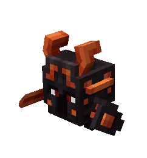<figcaption></figcaption></figure> <figure>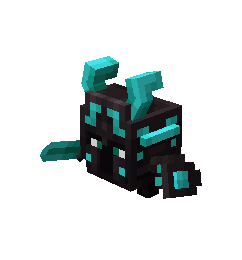<figcaption></figcaption></figure>

<mark style="color:yellow;">Jack’pote</mark>

<table><thead><tr><th width="129.7333984375">Niveau</th><th width="270.183349609375">Classique</th><th width="260.16656494140625">Shiny</th></tr></thead><tbody><tr><td>Niveau 1</td><td>+60 de chance</td><td>+90 de chance</td></tr><tr><td>Niveau 5</td><td>15 000 $ /h</td><td>22 500 $ /h</td></tr><tr><td>Niveau 10</td><td>1% supplémentaire sur l'argent de tous les métiers</td><td>1,5% supplémentaire sur l'argent de tous les métiers</td></tr><tr><td>Niveau 15</td><td>1,5% supplémentaire sur l'xp de tous les métiers</td><td>2% supplémentaire sur l'xp de tous les métiers</td></tr><tr><td>Niveau 20</td><td>10% de gain d’xp sur les familiers</td><td>15% de gain d’xp sur les familiers</td></tr></tbody></table>

<figure>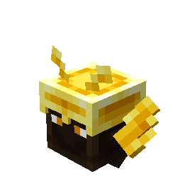<figcaption></figcaption></figure> <figure>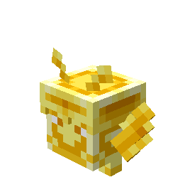<figcaption></figcaption></figure>

<mark style="color:yellow;">Coffre mignon</mark>

<table><thead><tr><th width="129.7332763671875">Niveau</th><th width="270.183349609375">Classique</th><th width="260.16668701171875">Shiny</th></tr></thead><tbody><tr><td>Niveau 1</td><td>+10 de chance</td><td>+15 de chance</td></tr><tr><td>Niveau 5</td><td>+15 de chance</td><td>+25 de chance</td></tr><tr><td>Niveau 10</td><td>+20 de chance</td><td>+30 de chance</td></tr><tr><td>Niveau 15</td><td>+25 de chance</td><td>+35 de chance</td></tr><tr><td>Niveau 20</td><td>+30 de chance</td><td>+45 de chance</td></tr></tbody></table>

<figure>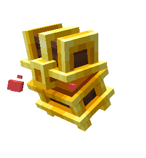<figcaption></figcaption></figure> <figure>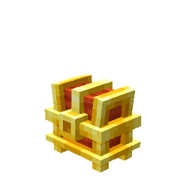<figcaption></figcaption></figure>

<mark style="color:yellow;">Imperius</mark>

<table><thead><tr><th width="129.7333984375">Niveau</th><th width="270.183349609375">Classique</th><th width="260.16656494140625">Shiny</th></tr></thead><tbody><tr><td>Niveau 1</td><td>+50 de chance</td><td>+75 de chance</td></tr><tr><td>Niveau 5</td><td>15 000 $ /h</td><td>22 500 $ /h</td></tr><tr><td>Niveau 10</td><td>3.5% supplémentaire sur l'xp du métier chasseur</td><td>5% supplémentaire sur l'xp du métier chasseur</td></tr><tr><td>Niveau 15</td><td>Vous pouvez monter sur Imperius</td><td>Vous pouvez monter sur Imperius</td></tr><tr><td>Niveau 20</td><td>2,5% supplémentaire sur l'xp de tous les métiers</td><td>3,5% supplémentaire sur l'xp de tous les métiers</td></tr></tbody></table>

<figure>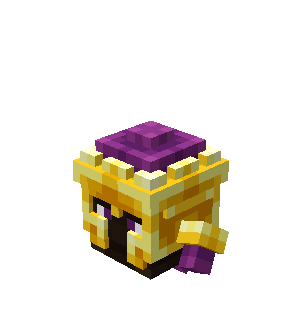<figcaption></figcaption></figure> <figure>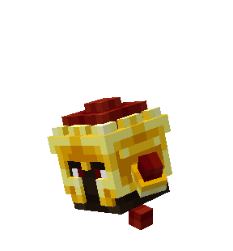<figcaption></figcaption></figure>

<mark style="color:yellow;">Wall-e</mark>

| Niveau    | Classique                                                    |
| --------- | ------------------------------------------------------------ |
| Niveau 1  | Effet double saut (spawn uniquement)                         |
| Niveau 5  | 2% supplémentaire sur les capsules dans tout les métier      |
| Niveau 10 | +2% de points de box                                         |
| Niveau 15 | + 25 xp de personnage /h                                     |
| Niveau 20 | Wall-E cherche et vous donne 1 poudre perlimpinpin par heure |

<figure>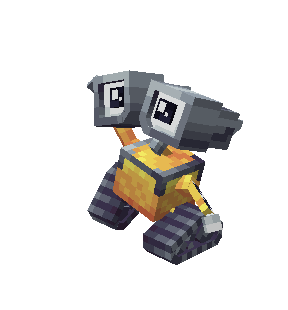<figcaption></figcaption></figure>

