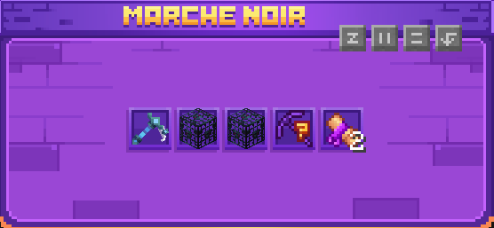
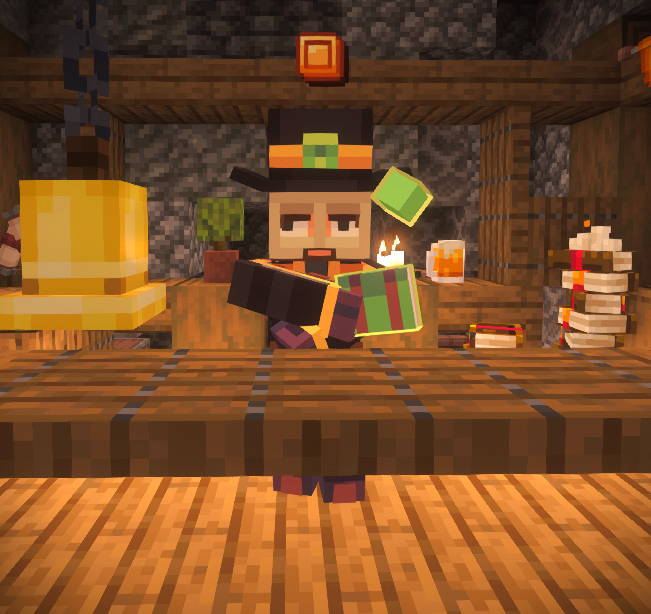

# 💎 Les Géodes

### Comment fonctionnent les géodes ?

<mark style="color:yellow;">**Obtention**</mark> : Les géodes peuvent être obtenues en brisant différents types de minerais tels que l’or, le diamant, l’émeraude ou encore la netherite. Toutefois, leur obtention n’est pas garantie : chaque minerai que vous minez vous offre simplement une certaine probabilité d’en recevoir une. Il est donc possible d’en obtenir plusieurs à la suite, comme de ne pas en récupérer pendant un certain temps. Pour maximiser vos chances d’en obtenir, le moyen le plus efficace reste de miner les **minerais custom**, qui offrent généralement un meilleur rendement en géodes.

Les **géodes** sont une monnaie spéciale permettant d’acheter des objets rares au **marché noir**.

Ce marché propose **des objets uniques et parfois très puissants**, qui ne sont pas toujours accessibles par les moyens classiques. Les géodes deviennent donc une ressource précieuse pour les joueurs souhaitant améliorer rapidement leur équipement ou obtenir des objets exclusifs.

### **Fonctionnement du marché noir :**

Chaque jour, le marché noir propose **jusqu’à 5 objets différents** à l’achat. Les objets disponibles changent régulièrement, ce qui encourage les joueurs à venir consulter les offres quotidiennement pour ne pas rater une opportunité.

<figure><figcaption></figcaption></figure>

### **Accès au marché noir :**

Le marché noir est accessible via un **PNJ situé au spawn**, à un emplacement fixe afin d’être facilement trouvable par tous les joueurs.

<figure><figcaption></figcaption></figure>

### **Condition d’accès :**

L’accès au marché noir est **débloqué à partir du rang&#x20;**_**Diamant I**_. Une fois ce rang atteint, les joueurs peuvent interagir avec le PNJ et utiliser leurs géodes pour effectuer des achats.


Pensez à vérifier le marché noir chaque jour : certains objets rares peuvent apparaître et disparaître rapidement !


<mark style="color:yellow;">**Concassage**</mark> : Une fois obtenues, les géodes peuvent être concassées dans une machine appelée [concasseur](le-concasseur.md).

En concassant une géode, tu récupères une géode plus ou moins rare. Voici les différents types :

* _**Géode de quartz**_  (⭐)
* _**Géode d’améthyste**_  (⭐⭐)
* _**Géode de Jaspe**_  (⭐⭐⭐)
* _**Géode d'Azurite**_  (⭐⭐⭐⭐)
* _**Géode d’agate**_  (⭐⭐⭐⭐⭐)


Lors du concassage, tu peux également obtenir de la **poudre de perlimpinpin**, essentielle pour réparer certains de tes items à la forge.

