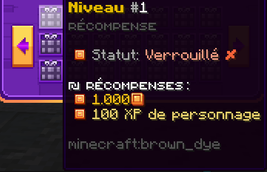

# 👷 Les Métiers

### Introduction

Les métiers sur Blocaria vous permettent de gagner de l'argent et de suivre la progression de votre aventure. Vous aurez le choix entre plusieurs métiers : fermier, mineur, pêcheur, chasseur et bûcheron.\
\
Au début de votre aventure, vous pourrez exercer un seul métier en même temps. En avançant dans les rangs, vous pourrez en exercer plusieurs à la fois.

### Rejoindre un métier

Pour ouvrir le menu des métiers, il vous suffit d'entrer la commande <kbd><mark style="color:yellow;">/jobs<mark style="color:yellow;"></kbd> .

Pour activer un métier, il vous suffit de choisir le métier que vous souhaitez exercer puis l'activer avec la coche verte.\
Pour changer de métier, il vous suffit de retirer la coche et de sélectionner le nouveau métier.

**Vous pourrez changer n'importe quand de métier sans perdre la progression déjà effectuée.**

<figure><figcaption></figcaption></figure>

### Augmenter son niveau de métier

Pour monter de niveau dans les métiers, il vous suffit de réaliser des actions pour gagner de l'XP métier.\
Vous trouverez les actions que vous pouvez faire dans chaque métier avec la commande <kbd><mark style="color:yellow;">/jobs<mark style="color:yellow;"></kbd>.

* <mark style="color:yellow;">**Fermier**</mark> : Récolter des cultures, reproduire des animaux, tondre des moutons et apprivoiser des animaux.
* <mark style="color:yellow;">**Mineur**</mark> : Extraire des minerais et les faire cuire.
* <mark style="color:yellow;">**Pêcheur**</mark> : Pêcher des ressources, cuire des poissons et les tuer directement.
* <mark style="color:yellow;">**Chasseur**</mark> : Tuer des animaux, des monstres et des mobs personnalisés.
* <mark style="color:yellow;">**Bûcheron**</mark> : Abattre des arbres, cuire le bois et l'écorcer.

Chaque niveau de métier atteint vous offrira une récompense. Vous pourrez la récupérer facilement avec la commande <kbd><mark style="color:yellow;">/jobs claim<mark style="color:yellow;"></kbd> .

<figure><figcaption></figcaption></figure>

### Les boosts métier

Vous trouverez des boosts métier, vous permettant d'augmenter l'XP récolté par action.\
Les boosts ont différentes raretés qui leur confèrent un effet d'une durée variable ainsi qu'un pourcentage d'XP plus ou moins élevé.

Pour l'activer, il vous suffira de cliquer dans le vide avec votre boost en main.

Celui-ci activera un chronomètre affiché en haut de votre écran, correspondant à la durée d'activation du boost.\
Pour être sûr que le boost soit activé, il est conseillé de faire un aller-retour au spawn avant de commencer les actions métier.

<figure><figcaption></figcaption></figure>
