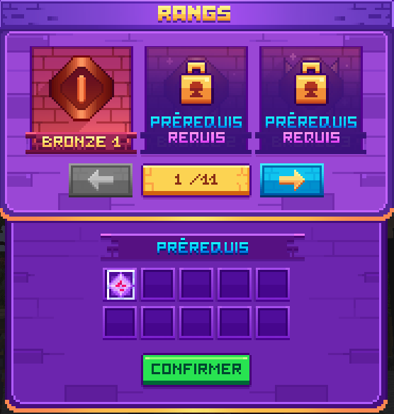

# 👑 Les Rangs

Chaque rang nécessite de remplir différents prérequis, incluant des quêtes à accomplir. <mark style="color:yellow;">**`/rangs`**</mark>\
Les rangs permettent également d’obtenir des bonus permanents et d’accéder à certaines fonctionnalités supplémentaires.

\
Pour passer au rang suivant, il faudra compléter tous les "prérequis". Une fois les prérequis complétés, il vous suffira de cliquer sur confirmer. La maîtrise passera à la suivante et vous découvrirez de nouveaux prérequis.

<figure><figcaption></figcaption></figure>

### Récompenses maitrises

Bronze

Bronze I  : accès à un job en simultané, un magasin personnel, étage 1 du <mark style="color:yellow;">**`/warp mine`**</mark>

Bronze II  : accès à 2 emplacements au <mark style="color:yellow;">**`/hdv`**</mark>, accès au <mark style="color:yellow;">**`/nightvision`**</mark>

Bronze III  : accès à un concasseur supplémentaire <mark style="color:yellow;">**`/concasseur`**</mark>, accès à la commande <mark style="color:yellow;">**`/trade`**</mark>

Argent

Argent I  : accès à 2 emplacements au <mark style="color:yellow;">**`/hdv`**</mark>, accès à 2 shop personnel

Argent II  : accès à 2 magasins personnels, accès à un job supplémentaire

Argent III  : Accès à 3 homes <mark style="color:yellow;">**`/sethome`**</mark>, accès au premier bundle de rituel <mark style="color:yellow;">**`/jobs`**</mark>

Or

Or I  : accès à une table d'atelier supplémentaire <mark style="color:yellow;">**`/atelier`**</mark>, accès à l'étage 2 du <mark style="color:yellow;">**`/warp mine`**</mark>, accès à 4 emplacements au <mark style="color:yellow;">**`/hdv`**</mark>, accès à la commande <mark style="color:yellow;">**`/pv1`**</mark>

Or II  : accès à un concasseur supplémentaire <mark style="color:yellow;">**`/concasseur`**</mark>, accès à 4 magasins personnel, accès au deuxième bundle de rituel <mark style="color:yellow;">**`/jobs`**</mark> , accès à un job supplémentaire, accès à la commande <mark style="color:yellow;">**`/condense`**</mark> (cooldown 10 minutes)

Or III  : accès à 5 magasins personnels, accès à la commande <mark style="color:yellow;">**`/qs buy`**</mark>

Platine

Platine I  : accès à 2 emplacements au <mark style="color:yellow;">**`/hdv`**</mark>, accès au troisième bundle de rituel <mark style="color:yellow;">**`/jobs`**</mark>

Platine II  : accès à 5 magasins personnels, accès à un job supplémentaire, accès à la commande <mark style="color:yellow;">**`/pv2`**</mark>

Platine III  : Accès à 4 homes <mark style="color:yellow;">**`/sethome`**</mark>, +5% d'argent pêcheur, accès à la commande <mark style="color:yellow;">**`/feed`**</mark> (cooldown 10 minutes)

Diamant

Diamant I  : + 5% d'argent bucheron, Accès au marché noir <mark style="color:yellow;">**`/codex`**</mark> ,Accès à l'étage 3 de la mine <mark style="color:yellow;">**`/warp mine`**</mark>, Accès à 6 objets au <mark style="color:yellow;">**`/hdv`**</mark>, Accès à la commande <mark style="color:yellow;">**`/slimechunck`**</mark> (permet de voir où se situe le chunck à slime sur votre box.

Diamant II  : Accès à 8 magasins personnels, accès à un concasseur supplémentaire <mark style="color:yellow;">**`/concasseur`**</mark>, accès au quatrième bundle de rituels <mark style="color:yellow;">**`/jobs`**</mark>, accès à la commande <mark style="color:yellow;">**`/pv3`**</mark>

Diamant III  : +5% d'argent chasseur, accès à 7 objets au <mark style="color:yellow;">**`/hdv`**</mark>, accès à la commande <mark style="color:yellow;">**`/hat`**</mark> permet de mettre un bloc au choix sur votre tête

Émeraude

Émeraude I  : +5%. d'expérience agriculteur, accès à une table d'atelier supplémentaire <mark style="color:yellow;">**`/atelier`**</mark>, Accès à 6 objets au <mark style="color:yellow;">**`/hdv`**</mark>

Émeraude II  : Accès à 8 magasins personnels, accès à la commande <mark style="color:yellow;">**`/top`**</mark> permet de se téléporter au point le plus haut.

Émeraude III  : +5% d'expérience mineur, Accès à 10 magasins personnels, Accès à 5 homes <mark style="color:yellow;">**`/sethome`**</mark>

Rubis

Rubis I  : +5% d'expérience pêcheur, accès au cinquième bundle de rituel, <mark style="color:yellow;">**`/job`**</mark>, accès à l'étage 4 du <mark style="color:yellow;">**`/warp mine`**</mark>, accès à un métier supplémentaire.

Rubis II  : accès à un concasseur supplémentaire <mark style="color:yellow;">**`/concasseur`**</mark>, accès à 11 magasins personnels, accès à la commande <mark style="color:yellow;">**`/sell all`**</mark> permet de vendre automatiquement l'entièreté de votre inventaire

Rubis III  : Accès à 6 homes <mark style="color:yellow;">**`/sethome`**</mark>, accès à 9 objets au <mark style="color:yellow;">**`/hdv`**</mark>, accès à la commande <mark style="color:yellow;">**`/pv4`**</mark>

Saphir

Saphir I  : +5% d'expérience bûcheron, accès à 12 magasins personnels, accès à un atelier supplémentaire <mark style="color:yellow;">**`/atelier`**</mark>

Saphir II  : accès à 14 magasins personnels, Accès à 7 homes <mark style="color:yellow;">**`/sethome`**</mark>

Saphir III  : accès à 14 magasins personnels, accès au sixièmes bundle de rituels <mark style="color:yellow;">**`/jobs`**</mark>, accès à la commande <mark style="color:yellow;">**`/pv5`**</mark>

Onyx

Onyx I  : +5% d'expérience chasseur, Accès à 10 objets au <mark style="color:yellow;">**`/hdv`**</mark>, accès à la commande <mark style="color:yellow;">**`/repair`**</mark> (cooldown 30 minutes) permet de réparer un outil classique gratuitement de manière illimitée

Onyx II  : +5% de capsule (agriculture), accès à 15 magasins personnels, accès à 8 homes <mark style="color:yellow;">**`/sethome`**</mark>, accès à un métier supplémentaire

Onyx III  : accès à 15 magasins personnels, accès au septième bundle de rituels <mark style="color:yellow;">**`/jobs`**</mark>, accès à un concasseur supplémentaire <mark style="color:yellow;">**`/concasseur`**</mark>, accès à la commande <mark style="color:yellow;">**`/pv6`**</mark>

Obsidienne

Obsidienne I  : +5% de capsule (pêcheur), accès à 8 homes <mark style="color:yellow;">**`/sethome`**</mark>, accès à un atelier supplémentaire <mark style="color:yellow;">**`/atelier`**</mark>, accès à la commande <mark style="color:yellow;">**`/pv6`**</mark>

Obsidienne II  : +5% de capsule (bucheron), accès à 15 magasins personnels, accès à vos concasseurs <mark style="color:yellow;">**`/concasseur`**</mark> permet d'accéder à vos concasseurs à distance, facilitant l'utilisation

Maitre

Maître  : Bravo, vous avez enfin réussi à gravir tous les échelons. Félicitations !

