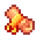

# 📜 Les Rituels

### Fonctionnement des rituels

Les rituels sont des items se présentant sous la forme d’un parchemin. Ils arborent un bandeau de couleur différente selon leur niveau de rareté.

Ces derniers sont des missions temporaires vous demandant de récolter des ressources ou de tuer des mobs. Ces missions sont obligatoirement en lien avec l'un de vos métiers.

### Les différents rituels

Les rituels aléatoires :

Ces rituels aléatoires sont souvent distribués en récompense et vous permettent de recevoir un rituel lié à n'importe quel métier.

Les rituels possèdent deux états possibles : **caché** et **révélé**.

* **État Caché** : Le parchemin affiche uniquement le métier attribué ainsi que sa rareté.
* **État Révélé** : Une fois le rituel révélé, la mission spécifique à accomplir apparaît. Vous disposez alors de 5 jours pour terminer cette mission avant qu'elle n'expire.

Ces missions seront forcément en lien avec l'un des métiers présents sur le serveur :

* ⛏️ Mineur
* 🌾 Agriculteur
* 🌲 Bûcheron
* 🎣 Pêcheur
* 🏹 Chasseur

En plus des différents métiers, un niveau de rareté leur est attribué :

➠ <mark style="color:green;">Commun</mark> 

➠ <mark style="color:blue;">Rare</mark> 

➠ <mark style="color:purple;">Épique</mark> 

➠ <mark style="color:red;">Légendaire</mark> 

➠ <mark style="color:yellow;">Mythique</mark>

### Obtention des rituels

Les rituels peuvent s’obtenir via les actions suivantes :

→ Récompense de métiers.

→ Achat aux enchères.

→ Achat au marché noir.

→ Achat journalier via le <kbd><mark style="color:yellow;">/jobs<mark style="color:yellow;"></kbd> (en échange d'XP vanilla).

### Précision pour l'obtention via le /jobs

Les rituels s’obtiennent via la commande <mark style="color:yellow;">**`/jobs`**</mark>, en achetant le **pack de rituels** disponible.

Même si la l'achat s’effectue depuis une interface liée à un métier (par exemple : Agriculteur), le pack n’est **pas propre à ce métier.**

Ainsi si le pack est acheté depuis l’interface **Agriculteur**, il ne pourra pas être acheté une seconde fois depuis l’interface **Mineur**. La limitation est globale et **indépendante du métier sélectionné**.\
**Important** : Vous ne pouvez donc acheter qu'**un seul pack de rituels par jour**.


**Vous pourrez l'acheter 2 fois par jour** si vous avez le grade **Légende** et un **abonnement actif**


### Activation du rituel

Un **clic droit avec le rituel en main** révèle la mission du parchemin.

C’est à cet instant précis que le rituel s’active et que le **chronomètre démarre**. Si la mission n’est pas terminée dans le temps imparti, le rituel **disparaît définitivement**.

### Important

* Tant que le **clic droit** n’a pas été effectué, le rituel reste **inactif**.
* Une fois le rituel **révélé**, l’activation est **irréversible**.
* Aucun **délai supplémentaire** n’est accordé après l'**expiration**.
