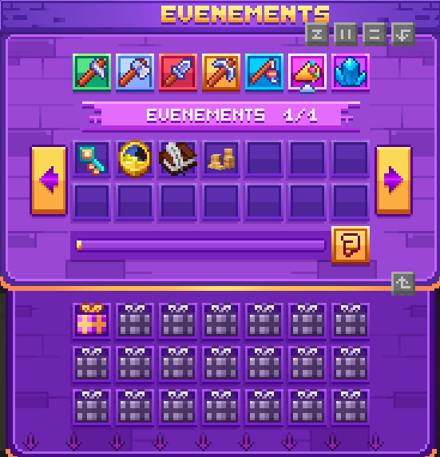

# ⭐ Les succès

### Présentation générale

Les s**uccès** constituent un système de progression basé sur l’accumulation d’actions effectuées au cours de votre aventure. Chaque Succès fonctionne comme un compteur qui augmente automatiquement lorsqu’une action correspondante est réalisée. <kbd><mark style="color:yellow;">/succès<mark style="color:yellow;"></kbd>

Certaines actions sont réalisables comme la destruction de blocs, l’élimination de créatures, la récolte de cultures, la pêche, la participation aux votes et aux activités. Chaque action fait monter son propre succès.

Chaque succès est divisé en **15 ou 21 paliers** successifs.\
À chaque palier atteint, une **récompense d’expérience de personnage** est accordée. La progression est permanente et ne peut pas être perdue.

### Succès Agriculteur

<strong>Agriculteur</strong>

Les succès d’agriculture sont basés sur la récolte de cultures. Chaque type de plante dispose de sa propre collection de succès, composée de 21 paliers indépendants.

<figure><figcaption></figcaption></figure>

La progression repose sur la quantité récoltée. Les premiers paliers sont atteints rapidement, tandis que les derniers demandent une implication plus importante.

Les cultures concernées incluent les plantations classiques, les cultures du Nether, les plantes spéciales ainsi que les cultures personnalisées.

### Succès Bûcheron

<strong>Bûcheron</strong>

Les succès de bûcheronnage sont liés à la coupe de bois. Chaque essence possède sa propre collection de succès avec 21 paliers.

<figure><figcaption></figcaption></figure>

La progression repose sur la quantité récoltée. Les premiers paliers sont atteints rapidement, tandis que les derniers demandent une implication plus importante.

### Succès Chasseur

<strong>Chasse</strong>

Les succès de chasse concernent les créatures standards. Chaque type de créature dispose de sa propre collection de succès.

Plusieurs collections peuvent progresser simultanément, ce qui permet d’avancer sur différents succès en parallèle.

<figure><figcaption></figcaption></figure>

**Chasse – créatures personnalisées**

Les Succès liés aux créatures personnalisées suivent la même structure que ceux des créatures classiques.

### Succès Mineur

<strong>Mineur</strong>

Les succès de minage sont liés à la destruction de blocs et de minerais. Chaque ressource possède sa propre collection de succès.

La progression peut s’effectuer simultanément sur plusieurs collections, notamment lorsque différentes ressources sont accessibles au même endroit. Cela permet une avancée globale sans nécessiter de se concentrer sur un minerai unique.

<figure><figcaption></figcaption></figure>

Les Succès miniers incluent aussi bien les ressources classiques que les minerais rares et personnalisés.

### Succès Pêcheur

<strong>Pêcheur</strong>

Les succès de pêche sont organisés par **rareté de poisson**. Chaque rareté dispose de sa propre collection de succès.

<figure><figcaption></figcaption></figure>

La progression repose sur l’ensemble des poissons pêchés dans un biome, sans possibilité de cibler un poisson précis.

Les collections incluent les poissons communs, rares, épiques, légendaires, mythiques ainsi que les trésors.

### Succès Caisses

<strong>Caisses</strong>

Les succès des caisses sont considérés comme secondaires. Ils sont obtenus via l’ouverture de différents types de coffres.

Ils incluent notamment :

Les caisses issues des votes,

Les caisses cosmétiques,

Les caisses de haute rareté,

Les caisses évent

Ces succès évoluent naturellement au fil des ouvertures.

### Succès Activité

<strong>Activité</strong>

Les succès d’activité reflètent votre implication globale sur le serveur. Ils sont basés sur des actions régulières et cumulatives.

<figure><figcaption></figcaption></figure>

Ils prennent en compte :

La participation aux votes,

Les réactions obtenues via le chat,

Le temps de jeu cumulé.

Ces succès valorisent votre constance et votre présence sur la durée.

### Succès Divers

<strong>Divers</strong>

Les succès divers regroupent des actions variées ne relevant pas directement d’un métier.

Ils incluent notamment :

L'expérience gagnée par les familiers,

Le concassage de géodes,

Le ramassage de monnaie,

Ces succès progressent de manière transversale et accompagnent la progression globale.


Ces succès servent à valoriser des moments clés et ne peuvent pas être répétés.

