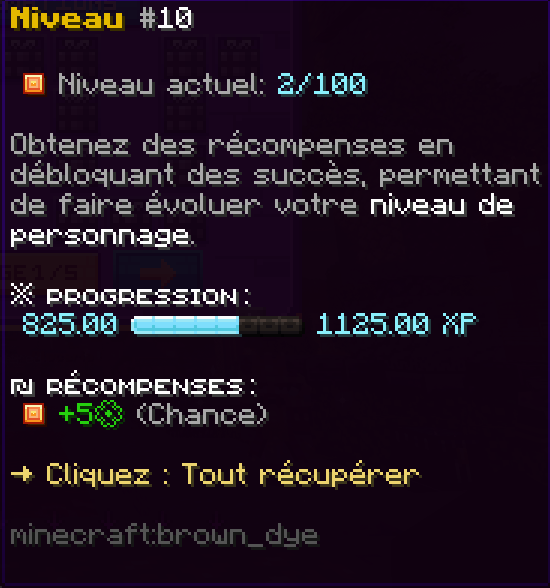

# 👫 Niveau de Personnage

### Introduction

Le **niveau de personnage** est un indicateur personnel reflétant votre avancement tout au long de votre aventure sur le serveur. Il représente votre progression globale et vous permet de débloquer différents éléments du jeu.

<figure><figcaption></figcaption></figure>

### Accès et évolution

Dans le menu **/personnage**, plusieurs niveaux sont visibles.\
Pour faire évoluer votre niveau de personnage, il est nécessaire de compléter des **succès**, accessibles via la commande **/succès**.

### Les succès

Les succès ont pour objectif de récompenser votre activité sur le serveur.\
Chaque succès complété vous octroie de l’**expérience de personnage (XP)**, laquelle est ajoutée à la barre de progression visible dans le menu **/personnage**.

Une fois cette barre entièrement remplie :

* Vous gagnez **un niveau de personnage**
* Vous recevez la **récompense associée** à ce niveau

### Importance du niveau de personnage

Les niveaux de personnage jouent un rôle central dans votre aventure :

* Ils sont requis pour certains **prérequis de rang**
* Ils permettent de débloquer la **Chance**, essentielle sur le serveur
* Ils témoignent de votre implication et de votre progression globale

### La chance

La c**hance** est une statistique de grande importance qui influence de nombreux aspects du serveur.\
Elle se débloque et s’améliore en augmentant votre niveau de personnage, lui-même obtenu grâce aux succès. Vous pouvez en obtenir également grâce à certains [familiers](./), et temporairement avec des [breuvages](les-breuvages.md).

Compléter un succès tel que :

* _Casser 100 bûches de chêne_

Elle vous rapporte de l’XP de personnage.\
Cette XP est ajoutée à votre barre de progression dans le menu **/personnage**. Une fois la barre complétée, vous obtenez un nouveau niveau ainsi que la récompense correspondante. 

<figure><figcaption></figcaption></figure>
