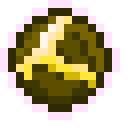
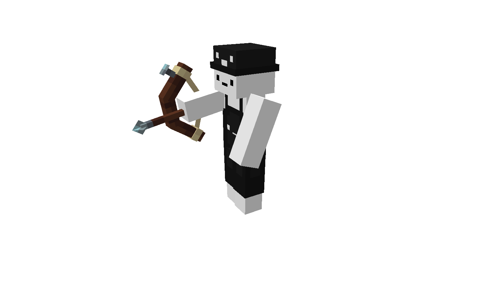

# 🪄 Outils évolutifs

Les **outils spéciaux sont évolutifs** et s’obtiennent par la progression dans les métiers.\
Ils peuvent être améliorés via une interface accessible avec **`sneak + clic droit`** (outil en main).

<figure><figcaption></figcaption></figure>

L’amélioration s’effectue à l’aide de **pierres d’évolution**, obtenables :

* À l’atelier (fabrication)
* Via certains bonus de familiers
* En récompenses de métiers, caisses ou événements
* Par certaines améliorations d’outils évolutifs

Les **outils enchantés** nécessitent des **pierres d’évolution forgée**.

Pierre d'évolution 

<table><thead><tr><th>Nom</th><th align="center" valign="middle">Items</th><th align="center">Craft</th></tr></thead><tbody><tr><td>Pierre d'évolution </td><td align="center" valign="middle"></td><td align="center"></td></tr><tr><td>
Pierre d'évolution forgée

</td><td align="center" valign="middle"></td><td align="center"></td></tr></tbody></table>

### Agriculteur

<strong>Récolteuse rustique</strong>

**Déblocage** : _Niveau 25_

**Type** : _Cisaille évolutive_

**Cultures** : _Cannes à sucre, Baies sucrées, Algues, Vignes_

**Durabilité** : _15 000_

**Amélioration possible :** _Vente automatique_

<figure><figcaption></figcaption></figure>

<strong>Fourche rustique</strong>

**Déblocage** : _**Niveau 50**_

**Type** : _Houe évolutive_

**Cultures** : _Carottes, Patates, Blé, Betteraves, Verrues du Nether_

**Durabilité** : _15 000_

**Amélioration possible :** _Replanteuse, Fortune, Vente automatique_

<figure><figcaption></figcaption></figure>

<strong>Hachette rustique</strong>

**Déblocage** : _Niveau 75_

**Type** : _Hache évolutive_

**Cultures** : _Melons, Citrouilles, Bambous_

**Durabilité** : _15 000_

**Amélioration possible :** _Touché de soie, Vente automatique_

<figure><figcaption></figcaption></figure>

<strong>Fourche forgée</strong>

**Déblocage** _: Niveau 100_

**Type** _: Amélioration de la Fourche rustique_

**Cultures** _: Carottes, Patates, Blé, Betteraves, Verrues du Nether_

**Durabilité** _: 20 000_

**Amélioration possible :** _Niveaux d'îles, Replanteuse, Fortune, Vente automatique, Durabilités_&#x20;

<figure><figcaption></figcaption></figure>

<strong>Récolteuse forgée</strong>

**Déblocage** : _Niveau 125_

**Cultures** : _Champignon brun, Champignon rouge, Cannes à sucre, Baies sucrées, Algues, Vignes_

**Durabilité** : _20 000_\
\
**Amélioration possible :** _Niveaux d'île, Vente automatique, Durabilités_

<figure><figcaption></figcaption></figure>

<strong>Hachette forgée</strong>

**Déblocage** : _Niveau 75_

**Type** : _Hache évolutive_

**Cultures** : _Melons, Citrouilles, Bambous, Cactus_

**Durabilité** : _15 000_

**Amélioration possible :** Niveaux d'île, _Touché de soie, Vente automatique, Durabilités_

<figure><figcaption></figcaption></figure>

### Bûcheron

<strong>Hache rustique</strong>

Déblocage : **Niveau 50**

Arbres : Chêne, Bouleau, Sapin, Acajou, Acacia, Cerisier

Durabilité : **2 500**

<figure><figcaption></figcaption></figure>

<strong>Hache de l’enfer</strong>

Déblocage : **Niveau 75**

Blocs : Tige carmin, Tige biscornue

Durabilité : **2 500**

<figure><figcaption></figcaption></figure>

<strong>Hache forgée</strong>

Déblocage : **Niveau 100**

Arbres : Chêne sombre, Chêne pâle, Palétuvier, Chêne, Bouleau, Sapin, Acajou, Acacia, Cerisier

Durabilité : **5 000**

<figure><figcaption></figcaption></figure>

<strong>Hache de l’enfer forgée</strong>

Déblocage : **Niveau 150**

Blocs : Tige carmin, Tige biscornue, Tige carmin, Tige biscornue

Durabilité : **5 000**

<figure><figcaption></figcaption></figure>

### Chasseur

<strong>Épée rustique</strong>

**Déblocage** : _Niveau 50_

**Durabilité** : _5 000_

**Amélioration possible :** _Aura de feu, Tranchant, Butin, Affilage, Vente automatique_

<figure><figcaption></figcaption></figure>

<strong>Arc rustique</strong>

**Déblocage** : _Niveau 75_

**Durabilité** : _1 500_

**Amélioration possible :** _Frappe, Infinité, Flamme, Puissance_

<figure><figcaption></figcaption></figure>

<strong>Épée forgée</strong>

**Déblocage** : _Niveau 125_

**Durabilité** : _10 000_

**Amélioration possible :** _Niveaux d'île_, _Aura de feu, Tranchant, Fléau des arthropodes, Butin, Affilage, Châtiment, Vente automatique, Durabilités_

<figure><figcaption></figcaption></figure>

<strong>Arc forgée</strong>

**Déblocage** : _Niveau 150_

**Durabilité** : _2 000_

**Amélioration possible :** _Frappe, Infinité, Flamme, Puissance, Explosion, Durabilités_

<figure><figcaption></figcaption></figure>

### Mineur

<strong>Pioche rustique</strong>

Déblocage : **Niveau 50**

Usage : Minerais personnalisés

Durabilité : **2 000**

<figure><figcaption></figcaption></figure>

<strong>Marteau rustique</strong>

Déblocage : **Niveau 75**

Fonction : Minage en **3x3**

Usage : Générateurs à minerais

Durabilité : **50 000**

<figure><figcaption></figcaption></figure>

<strong>Pioche forgée</strong>

Déblocage : **Niveau 100**

Durabilité : **3 000**

<figure><figcaption></figcaption></figure>

<strong>Marteau forgée</strong>

Déblocage : **Niveau 125**

Durabilité : **10 000**

<figure><figcaption></figcaption></figure>

### Pêcheur

<strong>Canne à pêche rustique</strong>

**Déblocage** : _Niveau 50_

**Durabilité** : _300_

**Amélioration possible :** _Double hameçon, Appât, Chance de la mer_

<figure><figcaption></figcaption></figure>

<strong>Canne à pêche forgée</strong>

**Déblocage** : _Niveau 100_

**Durabilité** : _500_

**Amélioration possible :** Niveaux d'île, _Double hameçon, Appât, Chance de la mer, Durabilités_

<figure><figcaption></figcaption></figure>

