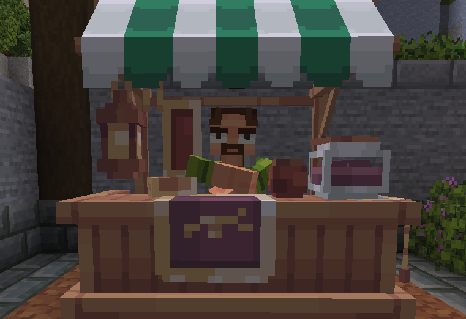

# 🍱 Shop

Sur Blocaria, tu peux accéder au marché en te rendant au spawn sur la place du marché ou en utilisant la commande <mark style="color:yellow;">**`/shop`**</mark>. C'est l'endroit idéal pour vendre et acheter des blocs ou items aux villageois.

<figure><figcaption></figcaption></figure>

Le <mark style="color:yellow;">**`/shop`**</mark> répertorie une grande variété d'articles dans différentes catégories :

* <mark style="color:yellow;">**Cultures**</mark> : Articles liés à l'agriculture, tels que les graines, les plantes et les produits agricoles.
* <mark style="color:yellow;">**Minerais**</mark> : Ressources minérales comme le fer, l'or, le diamant, etc.
* <mark style="color:yellow;">**Loots**</mark> : Objets obtenus en tuant des créatures.
* <mark style="color:yellow;">**Redstone**</mark> : Regroupe les mécanismes, circuits et créations utilisant la redstone
* <mark style="color:yellow;">**Divers**</mark> : Articles variés, souvent utiles dans le gameplay.
* <mark style="color:yellow;">**Blocs**</mark> : Différents types de blocs pour la construction et la décoration.

Dans toutes les boutiques, lorsque tu passes le curseur sur un objet, tu verras les détails pertinents, comme le prix d'achat et le prix de vente. Attention, certains objets sont uniquement vendables ou achetables.

<figure><figcaption></figcaption></figure>
