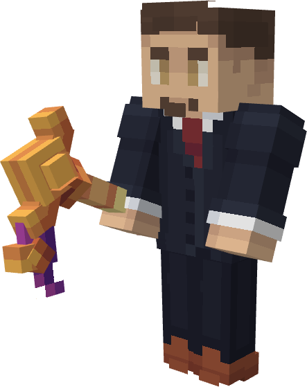
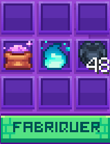

# ⚔️ Spawners

### Introduction

Les spawners sur les serveurs sont customisés. Pour qu'il fonctionne il faudra les alimenter avec de la poudre organique.\
\
Ces spawners pourront être additionnés pour augmenter le taux de production.

### Obtention des spawners et rareté

Les spawners peuvent s’obtenir de plusieurs manières à savoir :

➤ Récompense de caisses <kbd><mark style="color:yellow;">/vote<mark style="color:yellow;"></kbd>\
➤ Achat aux enchères <kbd><mark style="color:yellow;">/event<mark style="color:yellow;"></kbd>\
➤ Achat au marché noir <kbd><mark style="color:yellow;">/marchand<mark style="color:yellow;"></kbd>\
➤ Achat en gemmes <kbd><mark style="color:yellow;">/boutique<mark style="color:yellow;"></kbd>

Les types de spawners sont classés par rareté qui sont : \\

\
<mark style="color:$success;">Commun</mark> : Vache, cochon, lapin, mouton, poule\
<mark style="color:$primary;">Rare</mark> : Ours polaire, panda, poulpe\
<mark style="color:purple;">Épique</mark> : Zombie, squelette, araignée, creeper\
<mark style="color:red;">Légendaire</mark> : Enderman, slime, magma slime, sorcière\
<mark style="color:yellow;">Mythique</mark> : Gardien, blaze, piglin

### Pose des spawners

Les spawners peuvent être posés normalement sur votre boxe.

Les spawners avec des animaux passifs (vache, cochon, poule...) ont besoin de lumière et d'au moins un bloc d'herbe pour apparaître.\
Les spawners avec des monstres hostiles (Zombie, squelette, creeper...) ne doivent pas être exposés à la lumière pour apparaître.

Le système de pose custom vous permet de superposer des spawners les uns sur les autres pour augmenter la productivité. Il vous suffira de poser le spawner au même endroit pour que celui-ci s'ajoute au premier déjà posé. Un hologramme au-dessus du spawner vous indiquera le nombre de spawners superposés.\
\
Sur votre île, vous aurez une limite de 3 spawners par box en début d'aventure. Cette limite pourra être montée jusqu'à 15 dans le <kbd><mark style="color:yellow;">/upgrade<mark style="color:yellow;"></kbd>.\
\
Vous pourrez additionner jusqu'à 100 spawners et qui consommeront le même nombre de poudre organique qu'un seul spawner.

### La pioche à spawner

La pioche à spawner est obtenable dans les caisses afin de pouvoir les retirer toutefois elle a une durabilité et n'est pas réparable.

Clique droit : Retirer un spawner du stack (- 1 durabilité)\
Sneak + Clique droit : Récupérer tous les spawners (- 5 durabilités)

Si vous essayez de casser un spawner avec un autre outil que la pioche à spawner il ne se cassera pas et vous affiche un message dans le tchat.

<figure><figcaption></figcaption></figure>

### Apparition des entités

Un spawner fait apparaître des entités toutes les 30 secondes.\
Ces dernières apparaissent directement empilé et sans IA\
Le nombre d’entités dépend exclusivement du niveau spawner.

### Durabilité des spawners

Les spawners ont une durabilité, elle décroît de 1 à chaque apparition. Chaque poudre organique remonte la durabilité de 100 points mais ne peut pas dépasser les 200 points.\
Une fois la durabilité tombée à 0 ce dernier cesse de fonctionner. Il vous faudrait rester dans un rayon de 16 blocs pour que le spawner fonctionne\
Pour le remettre en fonctionnement, il faut faire un clic-droit dessus avec une poudre organique.

### Poudre organique

La poudre organique sert à réparer les spawners de 100 de durabilité par poudre. Clique droit sur le spawner afin de lui ajouter de la durabilité.\
Elle est uniquement obtenable via fabrication dans l’atelier <kbd><mark style="color:yellow;">/atelier<mark style="color:yellow;"></kbd>.

Pour la fabriquer, il vous suffit d'une âme, une poudre de perlimpinpin et 16 graines d'aubergines. Les âmes sont un loot rare obtenable en tuant des mobs customs.

<figure><figcaption></figcaption></figure>
