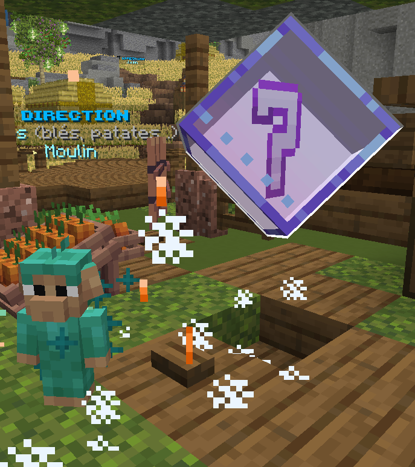

# 🗺️ Tutoriel

Le tutoriel est une aide au début de ton aventure qui va te permettre de comprendre les fonctionnalités du serveur et d'apprendre les commandes de base.

Le tutoriel se lance automatiquement à ton arrivée sur le serveur, dans l'interface à droite de ton écran. Il est impossible de passer le tutoriel. Le seul moyen de le fermer, c'est de le finir.

### Chapitre 1 : Une nouvelle aventure

Quête n°1 - Un nouveau départ

Créez votre box via la commande <mark style="color:yellow;">`/box create`</mark> \[Nom de la boxe]

<mark style="color:green;">Récompense</mark> : 500 

Quête n°2 - L'arbre de la vie

Cassez 4 bûches de chênes sur votre box <mark style="color:yellow;">`/box go`</mark>

<mark style="color:$success;">Récompense</mark> : 1000 

Quête n°3 - Une sacrée mission !

Effectuez la commande <mark style="color:yellow;">`/mission`</mark>

<mark style="color:$success;">Récompense</mark> : 1000 

Quête n°4 - La magie des cailloux

Minez 2 charbons dans le générateur de minerais sur votre box <mark style="color:yellow;">`/box go`</mark>

<mark style="color:green;">Récompenses</mark> : 1500  - 8 côtelettes crues

Quête n°5 - Un mineur né !

Rejoignez le métier de mineur <mark style="color:yellow;">`/jobs`</mark> (cliquer sur la pioche (métier miner) et sur l'icône rejoindre pour activer le métier). Montez au niveau 2 du job mineur.

<mark style="color:green;">Récompense</mark> : 2000 

Quête n°6 - Un travail payant

Récupérez la récompense de métier via la commande <mark style="color:yellow;">`/jobs claim`</mark>

<mark style="color:green;">Récompense</mark> : 2000 

Quête n°7 - Des amis !

Augmentez la limite de membres via la commande <mark style="color:yellow;">`/box upgrade`</mark>, passer la limite de 3 à 4 membres.

<mark style="color:green;">Récompense</mark> : 2000 

Quête n°8 - Agrandissement

Réalisez 4 missions afin d’agrandir votre box <mark style="color:yellow;">`/missions`</mark>

<mark style="color:green;">Récompense</mark> : 2500 

Quête n°9 - Retour aux sources

Retournez au spawn <mark style="color:yellow;">`/spawn`</mark>

<mark style="color:green;">Récompense</mark> : 2500 


_**Fin chapitre 1 : 100 xp personnage**_


### Chapitre 2 : Découverte des métiers

Quête n°1 - Mine craft

Entrez dans la mine <mark style="color:yellow;">`/mine`</mark>

<mark style="color:green;">Récompense :</mark> 2500 - 1 Pioche commune

Quête n°2 - Un mineur expérimenté

Passez niveau 5 dans le métier de mineur <mark style="color:yellow;">`/jobs`</mark>

<mark style="color:green;">Récompense</mark> : 3000 

Quête n°3 - Un nouvel horizon !

Quittez le métier de mineur pour rejoindre le métier d'agriculteur via <mark style="color:yellow;">`/jobs`</mark>. (Cliquez sur la pioche, puis sur l'icône Quitter le métier. Cliquez ensuite sur la houe, puis sur l'icône rejoindre le métier) Vous voilà désormais agriculteur !

<mark style="color:green;">Récompense</mark> : 3500 

Quête n°4 - Un agriculteur en herbe

Récoltez 8 patates, carottes, betteraves, blés aux champs <mark style="color:yellow;">`/warp champ`</mark>

<mark style="color:green;">Récompense</mark> : 4000  - Fourche commune

Quête n°5 - Ma jardinière secrète

Allez au stand près des champs (<mark style="color:yellow;">`/warp champ`</mark> )puis cliquez sur le point d'interrogation en 3D (tesseract)

<mark style="color:green;">Récompense</mark> : 4000  - Jardinière - Arrosoir - une graine de tomate

Quête n°6 - S'hydrater c’est important

Placez votre jardinière sur votre box et arrosez la terre à l’aide de l’arrosoir

<mark style="color:green;">Récompense</mark> : 4500  / 4 Compost

Quête n°7 - Le fruit d’un légume

Plantez une graine de tomate dans la jardinière

<mark style="color:green;">Récompense</mark> : 4500 

Quête n°8 - Un amis pour la vie ♥️

Récupérez votre familier puis posez-le dans votre box ( <mark style="color:yellow;">`/box go`</mark> ) une fois éclos, absorbez-le (clic droit)

<mark style="color:green;">Récompense</mark> : 5500 

Quête n°9 - Un compagnon pour la vie

Activez votre familier grâce au <mark style="color:yellow;">`/pet`</mark> fait clic droit sur celui, puis sortez-le en faisant à nouveau clic droit sur celui-ci

<mark style="color:green;">Récompense</mark> : 5500  - 2 Friandises

Quête n°10 - Les sucreries font grossir

Maintenant que Zébra est sorti, nourrissez-le avec des friandises en faisant clic droit sur lui (Sortir le familier via le <mark style="color:yellow;">`/pets`</mark>).

<mark style="color:green;">Récompense</mark> : 5500  - 4 pousses de chênes, bouleaux, sapins, jungles - 64 poudres d’os


_**Fin du chapitre 2 : 250 xp de personnage**_


### Chapitre 3 : Les mécaniques avancées

Quête n°1 - Un joueur expérimenté

Accédez au menu du personnage via la commande <mark style="color:yellow;">`/personnage`</mark>

<mark style="color:green;">Récompense</mark> : 5000 

Quête n°2 - Le collectionneur

Accédez au menu des collections via la commande <mark style="color:yellow;">`/success`</mark>

<mark style="color:green;">Récompense</mark> : 5000 

Quête n°3 - L'échelle sociale

Accédez au menu des rangs via la commande <mark style="color:yellow;">`/rang`</mark>

<mark style="color:green;">Récompense</mark> : 5000 

Quête n°4 - Seconde vie

Accéder à l’interface du forgeron <mark style="color:yellow;">`/forgeron`</mark>

<mark style="color:green;">Récompense</mark> : 5500  - Poudre de perlimpinpin - Poudre corrompue

Quête n°5 - Un concasseur ?

Allez au spawn, proche du forgeron <mark style="color:yellow;">`/warp forgeron`</mark>, et interagissez avec le concasseur

<mark style="color:green;">Récompense</mark> : 7500  - Un concasseur - Géode fermée

Quête n°6 - Concasse-tête

Concasser une géode fermée sur votre box <mark style="color:yellow;">`/box go`</mark>

<mark style="color:green;">Récompense</mark> : 7500 

Quête n°7 - Tout vu et tout bronzé

Passez le rang bronze II. Faire les quêtes dans le <mark style="color:yellow;">`/rang`</mark>

<mark style="color:green;">Récompense</mark> : 10000 


_**Fin du chapitre 3 : 400 xp de personnage**_


### Les tesseracts

Les tesseracts sont un hologramme en forme d’un point d’interrogation <mark style="color:yellow;">\[?]</mark> placés à des endroits stratégiques au spawn

<figure><figcaption></figcaption></figure>

<mark style="color:yellow;">→</mark> Devant la mine

<mark style="color:yellow;">→</mark> Devant le safari

<mark style="color:yellow;">→</mark> A côté du concasseur…
